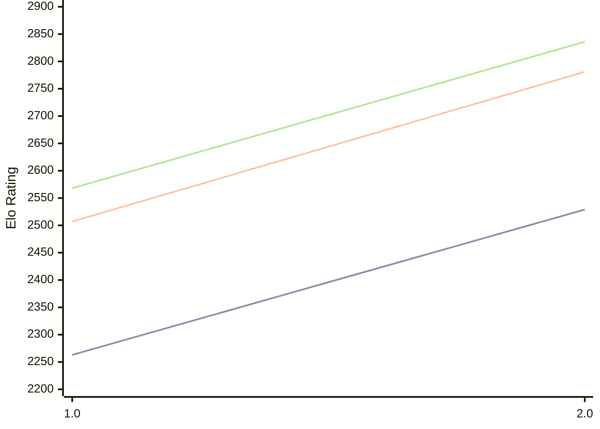

# Engine: Revolver

Author: Deshawn Mohan-Smith

Home: https://github.com/GoldenRare/Revolver

## Elo Ratings

| Version | Published | STC 8.0+0.08s  | LTC 60.0+0.60s | VLTC 2m24s+1.12s | Comment |
| --- | --- | --- | --- | --- | --- |
| 2.0 | 2026-05-01 | 2529(+266) | 2781(+274) | 2836(+268) |  |
| 1.0 | 2026-01-01 | 2263 | 2507 | 2568 |  |
 | | | cElo (∆ prev) | cElo (∆ prev) | cElo (∆ prev) | 

<a href="https://github.com/computer-chess-index/cci/issues/new?template=submit-version.yml&title=[VERSION]+Revolver+<version>&body=###%20Engine%20name%0ARevolver%0A%0A###%20Version%0A2.0" target="_blank">Submit new version</a>

 Test Conditions:

GUI/CLI: <a href=https://github.com/cutechess/cutechess target="_blank">Cute-Chess</a> 
Elo Calculation: <a href=https://www.remi-coulom.fr/Bayesian-Elo/ target="_blank">Bayesian-Elo</a> 
CPU: Intel(R) Core(TM) i5-7500T 2.70GHz 
Opening book: 8_moves_v3 
\* STC: 8.0+0.08s, LTC: 60.0+0.60s, VLTC: 2m24s+1.12s

 Lists:
Ratings: <a href=https://github.com/computer-chess-index/cci/blob/main/lists/CCIRatings.csv target="_blank">Complete list</a>

Generated: 2026-09-25 04:41:55

## Ratings Verlauf

## Detailed Evaluation Results

| Version | Time Control | Elo  | Range +/- | Matches | Score | Average Opponent Elo | Draws |
| --- | --- | --- | --- | --- | --- | --- | --- |
| 2.0 | VLTC (2m24s+1.12s) | 2836 | 25 | 504 | 52% | 2817 | 39% |
| 2.0 | LTC (60.0+0.60s) | 2781 | 25 | 510 | 51% | 2773 | 38% |
| 2.0 | STC (8.0+0.08s) | 2529 | 26 | 512 | 51% | 2525 | 29% |
| --- | --- | --- | --- | --- | --- | --- | --- |
| 1.0 | VLTC (2m24s+1.12s) | 2568 | 27 | 450 | 46% | 2610 | 32% |
| 1.0 | LTC (60.0+0.60s) | 2507 | 29 | 408 | 49% | 2518 | 25% |
| 1.0 | STC (8.0+0.08s) | 2263 | 26 | 516 | 51% | 2249 | 29% |
| --- | --- | --- | --- | --- | --- | --- | --- |