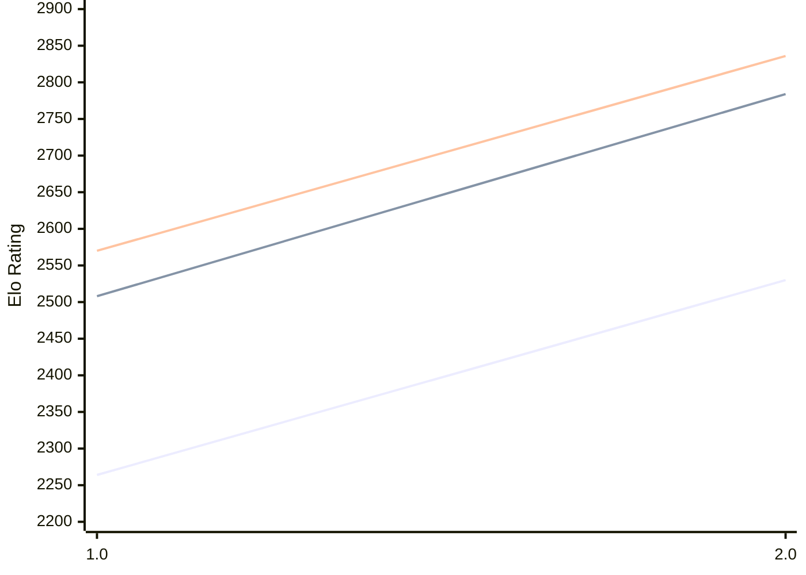

# Engine: Revolver

Author: Deshawn Mohan-Smith

Home: https://github.com/GoldenRare/Revolver

## Elo Ratings E1 (Ultra 7 265T (1.50 GHz) - E-Core)

| Version | Published | STC 8.0+0.08s  | LTC 60.0+0.60s | VLTC 2m24s+1.12s | Comment |
| --- | --- | --- | --- | --- | --- |
| 2.0 | 2026-05-01 | 2431 | 2734 | 2823 |  |
 | | | cElo (∆ prev) | cElo (∆ prev) | cElo (∆ prev) | 

## Elo Ratings P1 (Ultra 7 265T (1.50 GHz) - P-Core)

| Version | Published | STC 8.0+0.08s  | LTC 60.0+0.60s | VLTC 2m24s+1.12s | Comment |
| --- | --- | --- | --- | --- | --- |
| 2.0 | 2026-05-01 | 2500 | 2795 | 2900 |  |
 | | | cElo (∆ prev) | cElo (∆ prev) | cElo (∆ prev) | 

## Elo Ratings T1 (i5-7500T 2.70GHz)

| Version | Published | STC 8.0+0.08s  | LTC 60.0+0.60s | VLTC 2m24s+1.12s | Comment |
| --- | --- | --- | --- | --- | --- |
| 2.0 | 2026-05-01 | 2530(+266) | 2784(+276) | 2836(+266) |  |
| 1.0 | 2026-01-01 | 2264 | 2508 | 2570 |  |
 | | | cElo (∆ prev) | cElo (∆ prev) | cElo (∆ prev) | 

<a href="https://github.com/computer-chess-index/cci/issues/new?template=submit-version.yml&title=[VERSION]+Revolver+<version>&body=###%20Engine%20name%0ARevolver%0A%0A###%20Version%0A2.0" target="_blank">Submit new version</a>

 Test Conditions:

GUI/CLI: <a href=https://github.com/cutechess/cutechess target="_blank">Cute-Chess</a> 
Elo Calculation: <a href=https://www.remi-coulom.fr/Bayesian-Elo/ target="_blank">Bayesian-Elo</a> 
CPU for P1: Intel(R) Core(TM) Ultra 7 265T (1.50 GHz) - P-Core 
CPU for E1: Intel(R) Core(TM) Ultra 7 265T (1.50 GHz) - E-Core 
CPU for T1: Intel(R) Core(TM) i5-7500T 2.70GHz 
Opening book: 8_moves_v3 
\* STC: 8.0+0.08s, LTC: 60.0+0.60s, VLTC: 2m24s+1.12s

 Lists:
Ratings: <a href=https://github.com/computer-chess-index/cci/blob/main/lists/CCIRatings.csv target="_blank">Complete list</a>

Generated: 2026-10-19 04:42:30

## Ratings Verlauf T1

```mermaid
%%{init: {"theme":"base","themeVariables":{"seriesColors:['#a3a3a3','#222221','#faa371']}}}%%
xychart-beta
  x-axis ["1.0", "2.0"]
  y-axis "Elo Rating" 2200 --> 2900
  line "T1: STC (8.0+0.08s)" [2264, 2530]
  line "T1: LTC (60.0+0.60s)" [2508, 2784]
  line "T1: VLTC (2m24s+1.12s)" [2570, 2836]
```

## Detailed Evaluation Results

| Version | Time Control | Variant | Elo  | Range +/- | Matches | Score | Average Opponent Elo | Draws |
| --- | --- |--- | --- | --- | --- | --- | --- | --- |
| 2.0 | VLTC (2m24s+1.12s) | T1 | 2836 | 25 | 508 | 52% | 2819 | 39% |
|  |  | P1 | 2900 | 43 | 168 | 53% | 2855 | 43% |
|  |  | E1 | 2823 | 35 | 266 | 52% | 2766 | 37% |
|  | LTC (60.0+0.60s) | T1 | 2784 | 25 | 510 | 51% | 2774 | 38% |
|  |  | P1 | 2795 | 41 | 200 | 53% | 2746 | 34% |
|  |  | E1 | 2734 | 34 | 298 | 50% | 2728 | 32% |
|  | STC (8.0+0.08s) | T1 | 2530 | 26 | 512 | 51% | 2526 | 29% |
|  |  | P1 | 2500 | 40 | 206 | 47% | 2529 | 31% |
|  |  | E1 | 2431 | 32 | 326 | 49% | 2435 | 27% |
| --- | --- |--- | --- | --- | --- | --- | --- | --- |
| 1.0 | VLTC (2m24s+1.12s) | T1 | 2570 | 27 | 450 | 46% | 2611 | 32% |
|  | LTC (60.0+0.60s) | T1 | 2508 | 29 | 408 | 49% | 2519 | 25% |
|  | STC (8.0+0.08s) | T1 | 2264 | 26 | 516 | 51% | 2252 | 29% |