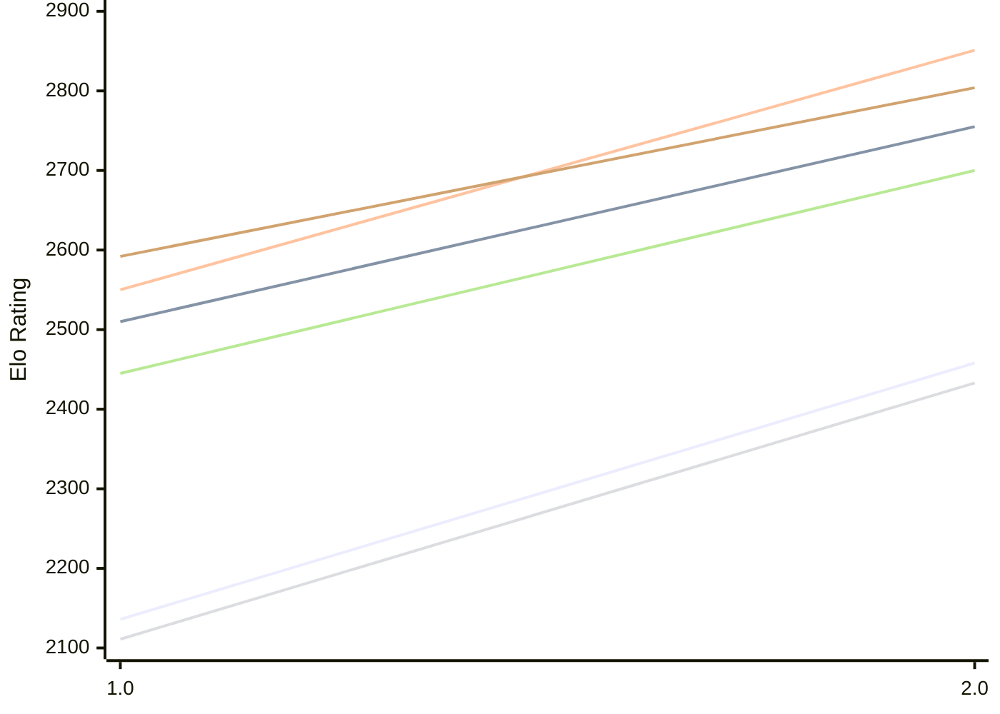
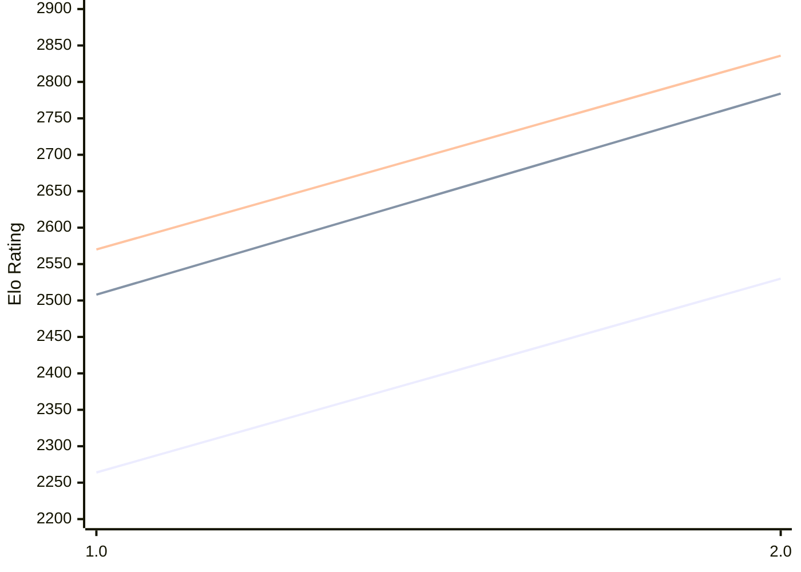

# Engine: Revolver

Author: Deshawn Mohan-Smith

Home: https://github.com/GoldenRare/Revolver

## Elo Ratings E1 (Ultra 7 265T (1.50 GHz) - E-Core)

| Version | Published | STC 8.0+0.08s  | LTC 60.0+0.60s | VLTC 2m24s+1.12s | Comment |
| --- | --- | --- | --- | --- | --- |
| 2.0 | 2026-05-01 | 2458(+322) | 2755(+245) | 2851(+301) |  |
| 1.0 | 2026-01-01 | 2136 | 2510 | 2550 |  |
 | | | cElo (∆ prev) | cElo (∆ prev) | cElo (∆ prev) | 

## Elo Ratings P1 (Ultra 7 265T (1.50 GHz) - P-Core)

| Version | Published | STC 8.0+0.08s  | LTC 60.0+0.60s | VLTC 2m24s+1.12s | Comment |
| --- | --- | --- | --- | --- | --- |
| 2.0 | 2026-05-01 | 2433(+322) | 2700(+255) | 2804(+212) |  |
| 1.0 | 2026-01-01 | 2111 | 2445 | 2592 |  |
 | | | cElo (∆ prev) | cElo (∆ prev) | cElo (∆ prev) | 

## Elo Ratings T1 (i5-7500T 2.70GHz)

| Version | Published | STC 8.0+0.08s  | LTC 60.0+0.60s | VLTC 2m24s+1.12s | Comment |
| --- | --- | --- | --- | --- | --- |
| 2.0 | 2026-05-01 | 2530(+266) | 2784(+276) | 2836(+266) |  |
| 1.0 | 2026-01-01 | 2264 | 2508 | 2570 |  |
 | | | cElo (∆ prev) | cElo (∆ prev) | cElo (∆ prev) | 

<a href="https://github.com/computer-chess-index/cci/issues/new?template=submit-version.yml&title=[VERSION]+Revolver+<version>&body=###%20Engine%20name%0ARevolver%0A%0A###%20Version%0A2.0" target="_blank">Submit new version</a>

 Test Conditions:

GUI/CLI: <a href=https://github.com/cutechess/cutechess target="_blank">Cute-Chess</a> 
Elo Calculation: <a href=https://www.remi-coulom.fr/Bayesian-Elo/ target="_blank">Bayesian-Elo</a> 
CPU for P1: Intel(R) Core(TM) Ultra 7 265T (1.50 GHz) - P-Core 
CPU for E1: Intel(R) Core(TM) Ultra 7 265T (1.50 GHz) - E-Core 
CPU for T1: Intel(R) Core(TM) i5-7500T 2.70GHz 
Opening book: 8_moves_v3 
\* STC: 8.0+0.08s, LTC: 60.0+0.60s, VLTC: 2m24s+1.12s

 Lists:
Ratings: <a href=https://github.com/computer-chess-index/cci/blob/main/lists/CCIRatings.csv target="_blank">Complete list</a>

Generated: 2026-11-18 05:42:36

## Ratings Verlauf E1 / P1

```mermaid
%%{init: {"theme":"base","themeVariables":{"seriesColors:['#a3a3a3','#222221','#faa371']}}}%%
xychart-beta
  x-axis ["1.0", "2.0"]
  y-axis "Elo Rating" 2100 --> 2900
  line "E1: STC (8.0+0.08s)" [2136, 2458]
  line "E1: LTC (60.0+0.60s)" [2510, 2755]
  line "E1: VLTC (2m24s+1.12s)" [2550, 2851]
  line "P1: STC (8.0+0.08s)" [2111, 2433]
  line "P1: LTC (60.0+0.60s)" [2445, 2700]
  line "P1: VLTC (2m24s+1.12s)" [2592, 2804]
```

## Ratings Verlauf T1

```mermaid
%%{init: {"theme":"base","themeVariables":{"seriesColors:['#a3a3a3','#222221','#faa371']}}}%%
xychart-beta
  x-axis ["1.0", "2.0"]
  y-axis "Elo Rating" 2200 --> 2900
  line "T1: STC (8.0+0.08s)" [2264, 2530]
  line "T1: LTC (60.0+0.60s)" [2508, 2784]
  line "T1: VLTC (2m24s+1.12s)" [2570, 2836]
```

## Detailed Evaluation Results

| Version | Time Control | Variant | Elo  | Range +/- | Matches | Score | Average Opponent Elo | Draws |
| --- | --- |--- | --- | --- | --- | --- | --- | --- |
| 2.0 | VLTC (2m24s+1.12s) | P1 | 2804 | 33 | 296 | 50% | 2792 | 39% |
|  |  | E1 | 2851 | 30 | 362 | 52% | 2799 | 37% |
|  |  | T1 | 2836 | 25 | 508 | 52% | 2819 | 39% |
|  | LTC (60.0+0.60s) | P1 | 2700 | 37 | 248 | 51% | 2643 | 31% |
|  |  | E1 | 2755 | 28 | 414 | 50% | 2750 | 36% |
|  |  | T1 | 2784 | 25 | 510 | 51% | 2774 | 38% |
|  | STC (8.0+0.08s) | P1 | 2433 | 36 | 258 | 48% | 2445 | 30% |
|  |  | E1 | 2458 | 29 | 400 | 49% | 2457 | 27% |
|  |  | T1 | 2530 | 26 | 512 | 51% | 2526 | 29% |
| --- | --- |--- | --- | --- | --- | --- | --- | --- |
| 1.0 | VLTC (2m24s+1.12s) | T1 | 2570 | 27 | 450 | 46% | 2611 | 32% |
|  |  | P1 | 2592 | 77 | 52 | 41% | 2665 | 37% |
|  |  | E1 | 2550 | 62 | 94 | 48% | 2572 | 20% |
|  | LTC (60.0+0.60s) | T1 | 2508 | 29 | 408 | 49% | 2519 | 25% |
|  |  | P1 | 2445 | 73 | 72 | 58% | 2315 | 28% |
|  |  | E1 | 2510 | 59 | 104 | 46% | 2519 | 23% |
|  | STC (8.0+0.08s) | T1 | 2264 | 26 | 516 | 51% | 2252 | 29% |
|  |  | P1 | 2111 | 72 | 80 | 44% | 2229 | 14% |
|  |  | E1 | 2136 | 52 | 134 | 57% | 2084 | 30% |