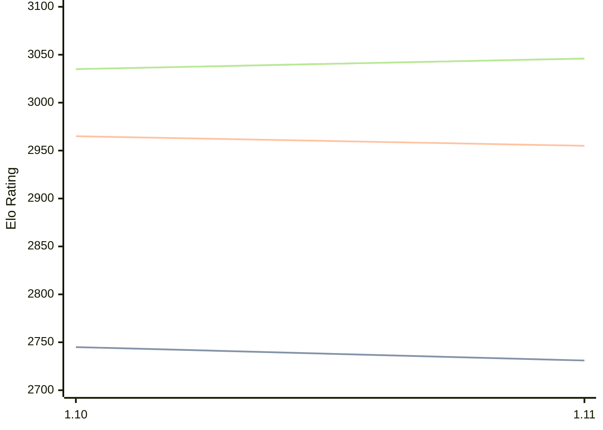

# Engine: Roc

Author: Tom Hyer

Home: https://github.com/TomHyer/Roc

## Elo Ratings

| Version | Published | STC 8.0+0.08s  | LTC 60.0+0.60s | VLTC 2m24s+1.12s | Comment |
| --- | --- | --- | --- | --- | --- |
| 1.11 | 2026-05-11 | 2731(-14) | 2955(-10) | 3046(+11) |  |
| 1.10 | 2026-02-21 | 2745(+new) | 2965(+new) | 3035(+new) |  |
| TCEC19_1 | 2020-08-05 |  |  |  |  |
| 1.0 | 2019-01-02 |  |  |  |  |
| 0.8 | 2017-06-18 |  |  |  |  |
| 0.7 | 2017-05-09 |  |  |  |  |
| 0.6 | 2017-03-13 |  |  |  |  |
| 0.5 | 2017-02-23 |  |  |  |  |
| 0.4 | 2017-02-18 |  |  |  |  |
| 0.3 | 2017-02-11 |  |  |  |  |
| 0.2 | 2017-02-03 |  |  |  |  |
| 0.1 | 2017-01-19 |  |  |  |  |
 | | | cElo (∆ prev) | cElo (∆ prev) | cElo (∆ prev) | 

<a href="https://github.com/computer-chess-index/cci/issues/new?template=submit-version.yml&title=[VERSION]+Roc+<version>&body=###%20Engine%20name%0ARoc%0A%0A###%20Version%0A1.11" target="_blank">Submit new version</a>

 Test Conditions:

GUI/CLI: <a href=https://github.com/cutechess/cutechess target="_blank">Cute-Chess</a> 
Elo Calculation: <a href=https://www.remi-coulom.fr/Bayesian-Elo/ target="_blank">Bayesian-Elo</a> 
CPU: Intel(R) Core(TM) i5-7500T 2.70GHz 
Opening book: 8_moves_v3 
\* STC: 8.0+0.08s, LTC: 60.0+0.60s, VLTC: 2m24s+1.12s

 Lists:
Ratings: <a href=https://github.com/computer-chess-index/cci/blob/main/lists/CCIRatings.csv target="_blank">Complete list</a>

Generated: 2026-09-25 04:42:06

## Ratings Verlauf

## Detailed Evaluation Results

| Version | Time Control | Elo  | Range +/- | Matches | Score | Average Opponent Elo | Draws |
| --- | --- | --- | --- | --- | --- | --- | --- |
| 1.11 | VLTC (2m24s+1.12s) | 3046 | 25 | 512 | 50% | 3051 | 39% |
| 1.11 | LTC (60.0+0.60s) | 2955 | 25 | 512 | 52% | 2939 | 37% |
| 1.11 | STC (8.0+0.08s) | 2731 | 25 | 490 | 49% | 2741 | 37% |
| --- | --- | --- | --- | --- | --- | --- | --- |
| 1.10 | VLTC (2m24s+1.12s) | 3035 | 26 | 454 | 52% | 3020 | 40% |
| 1.10 | LTC (60.0+0.60s) | 2965 | 28 | 386 | 50% | 2965 | 41% |
| 1.10 | STC (8.0+0.08s) | 2745 | 27 | 446 | 53% | 2708 | 38% |
| --- | --- | --- | --- | --- | --- | --- | --- |