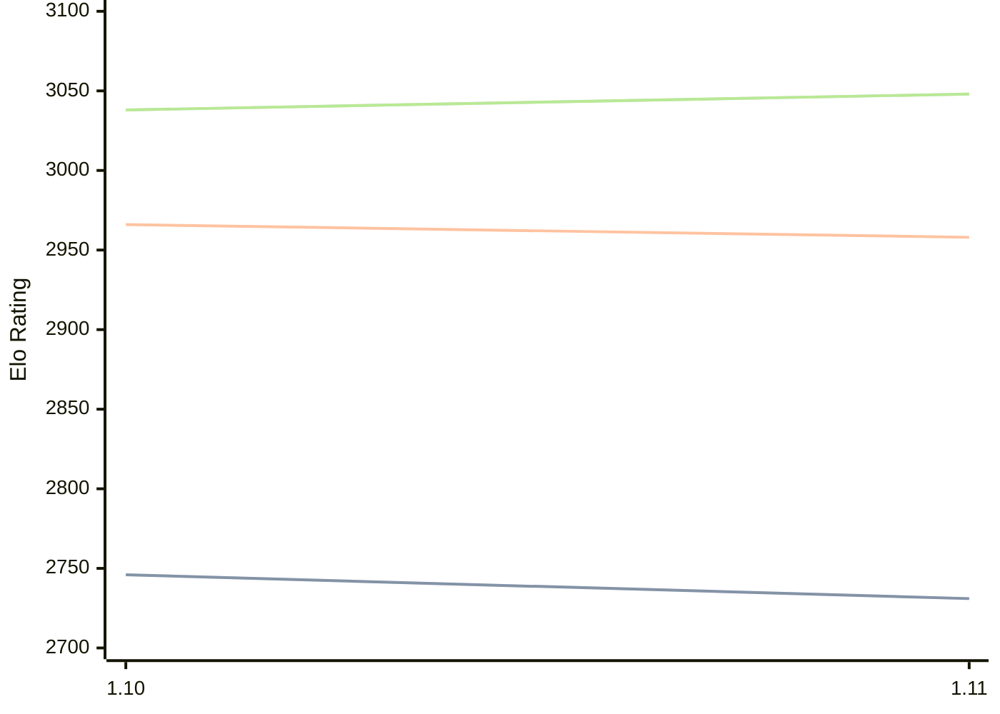

# Engine: Roc

Author: Tom Hyer

Home: https://github.com/TomHyer/Roc

## Elo Ratings E1

| Version | Published | STC 8.0+0.08s  | LTC 60.0+0.60s | VLTC 2m24s+1.12s | Comment |
| --- | --- | --- | --- | --- | --- |
| 1.11 | 2026-05-11 | 2635 | 2894 | 2962 |  |
 | | | cElo (∆ prev) | cElo (∆ prev) | cElo (∆ prev) | 

## Elo Ratings P1

| Version | Published | STC 8.0+0.08s  | LTC 60.0+0.60s | VLTC 2m24s+1.12s | Comment |
| --- | --- | --- | --- | --- | --- |
| 1.11 | 2026-05-11 | 2847 | 3148 | 3212 |  |
 | | | cElo (∆ prev) | cElo (∆ prev) | cElo (∆ prev) | 

## Elo Ratings T1

| Version | Published | STC 8.0+0.08s  | LTC 60.0+0.60s | VLTC 2m24s+1.12s | Comment |
| --- | --- | --- | --- | --- | --- |
| 1.11 | 2026-05-11 | 2731(-15) | 2958(-8) | 3048(+10) |  |
| 1.10 | 2026-02-21 | 2746 | 2966 | 3038 |  |
 | | | cElo (∆ prev) | cElo (∆ prev) | cElo (∆ prev) | 

<a href="https://github.com/computer-chess-index/cci/issues/new?template=submit-version.yml&title=[VERSION]+Roc+<version>&body=###%20Engine%20name%0ARoc%0A%0A###%20Version%0A1.11" target="_blank">Submit new version</a>

 Test Conditions:

GUI/CLI: <a href=https://github.com/cutechess/cutechess target="_blank">Cute-Chess</a> 
Elo Calculation: <a href=https://www.remi-coulom.fr/Bayesian-Elo/ target="_blank">Bayesian-Elo</a> 
CPU for P1: Intel(R) Core(TM) Ultra 7 265T (1.50 GHz) - P-Core 
CPU for E1: Intel(R) Core(TM) Ultra 7 265T (1.50 GHz) - E-Core 
CPU for T1: Intel(R) Core(TM) i5-7500T 2.70GHz 
Opening book: 8_moves_v3 
\* STC: 8.0+0.08s, LTC: 60.0+0.60s, VLTC: 2m24s+1.12s

 Lists:
Ratings: <a href=https://github.com/computer-chess-index/cci/blob/main/lists/CCIRatings.csv target="_blank">Complete list</a>

Generated: 2026-10-10 04:42:07

## Ratings Verlauf

```mermaid
%%{init: {"theme":"base","themeVariables":{"seriesColors:['#a3a3a3','#222221','#faa371']}}}%%
xychart-beta
  x-axis ["1.10", "1.11"]
  y-axis "Elo Rating" 2700 --> 3100
  line "" [2746, 2731]
  line "STC (8.0+0.08s)" [2746, 2731]
  line "LTC (60.0+0.60s)" [2966, 2958]
  line "" [3038, 3048]
  line "VLTC (2m24s+1.12s)" [3038, 3048]
```

## Detailed Evaluation Results

| Version | Time Control | Elo  | Range +/- | Matches | Score | Average Opponent Elo | Draws |
| --- | --- | --- | --- | --- | --- | --- | --- |
| 1.11 | VLTC (2m24s+1.12s) | 3048 | 25 | 512 | 50% | 3052 | 39% |
| 1.11 | VLTC (2m24s+1.12s) | 3212 | 47 | 144 | 52% | 3183 | 40% |
| 1.11 | VLTC (2m24s+1.12s) | 2962 | 40 | 206 | 52% | 2923 | 37% |
| 1.11 | LTC (60.0+0.60s) | 2958 | 25 | 520 | 52% | 2942 | 38% |
| 1.11 | LTC (60.0+0.60s) | 3148 | 42 | 174 | 51% | 3137 | 40% |
| 1.11 | LTC (60.0+0.60s) | 2894 | 39 | 216 | 51% | 2882 | 34% |
| 1.11 | STC (8.0+0.08s) | 2731 | 25 | 498 | 49% | 2743 | 37% |
| --- | --- | --- | --- | --- | --- | --- | --- |
| 1.11 | STC (8.0+0.08s) | 2847 | 43 | 176 | 47% | 2882 | 31% |
| --- | --- | --- | --- | --- | --- | --- | --- |
| 1.11 | STC (8.0+0.08s) | 2635 | 36 | 252 | 46% | 2680 | 31% |
| --- | --- | --- | --- | --- | --- | --- | --- |
| 1.10 | VLTC (2m24s+1.12s) | 3038 | 26 | 454 | 52% | 3023 | 40% |
| 1.10 | LTC (60.0+0.60s) | 2966 | 28 | 386 | 50% | 2966 | 41% |
| 1.10 | STC (8.0+0.08s) | 2746 | 27 | 446 | 53% | 2709 | 38% |
| --- | --- | --- | --- | --- | --- | --- | --- |