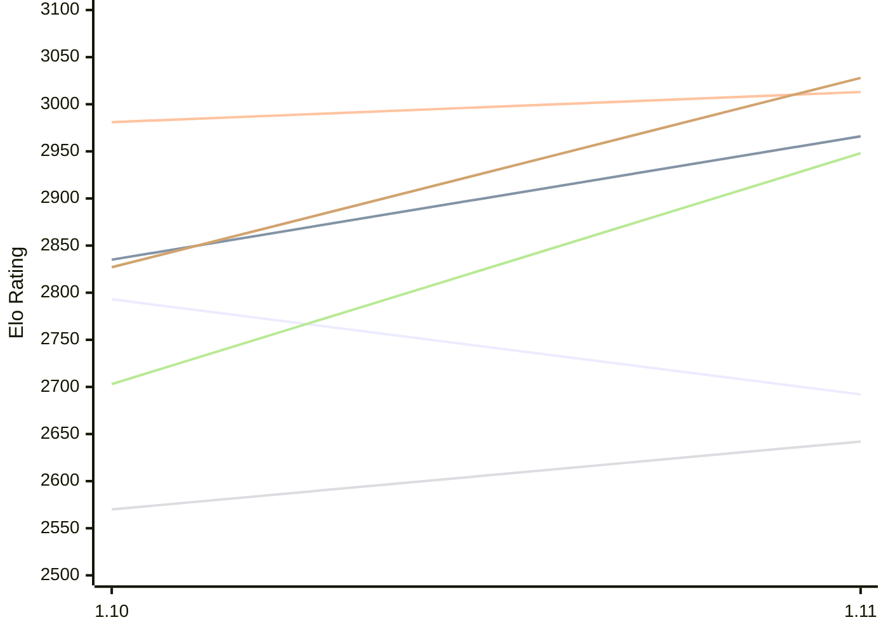
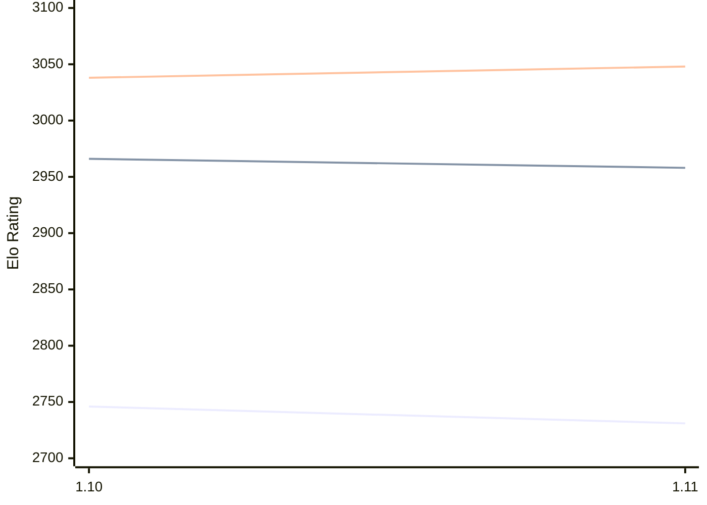

# Engine: Roc

Author: Tom Hyer

Home: https://github.com/TomHyer/Roc

## Elo Ratings E1 (Ultra 7 265T (1.50 GHz) - E-Core)

| Version | Published | STC 8.0+0.08s  | LTC 60.0+0.60s | VLTC 2m24s+1.12s | Comment |
| --- | --- | --- | --- | --- | --- |
| 1.11 | 2026-05-11 | 2692(-101) | 2966(+131) | 3013(+32) |  |
| 1.10 | 2026-02-21 | 2793 | 2835 | 2981 |  |
 | | | cElo (∆ prev) | cElo (∆ prev) | cElo (∆ prev) | 

## Elo Ratings P1 (Ultra 7 265T (1.50 GHz) - P-Core)

| Version | Published | STC 8.0+0.08s  | LTC 60.0+0.60s | VLTC 2m24s+1.12s | Comment |
| --- | --- | --- | --- | --- | --- |
| 1.11 | 2026-05-11 | 2642(+72) | 2948(+245) | 3028(+201) |  |
| 1.10 | 2026-02-21 | 2570 | 2703 | 2827 |  |
 | | | cElo (∆ prev) | cElo (∆ prev) | cElo (∆ prev) | 

## Elo Ratings T1 (i5-7500T 2.70GHz)

| Version | Published | STC 8.0+0.08s  | LTC 60.0+0.60s | VLTC 2m24s+1.12s | Comment |
| --- | --- | --- | --- | --- | --- |
| 1.11 | 2026-05-11 | 2731(-15) | 2958(-8) | 3048(+10) |  |
| 1.10 | 2026-02-21 | 2746 | 2966 | 3038 |  |
 | | | cElo (∆ prev) | cElo (∆ prev) | cElo (∆ prev) | 

<a href="https://github.com/computer-chess-index/cci/issues/new?template=submit-version.yml&title=[VERSION]+Roc+<version>&body=###%20Engine%20name%0ARoc%0A%0A###%20Version%0A1.11" target="_blank">Submit new version</a>

 Test Conditions:

GUI/CLI: <a href=https://github.com/cutechess/cutechess target="_blank">Cute-Chess</a> 
Elo Calculation: <a href=https://www.remi-coulom.fr/Bayesian-Elo/ target="_blank">Bayesian-Elo</a> 
CPU for P1: Intel(R) Core(TM) Ultra 7 265T (1.50 GHz) - P-Core 
CPU for E1: Intel(R) Core(TM) Ultra 7 265T (1.50 GHz) - E-Core 
CPU for T1: Intel(R) Core(TM) i5-7500T 2.70GHz 
Opening book: 8_moves_v3 
\* STC: 8.0+0.08s, LTC: 60.0+0.60s, VLTC: 2m24s+1.12s

 Lists:
Ratings: <a href=https://github.com/computer-chess-index/cci/blob/main/lists/CCIRatings.csv target="_blank">Complete list</a>

Generated: 2026-11-13 05:42:18

## Ratings Verlauf E1 / P1

```mermaid
%%{init: {"theme":"base","themeVariables":{"seriesColors:['#a3a3a3','#222221','#faa371']}}}%%
xychart-beta
  x-axis ["1.10", "1.11"]
  y-axis "Elo Rating" 2500 --> 3100
  line "E1: STC (8.0+0.08s)" [2793, 2692]
  line "E1: LTC (60.0+0.60s)" [2835, 2966]
  line "E1: VLTC (2m24s+1.12s)" [2981, 3013]
  line "P1: STC (8.0+0.08s)" [2570, 2642]
  line "P1: LTC (60.0+0.60s)" [2703, 2948]
  line "P1: VLTC (2m24s+1.12s)" [2827, 3028]
```

## Ratings Verlauf T1

```mermaid
%%{init: {"theme":"base","themeVariables":{"seriesColors:['#a3a3a3','#222221','#faa371']}}}%%
xychart-beta
  x-axis ["1.10", "1.11"]
  y-axis "Elo Rating" 2700 --> 3100
  line "T1: STC (8.0+0.08s)" [2746, 2731]
  line "T1: LTC (60.0+0.60s)" [2966, 2958]
  line "T1: VLTC (2m24s+1.12s)" [3038, 3048]
```

## Detailed Evaluation Results

| Version | Time Control | Variant | Elo  | Range +/- | Matches | Score | Average Opponent Elo | Draws |
| --- | --- |--- | --- | --- | --- | --- | --- | --- |
| 1.11 | VLTC (2m24s+1.12s) | E1 | 3013 | 30 | 370 | 51% | 2996 | 35% |
|  |  | T1 | 3048 | 25 | 512 | 50% | 3052 | 39% |
|  |  | P1 | 3028 | 37 | 232 | 52% | 2994 | 39% |
|  | LTC (60.0+0.60s) | E1 | 2966 | 29 | 378 | 51% | 2961 | 36% |
|  |  | T1 | 2958 | 25 | 520 | 52% | 2942 | 38% |
|  |  | P1 | 2948 | 37 | 230 | 49% | 2955 | 39% |
|  | STC (8.0+0.08s) | E1 | 2692 | 31 | 350 | 47% | 2711 | 32% |
|  |  | T1 | 2731 | 25 | 498 | 49% | 2743 | 37% |
|  |  | P1 | 2642 | 34 | 286 | 44% | 2704 | 30% |
| --- | --- |--- | --- | --- | --- | --- | --- | --- |
| 1.10 | VLTC (2m24s+1.12s) | T1 | 3038 | 26 | 454 | 52% | 3023 | 40% |
|  |  | P1 | 2827 | 181 | 12 | 38% | 2950 | 8% |
|  |  | E1 | 2981 | 109 | 40 | 74% | 2606 | 23% |
|  | LTC (60.0+0.60s) | T1 | 2966 | 28 | 386 | 50% | 2966 | 41% |
|  |  | P1 | 2703 | 147 | 28 | 61% | 2466 | 14% |
|  |  | E1 | 2835 | 94 | 36 | 49% | 2844 | 31% |
|  | STC (8.0+0.08s) | T1 | 2746 | 27 | 446 | 53% | 2709 | 38% |
|  |  | P1 | 2570 | 125 | 20 | 48% | 2591 | 25% |
|  |  | E1 | 2793 | 94 | 36 | 54% | 2754 | 31% |