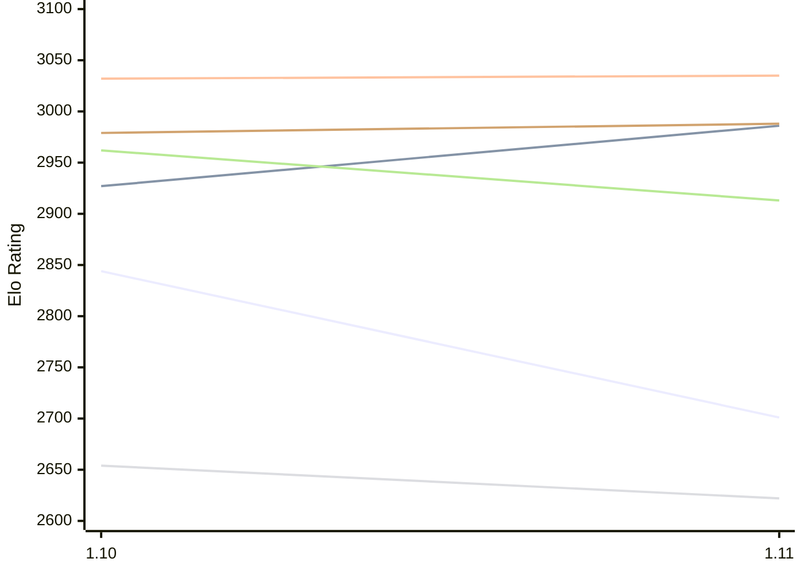
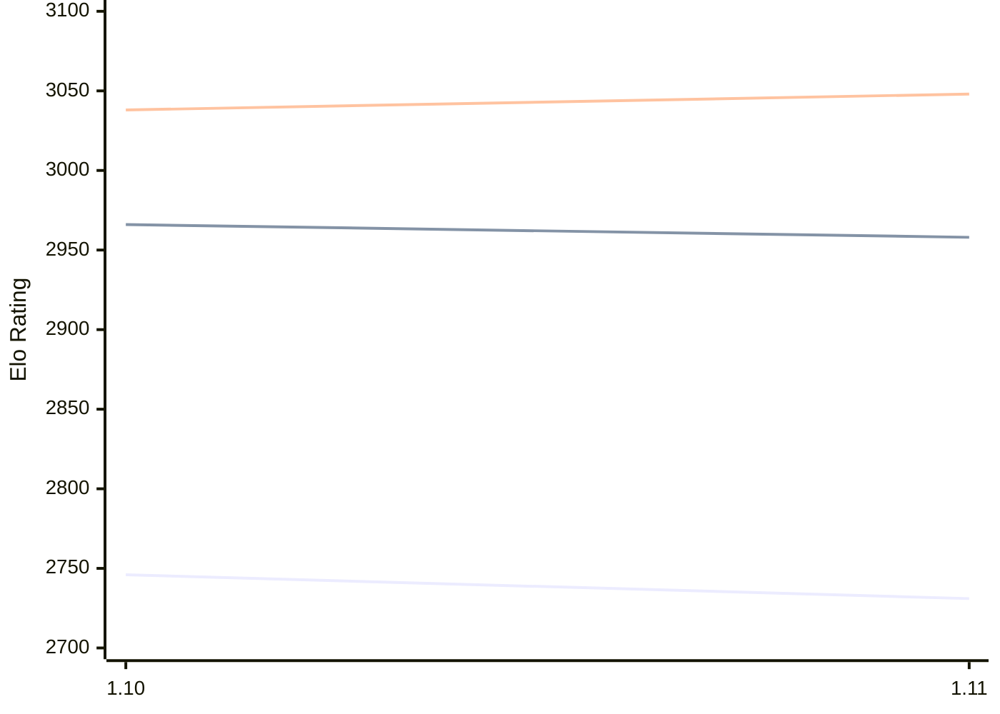

# Engine: Roc

Author: Tom Hyer

Home: https://github.com/TomHyer/Roc

## Elo Ratings E1 (Ultra 7 265T (1.50 GHz) - E-Core)

| Version | Published | STC 8.0+0.08s  | LTC 60.0+0.60s | VLTC 2m24s+1.12s | Comment |
| --- | --- | --- | --- | --- | --- |
| 1.11 | 2026-05-11 | 2701(-143) | 2986(+59) | 3035(+3) |  |
| 1.10 | 2026-02-21 | 2844 | 2927 | 3032 |  |
 | | | cElo (∆ prev) | cElo (∆ prev) | cElo (∆ prev) | 

## Elo Ratings P1 (Ultra 7 265T (1.50 GHz) - P-Core)

| Version | Published | STC 8.0+0.08s  | LTC 60.0+0.60s | VLTC 2m24s+1.12s | Comment |
| --- | --- | --- | --- | --- | --- |
| 1.11 | 2026-05-11 | 2622(-32) | 2913(-49) | 2988(+9) |  |
| 1.10 | 2026-02-21 | 2654 | 2962 | 2979 |  |
 | | | cElo (∆ prev) | cElo (∆ prev) | cElo (∆ prev) | 

## Elo Ratings T1 (i5-7500T 2.70GHz)

| Version | Published | STC 8.0+0.08s  | LTC 60.0+0.60s | VLTC 2m24s+1.12s | Comment |
| --- | --- | --- | --- | --- | --- |
| 1.11 | 2026-05-11 | 2731(-15) | 2958(-8) | 3048(+10) |  |
| 1.10 | 2026-02-21 | 2746 | 2966 | 3038 |  |
 | | | cElo (∆ prev) | cElo (∆ prev) | cElo (∆ prev) | 

<a href="https://github.com/computer-chess-index/cci/issues/new?template=submit-version.yml&title=[VERSION]+Roc+<version>&body=###%20Engine%20name%0ARoc%0A%0A###%20Version%0A1.11" target="_blank">Submit new version</a>

 Test Conditions:

GUI/CLI: <a href=https://github.com/cutechess/cutechess target="_blank">Cute-Chess</a> 
Elo Calculation: <a href=https://www.remi-coulom.fr/Bayesian-Elo/ target="_blank">Bayesian-Elo</a> 
CPU for P1: Intel(R) Core(TM) Ultra 7 265T (1.50 GHz) - P-Core 
CPU for E1: Intel(R) Core(TM) Ultra 7 265T (1.50 GHz) - E-Core 
CPU for T1: Intel(R) Core(TM) i5-7500T 2.70GHz 
Opening book: 8_moves_v3 
\* STC: 8.0+0.08s, LTC: 60.0+0.60s, VLTC: 2m24s+1.12s

 Lists:
Ratings: <a href=https://github.com/computer-chess-index/cci/blob/main/lists/CCIRatings.csv target="_blank">Complete list</a>

Generated: 2026-11-15 05:42:11

## Ratings Verlauf E1 / P1

```mermaid
%%{init: {"theme":"base","themeVariables":{"seriesColors:['#a3a3a3','#222221','#faa371']}}}%%
xychart-beta
  x-axis ["1.10", "1.11"]
  y-axis "Elo Rating" 2600 --> 3100
  line "E1: STC (8.0+0.08s)" [2844, 2701]
  line "E1: LTC (60.0+0.60s)" [2927, 2986]
  line "E1: VLTC (2m24s+1.12s)" [3032, 3035]
  line "P1: STC (8.0+0.08s)" [2654, 2622]
  line "P1: LTC (60.0+0.60s)" [2962, 2913]
  line "P1: VLTC (2m24s+1.12s)" [2979, 2988]
```

## Ratings Verlauf T1

```mermaid
%%{init: {"theme":"base","themeVariables":{"seriesColors:['#a3a3a3','#222221','#faa371']}}}%%
xychart-beta
  x-axis ["1.10", "1.11"]
  y-axis "Elo Rating" 2700 --> 3100
  line "T1: STC (8.0+0.08s)" [2746, 2731]
  line "T1: LTC (60.0+0.60s)" [2966, 2958]
  line "T1: VLTC (2m24s+1.12s)" [3038, 3048]
```

## Detailed Evaluation Results

| Version | Time Control | Variant | Elo  | Range +/- | Matches | Score | Average Opponent Elo | Draws |
| --- | --- |--- | --- | --- | --- | --- | --- | --- |
| 1.11 | VLTC (2m24s+1.12s) | E1 | 3035 | 29 | 386 | 51% | 3020 | 34% |
|  |  | T1 | 3048 | 25 | 512 | 50% | 3052 | 39% |
|  |  | P1 | 2988 | 37 | 240 | 51% | 2959 | 38% |
|  | LTC (60.0+0.60s) | E1 | 2986 | 29 | 382 | 51% | 2982 | 36% |
|  |  | T1 | 2958 | 25 | 520 | 52% | 2942 | 38% |
|  |  | P1 | 2913 | 37 | 230 | 49% | 2920 | 39% |
|  | STC (8.0+0.08s) | T1 | 2731 | 25 | 498 | 49% | 2743 | 37% |
|  |  | P1 | 2622 | 34 | 298 | 44% | 2689 | 29% |
|  |  | E1 | 2701 | 31 | 358 | 47% | 2723 | 32% |
| --- | --- |--- | --- | --- | --- | --- | --- | --- |
| 1.10 | VLTC (2m24s+1.12s) | T1 | 3038 | 26 | 454 | 52% | 3023 | 40% |
|  |  | P1 | 2979 | 109 | 30 | 48% | 3000 | 17% |
|  |  | E1 | 3032 | 72 | 72 | 62% | 2827 | 35% |
|  | LTC (60.0+0.60s) | T1 | 2966 | 28 | 386 | 50% | 2966 | 41% |
|  |  | P1 | 2962 | 121 | 40 | 68% | 2630 | 15% |
|  |  | E1 | 2927 | 71 | 64 | 57% | 2863 | 33% |
|  | STC (8.0+0.08s) | T1 | 2746 | 27 | 446 | 53% | 2709 | 38% |
|  |  | P1 | 2654 | 92 | 40 | 58% | 2585 | 25% |
|  |  | E1 | 2844 | 70 | 68 | 54% | 2801 | 26% |