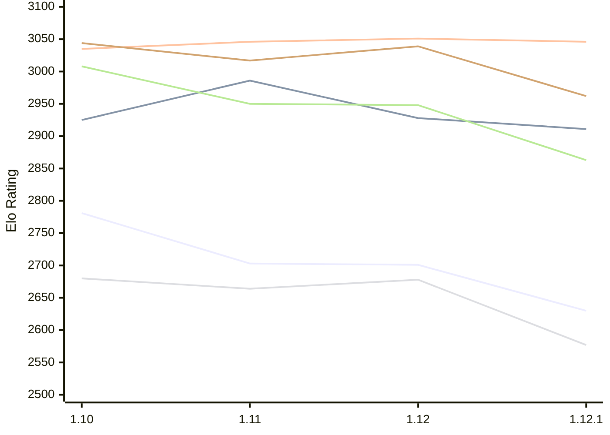
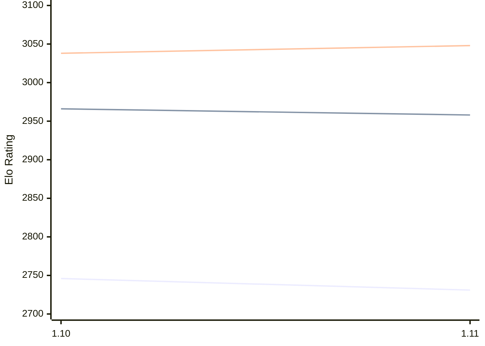

# Engine: Roc

Author: Tom Hyer

Home: https://github.com/TomHyer/Roc

## Elo Ratings E1 (Ultra 7 265T (1.50 GHz) - E-Core)

| Version | Published | STC 8.0+0.08s  | LTC 60.0+0.60s | VLTC 2m24s+1.12s | Comment |
| --- | --- | --- | --- | --- | --- |
| 1.12.1 | 2026-11-21 | 2630(-71) | 2911(-17) | 3046(-5) |  |
| 1.12 | 2026-11-19 | 2701(-2) | 2928(-58) | 3051(+5) |  |
| 1.11 | 2026-05-11 | 2703(-78) | 2986(+61) | 3046(+11) |  |
| 1.10 | 2026-02-21 | 2781 | 2925 | 3035 |  |
 | | | cElo (∆ prev) | cElo (∆ prev) | cElo (∆ prev) | 

## Elo Ratings P1 (Ultra 7 265T (1.50 GHz) - P-Core)

| Version | Published | STC 8.0+0.08s  | LTC 60.0+0.60s | VLTC 2m24s+1.12s | Comment |
| --- | --- | --- | --- | --- | --- |
| 1.12.1 | 2026-11-21 | 2577(-101) | 2863(-85) | 2962(-77) |  |
| 1.12 | 2026-11-19 | 2678(+14) | 2948(-2) | 3039(+22) |  |
| 1.11 | 2026-05-11 | 2664(-16) | 2950(-58) | 3017(-27) |  |
| 1.10 | 2026-02-21 | 2680 | 3008 | 3044 |  |
 | | | cElo (∆ prev) | cElo (∆ prev) | cElo (∆ prev) | 

## Elo Ratings T1 (i5-7500T 2.70GHz)

| Version | Published | STC 8.0+0.08s  | LTC 60.0+0.60s | VLTC 2m24s+1.12s | Comment |
| --- | --- | --- | --- | --- | --- |
| 1.11 | 2026-05-11 | 2731(-15) | 2958(-8) | 3048(+10) |  |
| 1.10 | 2026-02-21 | 2746 | 2966 | 3038 |  |
 | | | cElo (∆ prev) | cElo (∆ prev) | cElo (∆ prev) | 

<a href="https://github.com/computer-chess-index/cci/issues/new?template=submit-version.yml&title=[VERSION]+Roc+<version>&body=###%20Engine%20name%0ARoc%0A%0A###%20Version%0A1.11" target="_blank">Submit new version</a>

 Test Conditions:

GUI/CLI: <a href=https://github.com/cutechess/cutechess target="_blank">Cute-Chess</a> 
Elo Calculation: <a href=https://www.remi-coulom.fr/Bayesian-Elo/ target="_blank">Bayesian-Elo</a> 
CPU for P1: Intel(R) Core(TM) Ultra 7 265T (1.50 GHz) - P-Core 
CPU for E1: Intel(R) Core(TM) Ultra 7 265T (1.50 GHz) - E-Core 
CPU for T1: Intel(R) Core(TM) i5-7500T 2.70GHz 
Opening book: 8_moves_v3 
\* STC: 8.0+0.08s, LTC: 60.0+0.60s, VLTC: 2m24s+1.12s

 Lists:
Ratings: <a href=https://github.com/computer-chess-index/cci/blob/main/lists/CCIRatings.csv target="_blank">Complete list</a>

Generated: 2026-11-24 05:42:27

## Ratings Verlauf E1 / P1

```mermaid
%%{init: {"theme":"base","themeVariables":{"seriesColors:['#a3a3a3','#222221','#faa371']}}}%%
xychart-beta
  x-axis ["1.10", "1.11", "1.12", "1.12.1"]
  y-axis "Elo Rating" 2500 --> 3100
  line "E1: STC (8.0+0.08s)" [2781, 2703, 2701, 2630]
  line "E1: LTC (60.0+0.60s)" [2925, 2986, 2928, 2911]
  line "E1: VLTC (2m24s+1.12s)" [3035, 3046, 3051, 3046]
  line "P1: STC (8.0+0.08s)" [2680, 2664, 2678, 2577]
  line "P1: LTC (60.0+0.60s)" [3008, 2950, 2948, 2863]
  line "P1: VLTC (2m24s+1.12s)" [3044, 3017, 3039, 2962]
```

## Ratings Verlauf T1

```mermaid
%%{init: {"theme":"base","themeVariables":{"seriesColors:['#a3a3a3','#222221','#faa371']}}}%%
xychart-beta
  x-axis ["1.10", "1.11"]
  y-axis "Elo Rating" 2700 --> 3100
  line "T1: STC (8.0+0.08s)" [2746, 2731]
  line "T1: LTC (60.0+0.60s)" [2966, 2958]
  line "T1: VLTC (2m24s+1.12s)" [3038, 3048]
```

## Detailed Evaluation Results

| Version | Time Control | Variant | Elo  | Range +/- | Matches | Score | Average Opponent Elo | Draws |
| --- | --- |--- | --- | --- | --- | --- | --- | --- |
| 1.12.1 | VLTC (2m24s+1.12s) | P1 | 2962 | 43 | 176 | 46% | 2997 | 34% |
|  |  | E1 | 3046 | 46 | 144 | 50% | 3044 | 42% |
|  | LTC (60.0+0.60s) | P1 | 2863 | 50 | 124 | 48% | 2877 | 37% |
|  |  | E1 | 2911 | 43 | 180 | 49% | 2919 | 31% |
|  | STC (8.0+0.08s) | P1 | 2577 | 49 | 148 | 58% | 2491 | 23% |
|  |  | E1 | 2630 | 39 | 226 | 49% | 2638 | 26% |
| --- | --- |--- | --- | --- | --- | --- | --- | --- |
| 1.12 | VLTC (2m24s+1.12s) | P1 | 3039 | 49 | 122 | 53% | 3019 | 47% |
|  |  | E1 | 3051 | 43 | 176 | 51% | 3040 | 32% |
|  | LTC (60.0+0.60s) | P1 | 2948 | 52 | 116 | 51% | 2935 | 35% |
|  |  | E1 | 2928 | 37 | 230 | 49% | 2938 | 36% |
|  | STC (8.0+0.08s) | P1 | 2678 | 47 | 144 | 52% | 2661 | 33% |
|  |  | E1 | 2701 | 37 | 240 | 54% | 2668 | 28% |
| --- | --- |--- | --- | --- | --- | --- | --- | --- |
| 1.11 | VLTC (2m24s+1.12s) | T1 | 3048 | 25 | 512 | 50% | 3052 | 39% |
|  |  | P1 | 3017 | 34 | 272 | 50% | 2997 | 39% |
|  |  | E1 | 3046 | 28 | 410 | 51% | 3025 | 34% |
|  | LTC (60.0+0.60s) | T1 | 2958 | 25 | 520 | 52% | 2942 | 38% |
|  |  | P1 | 2950 | 35 | 246 | 49% | 2961 | 40% |
|  |  | E1 | 2986 | 28 | 402 | 50% | 2990 | 36% |
|  | STC (8.0+0.08s) | T1 | 2731 | 25 | 498 | 49% | 2743 | 37% |
|  |  | P1 | 2664 | 33 | 306 | 44% | 2728 | 29% |
|  |  | E1 | 2703 | 30 | 378 | 46% | 2727 | 31% |
| --- | --- |--- | --- | --- | --- | --- | --- | --- |
| 1.10 | VLTC (2m24s+1.12s) | T1 | 3038 | 26 | 454 | 52% | 3023 | 40% |
|  |  | P1 | 3044 | 80 | 54 | 51% | 3043 | 24% |
|  |  | E1 | 3035 | 59 | 104 | 58% | 2894 | 31% |
|  | LTC (60.0+0.60s) | T1 | 2966 | 28 | 386 | 50% | 2966 | 41% |
|  |  | P1 | 3008 | 88 | 60 | 63% | 2770 | 22% |
|  |  | E1 | 2925 | 57 | 96 | 53% | 2897 | 38% |
|  | STC (8.0+0.08s) | P1 | 2680 | 72 | 64 | 54% | 2642 | 27% |
|  |  | E1 | 2781 | 59 | 96 | 47% | 2804 | 28% |
|  |  | T1 | 2746 | 27 | 446 | 53% | 2709 | 38% |