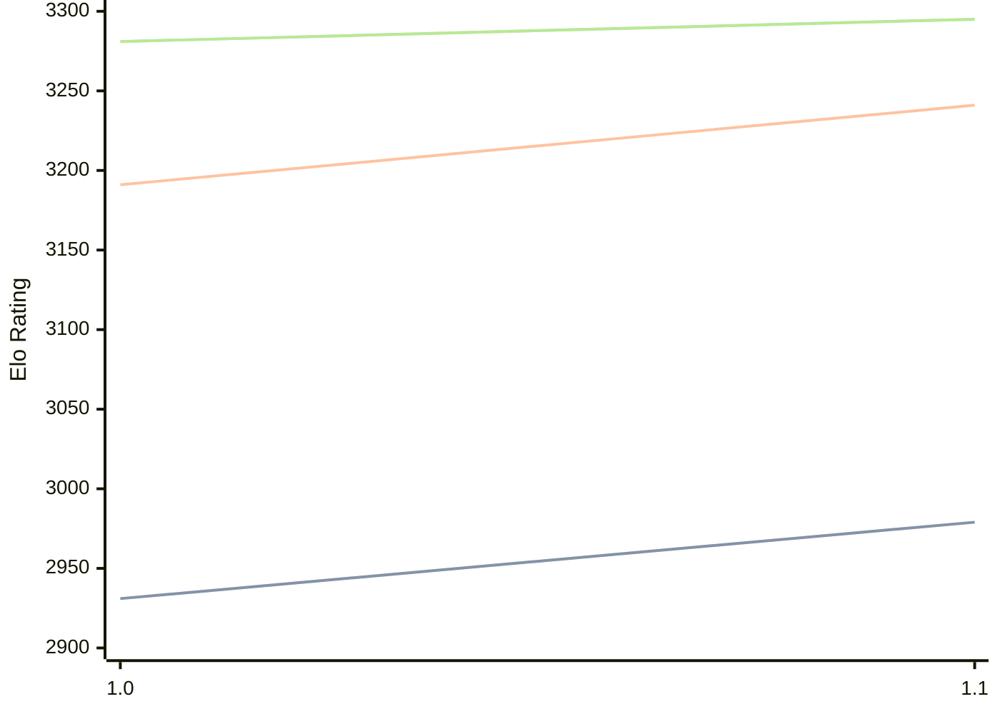

# Engine: RodentV

Author: Pawel Koziol

Home: https://github.com/nescitus/Rodent-V

## Elo Ratings

| Version | Published | STC 8.0+0.08s  | LTC 60.0+0.60s | VLTC 2m24s+1.12s | Comment |
| --- | --- | --- | --- | --- | --- |
| 1.1 | 2026-08-06 | 2979(+48) | 3241(+50) | 3295(+14) |  |
| 1.0 | 2026-08-02 | 2931 | 3191 | 3281 |  |
 | | | cElo (∆ prev) | cElo (∆ prev) | cElo (∆ prev) | 

<a href="https://github.com/computer-chess-index/cci/issues/new?template=submit-version.yml&title=[VERSION]+RodentV+<version>&body=###%20Engine%20name%0ARodentV%0A%0A###%20Version%0A1.1" target="_blank">Submit new version</a>

 Test Conditions:

GUI/CLI: <a href=https://github.com/cutechess/cutechess target="_blank">Cute-Chess</a> 
Elo Calculation: <a href=https://www.remi-coulom.fr/Bayesian-Elo/ target="_blank">Bayesian-Elo</a> 
CPU: Intel(R) Core(TM) i5-7500T 2.70GHz 
Opening book: 8_moves_v3 
\* STC: 8.0+0.08s, LTC: 60.0+0.60s, VLTC: 2m24s+1.12s

 Lists:
Ratings: <a href=https://github.com/computer-chess-index/cci/blob/main/lists/CCIRatings.csv target="_blank">Complete list</a>

Generated: 2026-08-23 06:28:30

## Ratings Verlauf

⬛ STC (8.0+0.08s) &nbsp;&nbsp; 🟧 LTC (60.0+0.60s) &nbsp;&nbsp; 🟩 VLTC (2m24s+1.12s)

dark mode: 🟩STC (8.0+0.08s) 🟧LTC (60.0+0.60s) ⬜VLTC (2m24s+1.12s)

## Detailed Evaluation Results

| Version | Time Control | Elo  | Range +/- | Matches | Score | Average Opponent Elo | Draws |
| --- | --- | --- | --- | --- | --- | --- | --- |
| 1.1 | VLTC (2m24s+1.12s) | 3295 | 33 | 236 | 50% | 3294 | 69% |
| 1.1 | LTC (60.0+0.60s) | 3241 | 29 | 314 | 53% | 3221 | 60% |
| 1.1 | STC (8.0+0.08s) | 2979 | 29 | 338 | 53% | 2955 | 50% |
| --- | --- | --- | --- | --- | --- | --- | --- |
| 1.0 | VLTC (2m24s+1.12s) | 3281 | 33 | 250 | 49% | 3283 | 61% |
| 1.0 | LTC (60.0+0.60s) | 3191 | 32 | 260 | 51% | 3182 | 57% |
| 1.0 | STC (8.0+0.08s) | 2931 | 37 | 224 | 53% | 2903 | 43% |
| --- | --- | --- | --- | --- | --- | --- | --- |