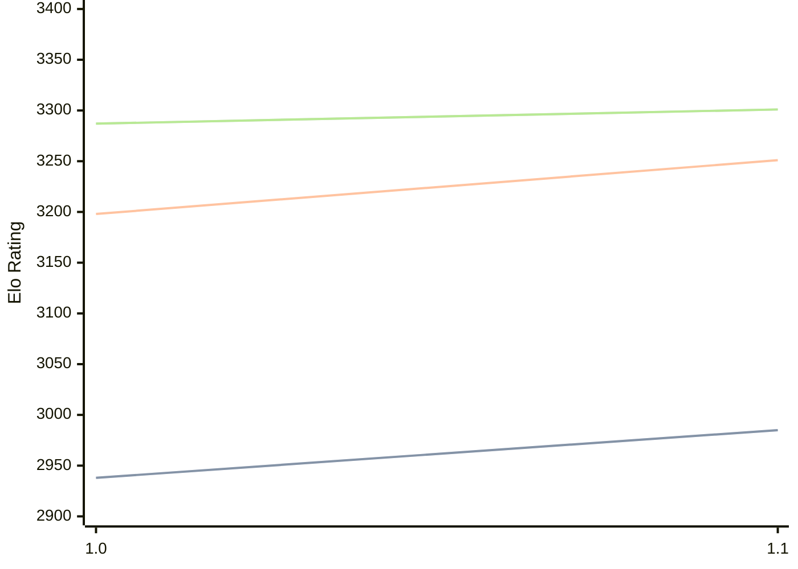

# Engine: RodentV

Author: Pawel Koziol

Home: https://github.com/nescitus/Rodent-V

## Elo Ratings

| Version | Published | STC 8.0+0.08s  | LTC 60.0+0.60s | VLTC 2m24s+1.12s | Comment |
| --- | --- | --- | --- | --- | --- |
| 1.2 | 2026-08-30 |  |  |  |  |
| 1.1 | 2026-08-06 | 2985(+47) | 3251(+53) | 3301(+14) |  |
| 1.0 | 2026-08-02 | 2938 | 3198 | 3287 |  |
 | | | cElo (∆ prev) | cElo (∆ prev) | cElo (∆ prev) | 

<a href="https://github.com/computer-chess-index/cci/issues/new?template=submit-version.yml&title=[VERSION]+RodentV+<version>&body=###%20Engine%20name%0ARodentV%0A%0A###%20Version%0A1.2" target="_blank">Submit new version</a>

 Test Conditions:

GUI/CLI: <a href=https://github.com/cutechess/cutechess target="_blank">Cute-Chess</a> 
Elo Calculation: <a href=https://www.remi-coulom.fr/Bayesian-Elo/ target="_blank">Bayesian-Elo</a> 
CPU: Intel(R) Core(TM) i5-7500T 2.70GHz 
Opening book: 8_moves_v3 
\* STC: 8.0+0.08s, LTC: 60.0+0.60s, VLTC: 2m24s+1.12s

 Lists:
Ratings: <a href=https://github.com/computer-chess-index/cci/blob/main/lists/CCIRatings.csv target="_blank">Complete list</a>

Generated: 2026-09-15 04:41:59

## Ratings Verlauf

## Detailed Evaluation Results

| Version | Time Control | Elo  | Range +/- | Matches | Score | Average Opponent Elo | Draws |
| --- | --- | --- | --- | --- | --- | --- | --- |
| 1.1 | VLTC (2m24s+1.12s) | 3301 | 29 | 288 | 50% | 3301 | 71% |
| 1.1 | LTC (60.0+0.60s) | 3251 | 27 | 358 | 53% | 3231 | 61% |
| 1.1 | STC (8.0+0.08s) | 2985 | 27 | 382 | 52% | 2965 | 49% |
| --- | --- | --- | --- | --- | --- | --- | --- |
| 1.0 | VLTC (2m24s+1.12s) | 3287 | 33 | 250 | 49% | 3290 | 61% |
| 1.0 | LTC (60.0+0.60s) | 3198 | 32 | 260 | 51% | 3189 | 57% |
| 1.0 | STC (8.0+0.08s) | 2938 | 37 | 224 | 53% | 2908 | 43% |
| --- | --- | --- | --- | --- | --- | --- | --- |