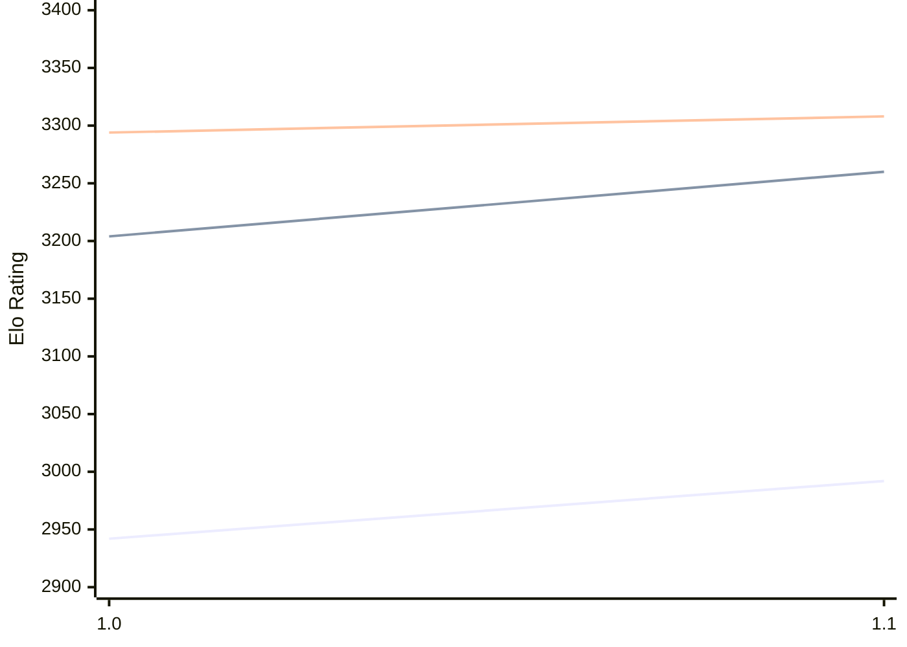

# Engine: RodentV

Author: Pawel Koziol

Home: https://github.com/nescitus/Rodent-V

## Elo Ratings E1 (Ultra 7 265T (1.50 GHz) - E-Core)

| Version | Published | STC 8.0+0.08s  | LTC 60.0+0.60s | VLTC 2m24s+1.12s | Comment |
| --- | --- | --- | --- | --- | --- |
| 1.1 | 2026-08-06 | 2857 | 3194 | 3263 |  |
 | | | cElo (∆ prev) | cElo (∆ prev) | cElo (∆ prev) | 

## Elo Ratings P1 (Ultra 7 265T (1.50 GHz) - P-Core)

| Version | Published | STC 8.0+0.08s  | LTC 60.0+0.60s | VLTC 2m24s+1.12s | Comment |
| --- | --- | --- | --- | --- | --- |
| 1.1 | 2026-08-06 | 3065 | 3376 | 3457 |  |
 | | | cElo (∆ prev) | cElo (∆ prev) | cElo (∆ prev) | 

## Elo Ratings T1 (i5-7500T 2.70GHz)

| Version | Published | STC 8.0+0.08s  | LTC 60.0+0.60s | VLTC 2m24s+1.12s | Comment |
| --- | --- | --- | --- | --- | --- |
| 1.1 | 2026-08-06 | 2992(+50) | 3260(+56) | 3308(+14) |  |
| 1.0 | 2026-08-02 | 2942 | 3204 | 3294 |  |
 | | | cElo (∆ prev) | cElo (∆ prev) | cElo (∆ prev) | 

<a href="https://github.com/computer-chess-index/cci/issues/new?template=submit-version.yml&title=[VERSION]+RodentV+<version>&body=###%20Engine%20name%0ARodentV%0A%0A###%20Version%0A1.1" target="_blank">Submit new version</a>

 Test Conditions:

GUI/CLI: <a href=https://github.com/cutechess/cutechess target="_blank">Cute-Chess</a> 
Elo Calculation: <a href=https://www.remi-coulom.fr/Bayesian-Elo/ target="_blank">Bayesian-Elo</a> 
CPU for P1: Intel(R) Core(TM) Ultra 7 265T (1.50 GHz) - P-Core 
CPU for E1: Intel(R) Core(TM) Ultra 7 265T (1.50 GHz) - E-Core 
CPU for T1: Intel(R) Core(TM) i5-7500T 2.70GHz 
Opening book: 8_moves_v3 
\* STC: 8.0+0.08s, LTC: 60.0+0.60s, VLTC: 2m24s+1.12s

 Lists:
Ratings: <a href=https://github.com/computer-chess-index/cci/blob/main/lists/CCIRatings.csv target="_blank">Complete list</a>

Generated: 2026-10-16 04:43:04

## Ratings Verlauf T1

```mermaid
%%{init: {"theme":"base","themeVariables":{"seriesColors:['#a3a3a3','#222221','#faa371']}}}%%
xychart-beta
  x-axis ["1.0", "1.1"]
  y-axis "Elo Rating" 2900 --> 3400
  line "T1: STC (8.0+0.08s)" [2942, 2992]
  line "T1: LTC (60.0+0.60s)" [3204, 3260]
  line "T1: VLTC (2m24s+1.12s)" [3294, 3308]
```

## Detailed Evaluation Results

| Version | Time Control | Variant | Elo  | Range +/- | Matches | Score | Average Opponent Elo | Draws |
| --- | --- |--- | --- | --- | --- | --- | --- | --- |
| 1.1 | VLTC (2m24s+1.12s) | T1 | 3308 | 29 | 292 | 50% | 3308 | 71% |
|  |  | P1 | 3457 | 36 | 196 | 51% | 3448 | 64% |
|  |  | E1 | 3263 | 31 | 264 | 48% | 3281 | 66% |
|  | LTC (60.0+0.60s) | T1 | 3260 | 27 | 374 | 53% | 3237 | 61% |
|  |  | P1 | 3376 | 36 | 208 | 48% | 3391 | 59% |
|  |  | E1 | 3194 | 31 | 272 | 48% | 3208 | 60% |
|  | STC (8.0+0.08s) | T1 | 2992 | 27 | 404 | 53% | 2946 | 49% |
|  |  | P1 | 3065 | 35 | 238 | 49% | 3070 | 49% |
|  |  | E1 | 2857 | 31 | 306 | 43% | 2916 | 51% |
| --- | --- |--- | --- | --- | --- | --- | --- | --- |
| 1.0 | VLTC (2m24s+1.12s) | T1 | 3294 | 33 | 250 | 49% | 3297 | 61% |
|  | LTC (60.0+0.60s) | T1 | 3204 | 32 | 260 | 51% | 3195 | 57% |
|  | STC (8.0+0.08s) | T1 | 2942 | 37 | 224 | 53% | 2913 | 43% |