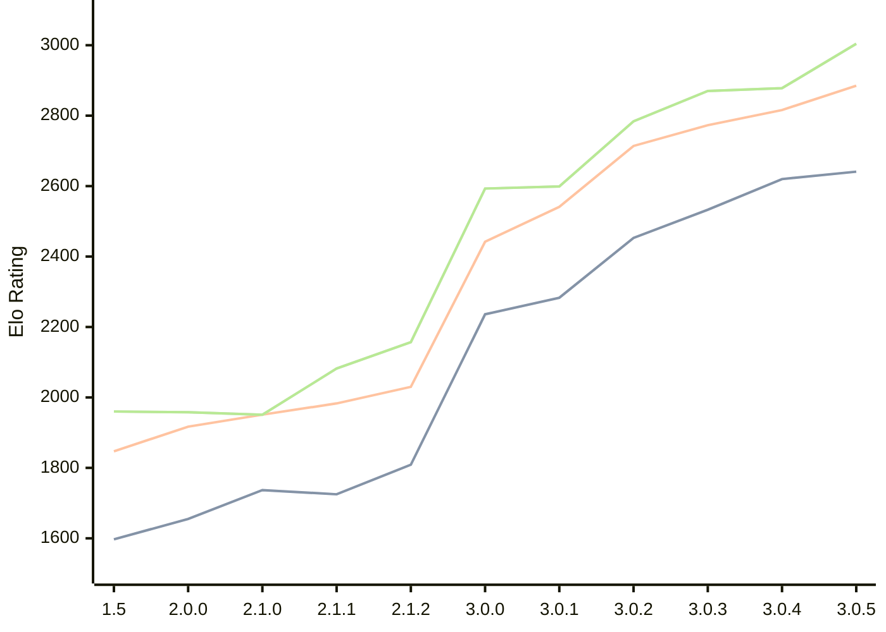

# Engine: Rudim

Author: Vishnu Bhagyanath

Home: https://github.com/znxftw/rudim

## Elo Ratings

| Version | Published | STC 8.0+0.08s  | LTC 60.0+0.60s | VLTC 2m24s+1.12s | Comment |
| --- | --- | --- | --- | --- | --- |
| 3.0.5 | 2026-07-06 | 2641(+21) | 2885(+69) | 3004(+126) |  |
| 3.0.4 | 2026-06-20 | 2620(+87) | 2816(+43) | 2878(+8) |  |
| 3.0.3 | 2026-06-18 | 2533(+80) | 2773(+59) | 2870(+86) |  |
| 3.0.2 | 2026-06-13 | 2453(+170) | 2714(+173) | 2784(+185) |  |
| 3.0.1 | 2026-06-09 | 2283(+47) | 2541(+99) | 2599(+6) |  |
| 3.0.0 | 2026-06-06 | 2236(+new) | 2442(+new) | 2593(+new) |  |
| 2.2.2 | 2026-05-29 |  |  |  |  |
| 2.2.1 | 2026-05-27 |  |  |  |  |
| 2.2.0 | 2026-05-26 |  |  |  |  |
| 2.1.3 | 2026-05-23 |  |  |  |  |
| 2.1.2 | 2026-05-20 | 1809(+84) | 2030(+47) | 2157(+75) |  |
| 2.1.1 | 2026-05-16 | 1725(-12) | 1983(+32) | 2082(+131) |  |
| 2.1.0 | 2026-05-14 | 1737(+82) | 1951(+34) | 1951(-7) |  |
| 2.0.0 | 2026-05-03 | 1655(+58) | 1917(+70) | 1958(-2) |  |
| 1.5 | 2026-04-28 | 1597 | 1847 | 1960 |  |
 | | | cElo (∆ prev) | cElo (∆ prev) | cElo (∆ prev) | 

<a href="https://github.com/computer-chess-index/cci/issues/new?template=submit-version.yml&title=[VERSION]+Rudim+<version>&body=###%20Engine%20name%0ARudim%0A%0A###%20Version%0A3.0.5" target="_blank">Submit new version</a>

 Test Conditions:

GUI/CLI: <a href=https://github.com/cutechess/cutechess target="_blank">Cute-Chess</a> 
Elo Calculation: <a href=https://www.remi-coulom.fr/Bayesian-Elo/ target="_blank">Bayesian-Elo</a> 
CPU: Intel(R) Core(TM) i5-7500T 2.70GHz 
Opening book: 8_moves_v3 
\* STC: 8.0+0.08s, LTC: 60.0+0.60s, VLTC: 2m24s+1.12s

 Lists:
Ratings: <a href=https://github.com/computer-chess-index/cci/blob/main/lists/CCIRatings.csv target="_blank">Complete list</a>

Generated: 2026-08-28 06:29:11

## Ratings Verlauf

## Detailed Evaluation Results

| Version | Time Control | Elo  | Range +/- | Matches | Score | Average Opponent Elo | Draws |
| --- | --- | --- | --- | --- | --- | --- | --- |
| 3.0.5 | VLTC (2m24s+1.12s) | 3004 | 30 | 316 | 50% | 3008 | 47% |
| 3.0.5 | LTC (60.0+0.60s) | 2885 | 30 | 336 | 50% | 2888 | 44% |
| 3.0.5 | STC (8.0+0.08s) | 2641 | 32 | 326 | 51% | 2635 | 32% |
| --- | --- | --- | --- | --- | --- | --- | --- |
| 3.0.4 | VLTC (2m24s+1.12s) | 2878 | 47 | 132 | 51% | 2869 | 45% |
| 3.0.4 | LTC (60.0+0.60s) | 2816 | 39 | 192 | 51% | 2808 | 46% |
| 3.0.4 | STC (8.0+0.08s) | 2620 | 44 | 170 | 51% | 2612 | 31% |
| --- | --- | --- | --- | --- | --- | --- | --- |
| 3.0.3 | VLTC (2m24s+1.12s) | 2870 | 38 | 208 | 53% | 2843 | 45% |
| 3.0.3 | LTC (60.0+0.60s) | 2773 | 42 | 174 | 50% | 2773 | 39% |
| 3.0.3 | STC (8.0+0.08s) | 2533 | 40 | 204 | 50% | 2529 | 30% |
| --- | --- | --- | --- | --- | --- | --- | --- |
| 3.0.2 | VLTC (2m24s+1.12s) | 2784 | 37 | 220 | 51% | 2776 | 43% |
| 3.0.2 | LTC (60.0+0.60s) | 2714 | 35 | 248 | 52% | 2699 | 46% |
| 3.0.2 | STC (8.0+0.08s) | 2453 | 38 | 220 | 51% | 2445 | 32% |
| --- | --- | --- | --- | --- | --- | --- | --- |
| 3.0.1 | VLTC (2m24s+1.12s) | 2599 | 37 | 232 | 50% | 2606 | 33% |
| 3.0.1 | LTC (60.0+0.60s) | 2541 | 36 | 252 | 51% | 2527 | 34% |
| 3.0.1 | STC (8.0+0.08s) | 2283 | 37 | 246 | 49% | 2294 | 30% |
| --- | --- | --- | --- | --- | --- | --- | --- |
| 3.0.0 | VLTC (2m24s+1.12s) | 2593 | 48 | 150 | 50% | 2597 | 26% |
| 3.0.0 | LTC (60.0+0.60s) | 2442 | 41 | 200 | 51% | 2427 | 30% |
| 3.0.0 | STC (8.0+0.08s) | 2236 | 32 | 338 | 57% | 2165 | 28% |
| --- | --- | --- | --- | --- | --- | --- | --- |
| 2.1.2 | VLTC (2m24s+1.12s) | 2157 | 35 | 274 | 51% | 2149 | 26% |
| 2.1.2 | LTC (60.0+0.60s) | 2030 | 37 | 244 | 51% | 2020 | 26% |
| 2.1.2 | STC (8.0+0.08s) | 1809 | 40 | 228 | 51% | 1797 | 21% |
| --- | --- | --- | --- | --- | --- | --- | --- |
| 2.1.1 | VLTC (2m24s+1.12s) | 2082 | 36 | 284 | 49% | 2088 | 23% |
| 2.1.1 | LTC (60.0+0.60s) | 1983 | 32 | 340 | 47% | 2001 | 26% |
| 2.1.1 | STC (8.0+0.08s) | 1725 | 37 | 264 | 48% | 1735 | 19% |
| --- | --- | --- | --- | --- | --- | --- | --- |
| 2.1.0 | VLTC (2m24s+1.12s) | 1951 | 34 | 292 | 51% | 1943 | 25% |
| 2.1.0 | LTC (60.0+0.60s) | 1951 | 34 | 288 | 50% | 1952 | 26% |
| 2.1.0 | STC (8.0+0.08s) | 1737 | 35 | 276 | 49% | 1740 | 29% |
| --- | --- | --- | --- | --- | --- | --- | --- |
| 2.0.0 | VLTC (2m24s+1.12s) | 1958 | 35 | 294 | 49% | 1968 | 19% |
| 2.0.0 | LTC (60.0+0.60s) | 1917 | 33 | 336 | 51% | 1905 | 20% |
| 2.0.0 | STC (8.0+0.08s) | 1655 | 34 | 306 | 47% | 1688 | 22% |
| --- | --- | --- | --- | --- | --- | --- | --- |
| 1.5 | VLTC (2m24s+1.12s) | 1960 | 37 | 264 | 47% | 1991 | 24% |
| 1.5 | LTC (60.0+0.60s) | 1847 | 35 | 296 | 50% | 1850 | 18% |
| 1.5 | STC (8.0+0.08s) | 1597 | 34 | 320 | 53% | 1565 | 21% |
| --- | --- | --- | --- | --- | --- | --- | --- |