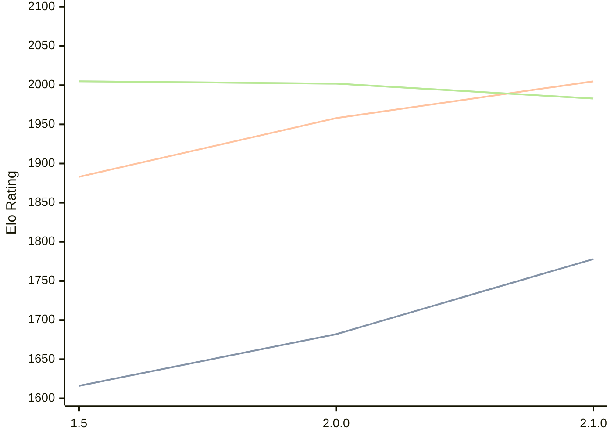

# Engine: Rudim

Author: Vishnu Bhagyanath

Home: https://github.com/znxftw/rudim

## Elo Ratings

| Version | Published | STC 8.0+0.08s  | LTC 60.0+0.60s | VLTC 2m24s+1.12s | Comment |
| --- | --- | --- | --- | --- | --- |
| 2.1.0 | 2026-05-14 | 1778(+96) | 2005(+47) | 1983(-19) |  |
| 2.0.0 | 2026-05-03 | 1682(+66) | 1958(+75) | 2002(-3) |  |
| 1.5 | 2026-04-28 | 1616(+new) | 1883(+new) | 2005(+new) |  |
| 1.4.1 | 2024-12-18 |  |  |  |  |
| 1.3 | 2024-12-05 |  |  |  |  |
| 1.2 | 2022-02-24 |  |  |  |  |
| 1.1 | 2022-02-07 |  |  |  |  |
| 1.0 | 2022-02-06 |  |  |  |  |
 | | | cElo (∆ prev) | cElo (∆ prev) | cElo (∆ prev) | 

<a href="https://github.com/computer-chess-index/cci/issues/new?template=submit-version.yml&title=[VERSION]+Rudim+<version>&body=###%20Engine%20name%0ARudim%0A%0A###%20Version%0A2.1.0" target="_blank">Submit new version</a>

 Test Conditions:

GUI/CLI: <a href=https://github.com/cutechess/cutechess target="_blank">Cute-Chess</a> 
Elo Calculation: <a href=https://www.remi-coulom.fr/Bayesian-Elo/ target="_blank">Bayesian-Elo</a> 
CPU: Intel(R) Core(TM) i5-7500T 2.70GHz 
Opening book: 8_moves_v3 
\* STC: 8.0+0.08s, LTC: 60.0+0.60s, VLTC: 2m24s+1.12s

 Lists:
Ratings: <a href=https://github.com/computer-chess-index/cci/blob/main/lists/CCIRatings.csv target="_blank">Complete list</a>

Generated: 2026-05-16 06:27:56

## Ratings Verlauf

⬛ STC (8.0+0.08s) &nbsp;&nbsp; 🟧 LTC (60.0+0.60s) &nbsp;&nbsp; 🟩 VLTC (2m24s+1.12s)

dark mode: 🟩STC (8.0+0.08s) 🟧LTC (60.0+0.60s) ⬜VLTC (2m24s+1.12s)

## Detailed Evaluation Results

| Version | Time Control | Elo  | Range +/- | Matches | Score | Average Opponent Elo | Draws |
| --- | --- | --- | --- | --- | --- | --- | --- |
| 2.1.0 | VLTC (2m24s+1.12s) | 1983 | 38 | 232 | 51% | 1970 | 25% |
| 2.1.0 | LTC (60.0+0.60s) | 2005 | 39 | 226 | 50% | 1999 | 27% |
| 2.1.0 | STC (8.0+0.08s) | 1778 | 40 | 208 | 50% | 1778 | 30% |
| --- | --- | --- | --- | --- | --- | --- | --- |
| 2.0.0 | VLTC (2m24s+1.12s) | 2002 | 35 | 294 | 49% | 2013 | 19% |
| 2.0.0 | LTC (60.0+0.60s) | 1958 | 33 | 336 | 51% | 1947 | 20% |
| 2.0.0 | STC (8.0+0.08s) | 1682 | 34 | 306 | 47% | 1715 | 22% |
| --- | --- | --- | --- | --- | --- | --- | --- |
| 1.5 | VLTC (2m24s+1.12s) | 2005 | 37 | 264 | 47% | 2036 | 24% |
| 1.5 | LTC (60.0+0.60s) | 1883 | 35 | 296 | 50% | 1887 | 18% |
| 1.5 | STC (8.0+0.08s) | 1616 | 34 | 320 | 53% | 1584 | 21% |
| --- | --- | --- | --- | --- | --- | --- | --- |