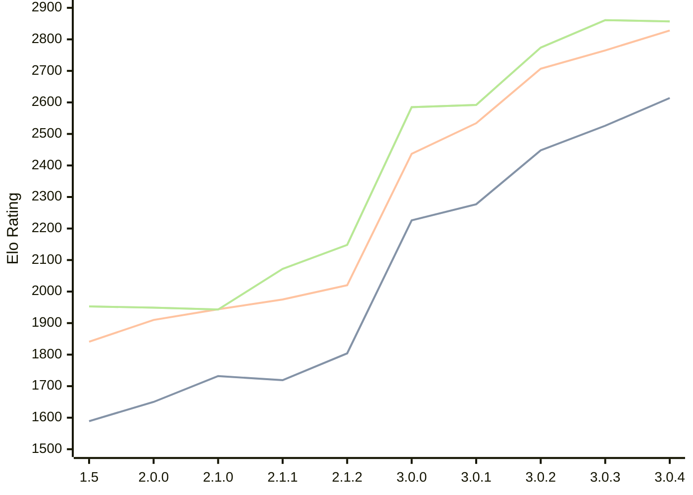

# Engine: Rudim

Author: Vishnu Bhagyanath

Home: https://github.com/znxftw/rudim

## Elo Ratings

| Version | Published | STC 8.0+0.08s  | LTC 60.0+0.60s | VLTC 2m24s+1.12s | Comment |
| --- | --- | --- | --- | --- | --- |
| 3.0.4 | 2026-06-20 | 2614(+88) | 2828(+63) | 2857(-4) |  |
| 3.0.3 | 2026-06-18 | 2526(+78) | 2765(+58) | 2861(+87) |  |
| 3.0.2 | 2026-06-13 | 2448(+171) | 2707(+173) | 2774(+182) |  |
| 3.0.1 | 2026-06-09 | 2277(+51) | 2534(+97) | 2592(+7) |  |
| 3.0.0 | 2026-06-06 | 2226(+new) | 2437(+new) | 2585(+new) |  |
| 2.2.2 | 2026-05-29 |  |  |  |  |
| 2.2.1 | 2026-05-27 |  |  |  |  |
| 2.2.0 | 2026-05-26 |  |  |  |  |
| 2.1.3 | 2026-05-23 |  |  |  |  |
| 2.1.2 | 2026-05-20 | 1804(+85) | 2020(+45) | 2148(+76) |  |
| 2.1.1 | 2026-05-16 | 1719(-13) | 1975(+31) | 2072(+129) |  |
| 2.1.0 | 2026-05-14 | 1732(+82) | 1944(+34) | 1943(-6) |  |
| 2.0.0 | 2026-05-03 | 1650(+61) | 1910(+69) | 1949(-4) |  |
| 1.5 | 2026-04-28 | 1589(+new) | 1841(+new) | 1953(+new) |  |
| 1.4.1 | 2024-12-18 |  |  |  |  |
| 1.3 | 2024-12-05 |  |  |  |  |
| 1.2 | 2022-02-24 |  |  |  |  |
| 1.1 | 2022-02-07 |  |  |  |  |
| 1.0 | 2022-02-06 |  |  |  |  |
 | | | cElo (∆ prev) | cElo (∆ prev) | cElo (∆ prev) | 

<a href="https://github.com/computer-chess-index/cci/issues/new?template=submit-version.yml&title=[VERSION]+Rudim+<version>&body=###%20Engine%20name%0ARudim%0A%0A###%20Version%0A3.0.4" target="_blank">Submit new version</a>

 Test Conditions:

GUI/CLI: <a href=https://github.com/cutechess/cutechess target="_blank">Cute-Chess</a> 
Elo Calculation: <a href=https://www.remi-coulom.fr/Bayesian-Elo/ target="_blank">Bayesian-Elo</a> 
CPU: Intel(R) Core(TM) i5-7500T 2.70GHz 
Opening book: 8_moves_v3 
\* STC: 8.0+0.08s, LTC: 60.0+0.60s, VLTC: 2m24s+1.12s

 Lists:
Ratings: <a href=https://github.com/computer-chess-index/cci/blob/main/lists/CCIRatings.csv target="_blank">Complete list</a>

Generated: 2026-06-23 06:29:19

## Ratings Verlauf

## Ratings Verlauf

⬛ STC (8.0+0.08s) &nbsp;&nbsp; 🟧 LTC (60.0+0.60s) &nbsp;&nbsp; 🟩 VLTC (2m24s+1.12s)

dark mode: 🟩STC (8.0+0.08s) 🟧LTC (60.0+0.60s) ⬜VLTC (2m24s+1.12s)

## Detailed Evaluation Results

| Version | Time Control | Elo  | Range +/- | Matches | Score | Average Opponent Elo | Draws |
| --- | --- | --- | --- | --- | --- | --- | --- |
| 3.0.4 | VLTC (2m24s+1.12s) | 2857 | 61 | 76 | 51% | 2850 | 49% |
| 3.0.4 | LTC (60.0+0.60s) | 2828 | 51 | 114 | 54% | 2793 | 46% |
| 3.0.4 | STC (8.0+0.08s) | 2614 | 50 | 128 | 52% | 2600 | 30% |
| --- | --- | --- | --- | --- | --- | --- | --- |
| 3.0.3 | VLTC (2m24s+1.12s) | 2861 | 38 | 208 | 53% | 2834 | 45% |
| 3.0.3 | LTC (60.0+0.60s) | 2765 | 42 | 174 | 50% | 2765 | 39% |
| 3.0.3 | STC (8.0+0.08s) | 2526 | 40 | 204 | 50% | 2520 | 30% |
| --- | --- | --- | --- | --- | --- | --- | --- |
| 3.0.2 | VLTC (2m24s+1.12s) | 2774 | 37 | 220 | 51% | 2768 | 43% |
| 3.0.2 | LTC (60.0+0.60s) | 2707 | 35 | 248 | 52% | 2692 | 46% |
| 3.0.2 | STC (8.0+0.08s) | 2448 | 38 | 220 | 51% | 2439 | 32% |
| --- | --- | --- | --- | --- | --- | --- | --- |
| 3.0.1 | VLTC (2m24s+1.12s) | 2592 | 37 | 232 | 50% | 2599 | 33% |
| 3.0.1 | LTC (60.0+0.60s) | 2534 | 36 | 252 | 51% | 2520 | 34% |
| 3.0.1 | STC (8.0+0.08s) | 2277 | 37 | 246 | 49% | 2287 | 30% |
| --- | --- | --- | --- | --- | --- | --- | --- |
| 3.0.0 | VLTC (2m24s+1.12s) | 2585 | 48 | 150 | 50% | 2589 | 26% |
| 3.0.0 | LTC (60.0+0.60s) | 2437 | 41 | 200 | 51% | 2422 | 30% |
| 3.0.0 | STC (8.0+0.08s) | 2226 | 32 | 338 | 57% | 2156 | 28% |
| --- | --- | --- | --- | --- | --- | --- | --- |
| 2.1.2 | VLTC (2m24s+1.12s) | 2148 | 35 | 274 | 51% | 2140 | 26% |
| 2.1.2 | LTC (60.0+0.60s) | 2020 | 37 | 244 | 51% | 2009 | 26% |
| 2.1.2 | STC (8.0+0.08s) | 1804 | 40 | 228 | 51% | 1791 | 21% |
| --- | --- | --- | --- | --- | --- | --- | --- |
| 2.1.1 | VLTC (2m24s+1.12s) | 2072 | 36 | 284 | 49% | 2079 | 23% |
| 2.1.1 | LTC (60.0+0.60s) | 1975 | 32 | 340 | 47% | 1991 | 26% |
| 2.1.1 | STC (8.0+0.08s) | 1719 | 37 | 264 | 48% | 1728 | 19% |
| --- | --- | --- | --- | --- | --- | --- | --- |
| 2.1.0 | VLTC (2m24s+1.12s) | 1943 | 34 | 292 | 51% | 1936 | 25% |
| 2.1.0 | LTC (60.0+0.60s) | 1944 | 34 | 288 | 50% | 1945 | 26% |
| 2.1.0 | STC (8.0+0.08s) | 1732 | 35 | 276 | 49% | 1735 | 29% |
| --- | --- | --- | --- | --- | --- | --- | --- |
| 2.0.0 | VLTC (2m24s+1.12s) | 1949 | 35 | 294 | 49% | 1962 | 19% |
| 2.0.0 | LTC (60.0+0.60s) | 1910 | 33 | 336 | 51% | 1899 | 20% |
| 2.0.0 | STC (8.0+0.08s) | 1650 | 34 | 306 | 47% | 1682 | 22% |
| --- | --- | --- | --- | --- | --- | --- | --- |
| 1.5 | VLTC (2m24s+1.12s) | 1953 | 37 | 264 | 47% | 1985 | 24% |
| 1.5 | LTC (60.0+0.60s) | 1841 | 35 | 296 | 50% | 1844 | 18% |
| 1.5 | STC (8.0+0.08s) | 1589 | 34 | 320 | 53% | 1558 | 21% |
| --- | --- | --- | --- | --- | --- | --- | --- |