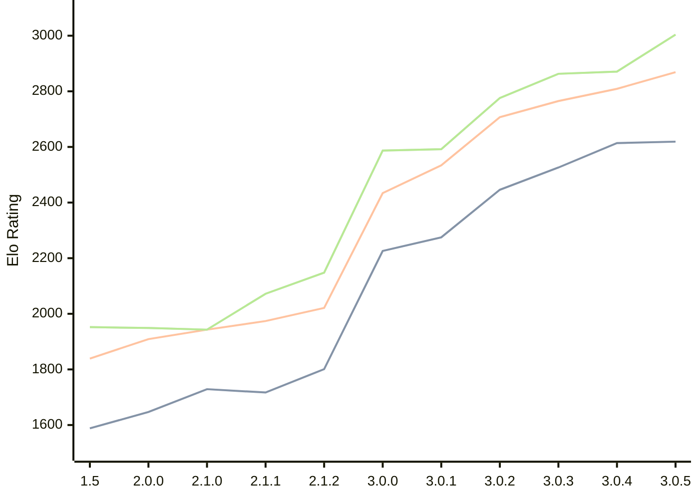

# Engine: Rudim

Author: Vishnu Bhagyanath

Home: https://github.com/znxftw/rudim

## Elo Ratings

| Version | Published | STC 8.0+0.08s  | LTC 60.0+0.60s | VLTC 2m24s+1.12s | Comment |
| --- | --- | --- | --- | --- | --- |
| 3.0.5 | 2026-07-06 | 2619(+5) | 2869(+60) | 3004(+133) |  |
| 3.0.4 | 2026-06-20 | 2614(+88) | 2809(+44) | 2871(+8) |  |
| 3.0.3 | 2026-06-18 | 2526(+80) | 2765(+58) | 2863(+87) |  |
| 3.0.2 | 2026-06-13 | 2446(+171) | 2707(+173) | 2776(+184) |  |
| 3.0.1 | 2026-06-09 | 2275(+49) | 2534(+100) | 2592(+5) |  |
| 3.0.0 | 2026-06-06 | 2226(+new) | 2434(+new) | 2587(+new) |  |
| 2.2.2 | 2026-05-29 |  |  |  |  |
| 2.2.1 | 2026-05-27 |  |  |  |  |
| 2.2.0 | 2026-05-26 |  |  |  |  |
| 2.1.3 | 2026-05-23 |  |  |  |  |
| 2.1.2 | 2026-05-20 | 1801(+84) | 2021(+47) | 2148(+76) |  |
| 2.1.1 | 2026-05-16 | 1717(-12) | 1974(+31) | 2072(+129) |  |
| 2.1.0 | 2026-05-14 | 1729(+82) | 1943(+34) | 1943(-6) |  |
| 2.0.0 | 2026-05-03 | 1647(+59) | 1909(+70) | 1949(-3) |  |
| 1.5 | 2026-04-28 | 1588 | 1839 | 1952 |  |
 | | | cElo (∆ prev) | cElo (∆ prev) | cElo (∆ prev) | 

<a href="https://github.com/computer-chess-index/cci/issues/new?template=submit-version.yml&title=[VERSION]+Rudim+<version>&body=###%20Engine%20name%0ARudim%0A%0A###%20Version%0A3.0.5" target="_blank">Submit new version</a>

 Test Conditions:

GUI/CLI: <a href=https://github.com/cutechess/cutechess target="_blank">Cute-Chess</a> 
Elo Calculation: <a href=https://www.remi-coulom.fr/Bayesian-Elo/ target="_blank">Bayesian-Elo</a> 
CPU: Intel(R) Core(TM) i5-7500T 2.70GHz 
Opening book: 8_moves_v3 
\* STC: 8.0+0.08s, LTC: 60.0+0.60s, VLTC: 2m24s+1.12s

 Lists:
Ratings: <a href=https://github.com/computer-chess-index/cci/blob/main/lists/CCIRatings.csv target="_blank">Complete list</a>

Generated: 2026-08-10 07:06:20

## Ratings Verlauf

⬛ STC (8.0+0.08s) &nbsp;&nbsp; 🟧 LTC (60.0+0.60s) &nbsp;&nbsp; 🟩 VLTC (2m24s+1.12s)

dark mode: 🟩STC (8.0+0.08s) 🟧LTC (60.0+0.60s) ⬜VLTC (2m24s+1.12s)

## Detailed Evaluation Results

| Version | Time Control | Elo  | Range +/- | Matches | Score | Average Opponent Elo | Draws |
| --- | --- | --- | --- | --- | --- | --- | --- |
| 3.0.5 | VLTC (2m24s+1.12s) | 3004 | 32 | 292 | 50% | 3001 | 46% |
| 3.0.5 | LTC (60.0+0.60s) | 2869 | 32 | 304 | 49% | 2880 | 44% |
| 3.0.5 | STC (8.0+0.08s) | 2619 | 34 | 276 | 49% | 2626 | 34% |
| --- | --- | --- | --- | --- | --- | --- | --- |
| 3.0.4 | VLTC (2m24s+1.12s) | 2871 | 47 | 132 | 51% | 2862 | 45% |
| 3.0.4 | LTC (60.0+0.60s) | 2809 | 39 | 192 | 51% | 2801 | 46% |
| 3.0.4 | STC (8.0+0.08s) | 2614 | 44 | 170 | 51% | 2606 | 31% |
| --- | --- | --- | --- | --- | --- | --- | --- |
| 3.0.3 | VLTC (2m24s+1.12s) | 2863 | 38 | 208 | 53% | 2836 | 45% |
| 3.0.3 | LTC (60.0+0.60s) | 2765 | 42 | 174 | 50% | 2765 | 39% |
| 3.0.3 | STC (8.0+0.08s) | 2526 | 40 | 204 | 50% | 2522 | 30% |
| --- | --- | --- | --- | --- | --- | --- | --- |
| 3.0.2 | VLTC (2m24s+1.12s) | 2776 | 37 | 220 | 51% | 2768 | 43% |
| 3.0.2 | LTC (60.0+0.60s) | 2707 | 35 | 248 | 52% | 2692 | 46% |
| 3.0.2 | STC (8.0+0.08s) | 2446 | 38 | 220 | 51% | 2438 | 32% |
| --- | --- | --- | --- | --- | --- | --- | --- |
| 3.0.1 | VLTC (2m24s+1.12s) | 2592 | 37 | 232 | 50% | 2599 | 33% |
| 3.0.1 | LTC (60.0+0.60s) | 2534 | 36 | 252 | 51% | 2520 | 34% |
| 3.0.1 | STC (8.0+0.08s) | 2275 | 37 | 246 | 49% | 2286 | 30% |
| --- | --- | --- | --- | --- | --- | --- | --- |
| 3.0.0 | VLTC (2m24s+1.12s) | 2587 | 48 | 150 | 50% | 2591 | 26% |
| 3.0.0 | LTC (60.0+0.60s) | 2434 | 41 | 200 | 51% | 2421 | 30% |
| 3.0.0 | STC (8.0+0.08s) | 2226 | 32 | 338 | 57% | 2156 | 28% |
| --- | --- | --- | --- | --- | --- | --- | --- |
| 2.1.2 | VLTC (2m24s+1.12s) | 2148 | 35 | 274 | 51% | 2140 | 26% |
| 2.1.2 | LTC (60.0+0.60s) | 2021 | 37 | 244 | 51% | 2010 | 26% |
| 2.1.2 | STC (8.0+0.08s) | 1801 | 40 | 228 | 51% | 1789 | 21% |
| --- | --- | --- | --- | --- | --- | --- | --- |
| 2.1.1 | VLTC (2m24s+1.12s) | 2072 | 36 | 284 | 49% | 2079 | 23% |
| 2.1.1 | LTC (60.0+0.60s) | 1974 | 32 | 340 | 47% | 1991 | 26% |
| 2.1.1 | STC (8.0+0.08s) | 1717 | 37 | 264 | 48% | 1727 | 19% |
| --- | --- | --- | --- | --- | --- | --- | --- |
| 2.1.0 | VLTC (2m24s+1.12s) | 1943 | 34 | 292 | 51% | 1935 | 25% |
| 2.1.0 | LTC (60.0+0.60s) | 1943 | 34 | 288 | 50% | 1944 | 26% |
| 2.1.0 | STC (8.0+0.08s) | 1729 | 35 | 276 | 49% | 1732 | 29% |
| --- | --- | --- | --- | --- | --- | --- | --- |
| 2.0.0 | VLTC (2m24s+1.12s) | 1949 | 35 | 294 | 49% | 1960 | 19% |
| 2.0.0 | LTC (60.0+0.60s) | 1909 | 33 | 336 | 51% | 1897 | 20% |
| 2.0.0 | STC (8.0+0.08s) | 1647 | 34 | 306 | 47% | 1679 | 22% |
| --- | --- | --- | --- | --- | --- | --- | --- |
| 1.5 | VLTC (2m24s+1.12s) | 1952 | 37 | 264 | 47% | 1983 | 24% |
| 1.5 | LTC (60.0+0.60s) | 1839 | 35 | 296 | 50% | 1841 | 18% |
| 1.5 | STC (8.0+0.08s) | 1588 | 34 | 320 | 53% | 1557 | 21% |
| --- | --- | --- | --- | --- | --- | --- | --- |