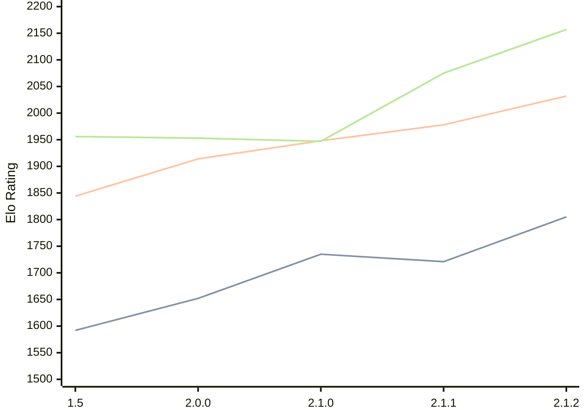

# Engine: Rudim

Author: Vishnu Bhagyanath

Home: https://github.com/znxftw/rudim

## Elo Ratings

| Version | Published | STC 8.0+0.08s  | LTC 60.0+0.60s | VLTC 2m24s+1.12s | Comment |
| --- | --- | --- | --- | --- | --- |
| 3.0.0 | 2026-06-06 |  |  |  |  |
| 2.2.2 | 2026-05-29 |  |  |  |  |
| 2.2.1 | 2026-05-27 |  |  |  |  |
| 2.2.0 | 2026-05-26 |  |  |  |  |
| 2.1.3 | 2026-05-23 |  |  |  |  |
| 2.1.2 | 2026-05-20 | 1805(+84) | 2032(+54) | 2157(+82) |  |
| 2.1.1 | 2026-05-16 | 1721(-14) | 1978(+30) | 2075(+128) |  |
| 2.1.0 | 2026-05-14 | 1735(+83) | 1948(+34) | 1947(-6) |  |
| 2.0.0 | 2026-05-03 | 1652(+60) | 1914(+70) | 1953(-3) |  |
| 1.5 | 2026-04-28 | 1592(+new) | 1844(+new) | 1956(+new) |  |
| 1.4.1 | 2024-12-18 |  |  |  |  |
| 1.3 | 2024-12-05 |  |  |  |  |
| 1.2 | 2022-02-24 |  |  |  |  |
| 1.1 | 2022-02-07 |  |  |  |  |
| 1.0 | 2022-02-06 |  |  |  |  |
 | | | cElo (∆ prev) | cElo (∆ prev) | cElo (∆ prev) | 

<a href="https://github.com/computer-chess-index/cci/issues/new?template=submit-version.yml&title=[VERSION]+Rudim+<version>&body=###%20Engine%20name%0ARudim%0A%0A###%20Version%0A3.0.0" target="_blank">Submit new version</a>

 Test Conditions:

GUI/CLI: <a href=https://github.com/cutechess/cutechess target="_blank">Cute-Chess</a> 
Elo Calculation: <a href=https://www.remi-coulom.fr/Bayesian-Elo/ target="_blank">Bayesian-Elo</a> 
CPU: Intel(R) Core(TM) i5-7500T 2.70GHz 
Opening book: 8_moves_v3 
\* STC: 8.0+0.08s, LTC: 60.0+0.60s, VLTC: 2m24s+1.12s

 Lists:
Ratings: <a href=https://github.com/computer-chess-index/cci/blob/main/lists/CCIRatings.csv target="_blank">Complete list</a>

Generated: 2026-06-07 06:27:45

## Ratings Verlauf

⬛ STC (8.0+0.08s) &nbsp;&nbsp; 🟧 LTC (60.0+0.60s) &nbsp;&nbsp; 🟩 VLTC (2m24s+1.12s)

dark mode: 🟩STC (8.0+0.08s) 🟧LTC (60.0+0.60s) ⬜VLTC (2m24s+1.12s)

## Detailed Evaluation Results

| Version | Time Control | Elo  | Range +/- | Matches | Score | Average Opponent Elo | Draws |
| --- | --- | --- | --- | --- | --- | --- | --- |
| 2.1.2 | VLTC (2m24s+1.12s) | 2157 | 36 | 266 | 52% | 2140 | 26% |
| 2.1.2 | LTC (60.0+0.60s) | 2032 | 39 | 224 | 52% | 2012 | 25% |
| 2.1.2 | STC (8.0+0.08s) | 1805 | 42 | 196 | 51% | 1796 | 22% |
| --- | --- | --- | --- | --- | --- | --- | --- |
| 2.1.1 | VLTC (2m24s+1.12s) | 2075 | 36 | 284 | 49% | 2082 | 23% |
| 2.1.1 | LTC (60.0+0.60s) | 1978 | 32 | 340 | 47% | 1994 | 26% |
| 2.1.1 | STC (8.0+0.08s) | 1721 | 37 | 264 | 48% | 1731 | 19% |
| --- | --- | --- | --- | --- | --- | --- | --- |
| 2.1.0 | VLTC (2m24s+1.12s) | 1947 | 34 | 292 | 51% | 1939 | 25% |
| 2.1.0 | LTC (60.0+0.60s) | 1948 | 34 | 288 | 50% | 1949 | 26% |
| 2.1.0 | STC (8.0+0.08s) | 1735 | 35 | 276 | 49% | 1737 | 29% |
| --- | --- | --- | --- | --- | --- | --- | --- |
| 2.0.0 | VLTC (2m24s+1.12s) | 1953 | 35 | 294 | 49% | 1964 | 19% |
| 2.0.0 | LTC (60.0+0.60s) | 1914 | 33 | 336 | 51% | 1902 | 20% |
| 2.0.0 | STC (8.0+0.08s) | 1652 | 34 | 306 | 47% | 1685 | 22% |
| --- | --- | --- | --- | --- | --- | --- | --- |
| 1.5 | VLTC (2m24s+1.12s) | 1956 | 37 | 264 | 47% | 1987 | 24% |
| 1.5 | LTC (60.0+0.60s) | 1844 | 35 | 296 | 50% | 1847 | 18% |
| 1.5 | STC (8.0+0.08s) | 1592 | 34 | 320 | 53% | 1561 | 21% |
| --- | --- | --- | --- | --- | --- | --- | --- |