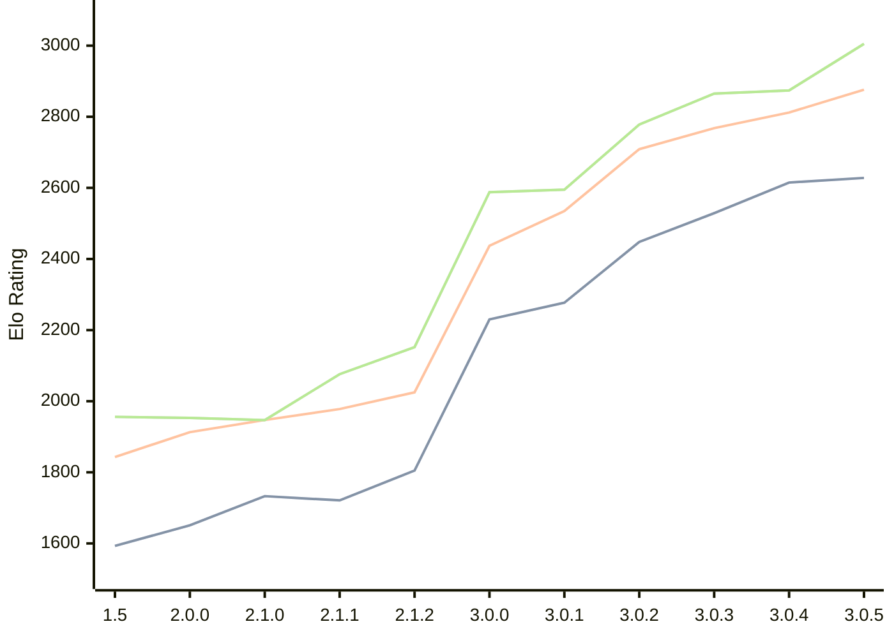

# Engine: Rudim

Author: Vishnu Bhagyanath

Home: https://github.com/znxftw/rudim

## Elo Ratings

| Version | Published | STC 8.0+0.08s  | LTC 60.0+0.60s | VLTC 2m24s+1.12s | Comment |
| --- | --- | --- | --- | --- | --- |
| 3.0.5 | 2026-07-06 | 2628(+13) | 2876(+64) | 3005(+131) |  |
| 3.0.4 | 2026-06-20 | 2615(+86) | 2812(+44) | 2874(+9) |  |
| 3.0.3 | 2026-06-18 | 2529(+81) | 2768(+59) | 2865(+87) |  |
| 3.0.2 | 2026-06-13 | 2448(+171) | 2709(+174) | 2778(+183) |  |
| 3.0.1 | 2026-06-09 | 2277(+47) | 2535(+98) | 2595(+7) |  |
| 3.0.0 | 2026-06-06 | 2230(+new) | 2437(+new) | 2588(+new) |  |
| 2.2.2 | 2026-05-29 |  |  |  |  |
| 2.2.1 | 2026-05-27 |  |  |  |  |
| 2.2.0 | 2026-05-26 |  |  |  |  |
| 2.1.3 | 2026-05-23 |  |  |  |  |
| 2.1.2 | 2026-05-20 | 1805(+84) | 2025(+47) | 2152(+76) |  |
| 2.1.1 | 2026-05-16 | 1721(-12) | 1978(+31) | 2076(+129) |  |
| 2.1.0 | 2026-05-14 | 1733(+82) | 1947(+34) | 1947(-6) |  |
| 2.0.0 | 2026-05-03 | 1651(+58) | 1913(+70) | 1953(-3) |  |
| 1.5 | 2026-04-28 | 1593 | 1843 | 1956 |  |
 | | | cElo (∆ prev) | cElo (∆ prev) | cElo (∆ prev) | 

<a href="https://github.com/computer-chess-index/cci/issues/new?template=submit-version.yml&title=[VERSION]+Rudim+<version>&body=###%20Engine%20name%0ARudim%0A%0A###%20Version%0A3.0.5" target="_blank">Submit new version</a>

 Test Conditions:

GUI/CLI: <a href=https://github.com/cutechess/cutechess target="_blank">Cute-Chess</a> 
Elo Calculation: <a href=https://www.remi-coulom.fr/Bayesian-Elo/ target="_blank">Bayesian-Elo</a> 
CPU: Intel(R) Core(TM) i5-7500T 2.70GHz 
Opening book: 8_moves_v3 
\* STC: 8.0+0.08s, LTC: 60.0+0.60s, VLTC: 2m24s+1.12s

 Lists:
Ratings: <a href=https://github.com/computer-chess-index/cci/blob/main/lists/CCIRatings.csv target="_blank">Complete list</a>

Generated: 2026-08-19 06:29:03

## Ratings Verlauf

⬛ STC (8.0+0.08s) &nbsp;&nbsp; 🟧 LTC (60.0+0.60s) &nbsp;&nbsp; 🟩 VLTC (2m24s+1.12s)

dark mode: 🟩STC (8.0+0.08s) 🟧LTC (60.0+0.60s) ⬜VLTC (2m24s+1.12s)

## Detailed Evaluation Results

| Version | Time Control | Elo  | Range +/- | Matches | Score | Average Opponent Elo | Draws |
| --- | --- | --- | --- | --- | --- | --- | --- |
| 3.0.5 | VLTC (2m24s+1.12s) | 3005 | 31 | 296 | 50% | 3004 | 46% |
| 3.0.5 | LTC (60.0+0.60s) | 2876 | 31 | 316 | 50% | 2882 | 43% |
| 3.0.5 | STC (8.0+0.08s) | 2628 | 33 | 292 | 50% | 2628 | 34% |
| --- | --- | --- | --- | --- | --- | --- | --- |
| 3.0.4 | VLTC (2m24s+1.12s) | 2874 | 47 | 132 | 51% | 2863 | 45% |
| 3.0.4 | LTC (60.0+0.60s) | 2812 | 39 | 192 | 51% | 2804 | 46% |
| 3.0.4 | STC (8.0+0.08s) | 2615 | 44 | 170 | 51% | 2608 | 31% |
| --- | --- | --- | --- | --- | --- | --- | --- |
| 3.0.3 | VLTC (2m24s+1.12s) | 2865 | 38 | 208 | 53% | 2839 | 45% |
| 3.0.3 | LTC (60.0+0.60s) | 2768 | 42 | 174 | 50% | 2768 | 39% |
| 3.0.3 | STC (8.0+0.08s) | 2529 | 40 | 204 | 50% | 2523 | 30% |
| --- | --- | --- | --- | --- | --- | --- | --- |
| 3.0.2 | VLTC (2m24s+1.12s) | 2778 | 37 | 220 | 51% | 2770 | 43% |
| 3.0.2 | LTC (60.0+0.60s) | 2709 | 35 | 248 | 52% | 2695 | 46% |
| 3.0.2 | STC (8.0+0.08s) | 2448 | 38 | 220 | 51% | 2439 | 32% |
| --- | --- | --- | --- | --- | --- | --- | --- |
| 3.0.1 | VLTC (2m24s+1.12s) | 2595 | 37 | 232 | 50% | 2601 | 33% |
| 3.0.1 | LTC (60.0+0.60s) | 2535 | 36 | 252 | 51% | 2522 | 34% |
| 3.0.1 | STC (8.0+0.08s) | 2277 | 37 | 246 | 49% | 2288 | 30% |
| --- | --- | --- | --- | --- | --- | --- | --- |
| 3.0.0 | VLTC (2m24s+1.12s) | 2588 | 48 | 150 | 50% | 2592 | 26% |
| 3.0.0 | LTC (60.0+0.60s) | 2437 | 41 | 200 | 51% | 2422 | 30% |
| 3.0.0 | STC (8.0+0.08s) | 2230 | 32 | 338 | 57% | 2160 | 28% |
| --- | --- | --- | --- | --- | --- | --- | --- |
| 2.1.2 | VLTC (2m24s+1.12s) | 2152 | 35 | 274 | 51% | 2144 | 26% |
| 2.1.2 | LTC (60.0+0.60s) | 2025 | 37 | 244 | 51% | 2014 | 26% |
| 2.1.2 | STC (8.0+0.08s) | 1805 | 40 | 228 | 51% | 1793 | 21% |
| --- | --- | --- | --- | --- | --- | --- | --- |
| 2.1.1 | VLTC (2m24s+1.12s) | 2076 | 36 | 284 | 49% | 2083 | 23% |
| 2.1.1 | LTC (60.0+0.60s) | 1978 | 32 | 340 | 47% | 1995 | 26% |
| 2.1.1 | STC (8.0+0.08s) | 1721 | 37 | 264 | 48% | 1731 | 19% |
| --- | --- | --- | --- | --- | --- | --- | --- |
| 2.1.0 | VLTC (2m24s+1.12s) | 1947 | 34 | 292 | 51% | 1939 | 25% |
| 2.1.0 | LTC (60.0+0.60s) | 1947 | 34 | 288 | 50% | 1948 | 26% |
| 2.1.0 | STC (8.0+0.08s) | 1733 | 35 | 276 | 49% | 1736 | 29% |
| --- | --- | --- | --- | --- | --- | --- | --- |
| 2.0.0 | VLTC (2m24s+1.12s) | 1953 | 35 | 294 | 49% | 1964 | 19% |
| 2.0.0 | LTC (60.0+0.60s) | 1913 | 33 | 336 | 51% | 1901 | 20% |
| 2.0.0 | STC (8.0+0.08s) | 1651 | 34 | 306 | 47% | 1683 | 22% |
| --- | --- | --- | --- | --- | --- | --- | --- |
| 1.5 | VLTC (2m24s+1.12s) | 1956 | 37 | 264 | 47% | 1987 | 24% |
| 1.5 | LTC (60.0+0.60s) | 1843 | 35 | 296 | 50% | 1845 | 18% |
| 1.5 | STC (8.0+0.08s) | 1593 | 34 | 320 | 53% | 1561 | 21% |
| --- | --- | --- | --- | --- | --- | --- | --- |