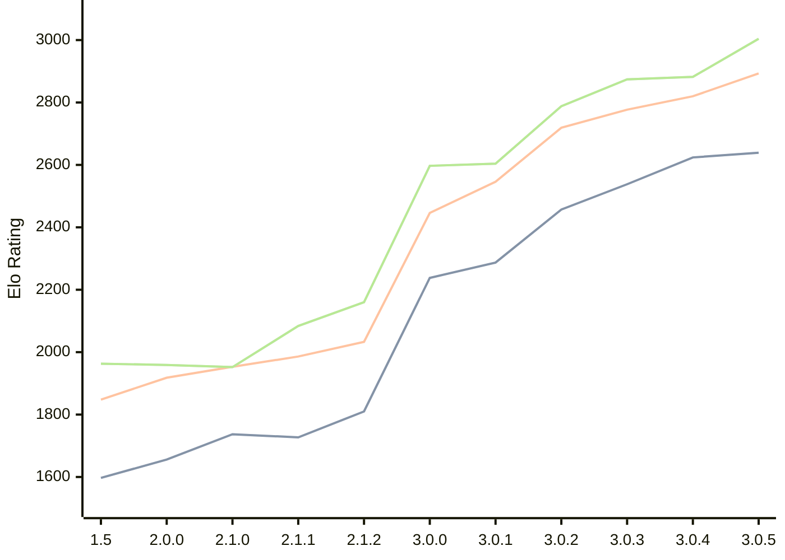

# Engine: Rudim

Author: Vishnu Bhagyanath

Home: https://github.com/znxftw/rudim

## Elo Ratings

| Version | Published | STC 8.0+0.08s  | LTC 60.0+0.60s | VLTC 2m24s+1.12s | Comment |
| --- | --- | --- | --- | --- | --- |
| 3.0.5 | 2026-07-06 | 2639(+15) | 2893(+73) | 3004(+122) |  |
| 3.0.4 | 2026-06-20 | 2624(+86) | 2820(+43) | 2882(+8) |  |
| 3.0.3 | 2026-06-18 | 2538(+81) | 2777(+58) | 2874(+86) |  |
| 3.0.2 | 2026-06-13 | 2457(+170) | 2719(+173) | 2788(+184) |  |
| 3.0.1 | 2026-06-09 | 2287(+49) | 2546(+100) | 2604(+7) |  |
| 3.0.0 | 2026-06-06 | 2238(+new) | 2446(+new) | 2597(+new) |  |
| 2.2.2 | 2026-05-29 |  |  |  |  |
| 2.2.1 | 2026-05-27 |  |  |  |  |
| 2.2.0 | 2026-05-26 |  |  |  |  |
| 2.1.3 | 2026-05-23 |  |  |  |  |
| 2.1.2 | 2026-05-20 | 1810(+83) | 2033(+47) | 2160(+76) |  |
| 2.1.1 | 2026-05-16 | 1727(-10) | 1986(+33) | 2084(+132) |  |
| 2.1.0 | 2026-05-14 | 1737(+81) | 1953(+35) | 1952(-7) |  |
| 2.0.0 | 2026-05-03 | 1656(+59) | 1918(+70) | 1959(-4) |  |
| 1.5 | 2026-04-28 | 1597 | 1848 | 1963 |  |
 | | | cElo (∆ prev) | cElo (∆ prev) | cElo (∆ prev) | 

<a href="https://github.com/computer-chess-index/cci/issues/new?template=submit-version.yml&title=[VERSION]+Rudim+<version>&body=###%20Engine%20name%0ARudim%0A%0A###%20Version%0A3.0.5" target="_blank">Submit new version</a>

 Test Conditions:

GUI/CLI: <a href=https://github.com/cutechess/cutechess target="_blank">Cute-Chess</a> 
Elo Calculation: <a href=https://www.remi-coulom.fr/Bayesian-Elo/ target="_blank">Bayesian-Elo</a> 
CPU: Intel(R) Core(TM) i5-7500T 2.70GHz 
Opening book: 8_moves_v3 
\* STC: 8.0+0.08s, LTC: 60.0+0.60s, VLTC: 2m24s+1.12s

 Lists:
Ratings: <a href=https://github.com/computer-chess-index/cci/blob/main/lists/CCIRatings.csv target="_blank">Complete list</a>

Generated: 2026-09-15 04:42:06

## Ratings Verlauf

## Detailed Evaluation Results

| Version | Time Control | Elo  | Range +/- | Matches | Score | Average Opponent Elo | Draws |
| --- | --- | --- | --- | --- | --- | --- | --- |
| 3.0.5 | VLTC (2m24s+1.12s) | 3004 | 28 | 372 | 49% | 3015 | 47% |
| 3.0.5 | LTC (60.0+0.60s) | 2893 | 29 | 368 | 50% | 2892 | 44% |
| 3.0.5 | STC (8.0+0.08s) | 2639 | 30 | 362 | 50% | 2638 | 31% |
| --- | --- | --- | --- | --- | --- | --- | --- |
| 3.0.4 | VLTC (2m24s+1.12s) | 2882 | 47 | 132 | 51% | 2873 | 45% |
| 3.0.4 | LTC (60.0+0.60s) | 2820 | 39 | 192 | 51% | 2812 | 46% |
| 3.0.4 | STC (8.0+0.08s) | 2624 | 44 | 170 | 51% | 2616 | 31% |
| --- | --- | --- | --- | --- | --- | --- | --- |
| 3.0.3 | VLTC (2m24s+1.12s) | 2874 | 38 | 208 | 53% | 2847 | 45% |
| 3.0.3 | LTC (60.0+0.60s) | 2777 | 42 | 174 | 50% | 2777 | 39% |
| 3.0.3 | STC (8.0+0.08s) | 2538 | 40 | 204 | 50% | 2533 | 30% |
| --- | --- | --- | --- | --- | --- | --- | --- |
| 3.0.2 | VLTC (2m24s+1.12s) | 2788 | 37 | 220 | 51% | 2780 | 43% |
| 3.0.2 | LTC (60.0+0.60s) | 2719 | 35 | 248 | 52% | 2704 | 46% |
| 3.0.2 | STC (8.0+0.08s) | 2457 | 38 | 220 | 51% | 2449 | 32% |
| --- | --- | --- | --- | --- | --- | --- | --- |
| 3.0.1 | VLTC (2m24s+1.12s) | 2604 | 37 | 232 | 50% | 2611 | 33% |
| 3.0.1 | LTC (60.0+0.60s) | 2546 | 36 | 252 | 51% | 2531 | 34% |
| 3.0.1 | STC (8.0+0.08s) | 2287 | 37 | 246 | 49% | 2296 | 30% |
| --- | --- | --- | --- | --- | --- | --- | --- |
| 3.0.0 | VLTC (2m24s+1.12s) | 2597 | 48 | 150 | 50% | 2601 | 26% |
| 3.0.0 | LTC (60.0+0.60s) | 2446 | 41 | 200 | 51% | 2431 | 30% |
| 3.0.0 | STC (8.0+0.08s) | 2238 | 32 | 338 | 57% | 2168 | 28% |
| --- | --- | --- | --- | --- | --- | --- | --- |
| 2.1.2 | VLTC (2m24s+1.12s) | 2160 | 35 | 274 | 51% | 2152 | 26% |
| 2.1.2 | LTC (60.0+0.60s) | 2033 | 37 | 244 | 51% | 2022 | 26% |
| 2.1.2 | STC (8.0+0.08s) | 1810 | 40 | 228 | 51% | 1798 | 21% |
| --- | --- | --- | --- | --- | --- | --- | --- |
| 2.1.1 | VLTC (2m24s+1.12s) | 2084 | 36 | 284 | 49% | 2093 | 23% |
| 2.1.1 | LTC (60.0+0.60s) | 1986 | 32 | 340 | 47% | 2003 | 26% |
| 2.1.1 | STC (8.0+0.08s) | 1727 | 37 | 264 | 48% | 1736 | 19% |
| --- | --- | --- | --- | --- | --- | --- | --- |
| 2.1.0 | VLTC (2m24s+1.12s) | 1952 | 34 | 292 | 51% | 1945 | 25% |
| 2.1.0 | LTC (60.0+0.60s) | 1953 | 34 | 288 | 50% | 1955 | 26% |
| 2.1.0 | STC (8.0+0.08s) | 1737 | 35 | 276 | 49% | 1742 | 29% |
| --- | --- | --- | --- | --- | --- | --- | --- |
| 2.0.0 | VLTC (2m24s+1.12s) | 1959 | 35 | 294 | 49% | 1971 | 19% |
| 2.0.0 | LTC (60.0+0.60s) | 1918 | 33 | 336 | 51% | 1906 | 20% |
| 2.0.0 | STC (8.0+0.08s) | 1656 | 34 | 306 | 47% | 1689 | 22% |
| --- | --- | --- | --- | --- | --- | --- | --- |
| 1.5 | VLTC (2m24s+1.12s) | 1963 | 37 | 264 | 47% | 1994 | 24% |
| 1.5 | LTC (60.0+0.60s) | 1848 | 35 | 296 | 50% | 1851 | 18% |
| 1.5 | STC (8.0+0.08s) | 1597 | 34 | 320 | 53% | 1566 | 21% |
| --- | --- | --- | --- | --- | --- | --- | --- |