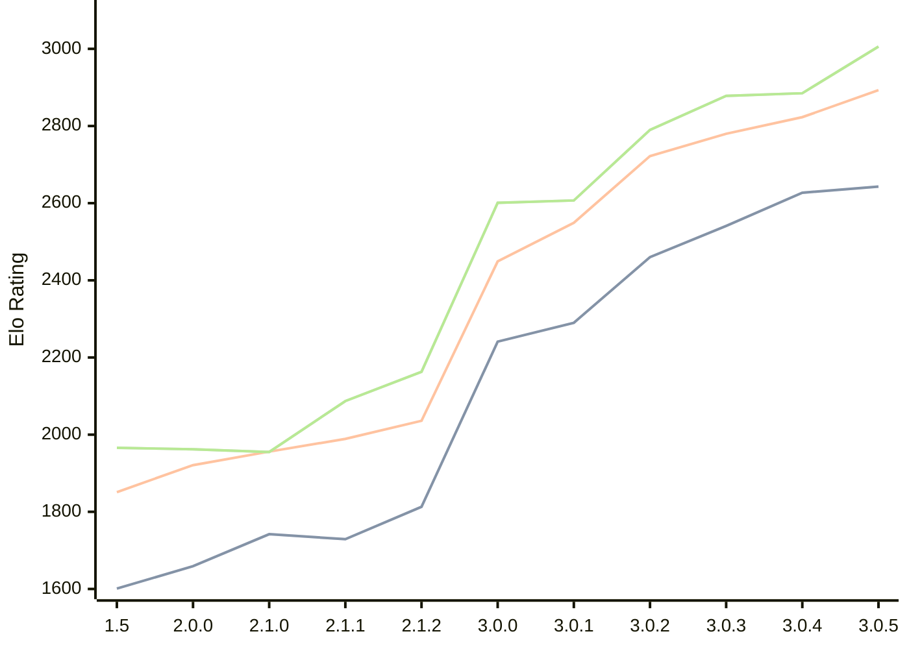

# Engine: Rudim

Author: Vishnu Bhagyanath

Home: https://github.com/znxftw/rudim

## Elo Ratings

| Version | Published | STC 8.0+0.08s  | LTC 60.0+0.60s | VLTC 2m24s+1.12s | Comment |
| --- | --- | --- | --- | --- | --- |
| 3.0.5 | 2026-07-06 | 2643(+16) | 2893(+70) | 3006(+121) |  |
| 3.0.4 | 2026-06-20 | 2627(+86) | 2823(+43) | 2885(+7) |  |
| 3.0.3 | 2026-06-18 | 2541(+81) | 2780(+58) | 2878(+88) |  |
| 3.0.2 | 2026-06-13 | 2460(+170) | 2722(+173) | 2790(+183) |  |
| 3.0.1 | 2026-06-09 | 2290(+49) | 2549(+100) | 2607(+6) |  |
| 3.0.0 | 2026-06-06 | 2241(+new) | 2449(+new) | 2601(+new) |  |
| 2.2.2 | 2026-05-29 |  |  |  |  |
| 2.2.1 | 2026-05-27 |  |  |  |  |
| 2.2.0 | 2026-05-26 |  |  |  |  |
| 2.1.3 | 2026-05-23 |  |  |  |  |
| 2.1.2 | 2026-05-20 | 1813(+84) | 2036(+47) | 2163(+76) |  |
| 2.1.1 | 2026-05-16 | 1729(-13) | 1989(+33) | 2087(+132) |  |
| 2.1.0 | 2026-05-14 | 1742(+83) | 1956(+35) | 1955(-7) |  |
| 2.0.0 | 2026-05-03 | 1659(+58) | 1921(+70) | 1962(-4) |  |
| 1.5 | 2026-04-28 | 1601 | 1851 | 1966 |  |
 | | | cElo (∆ prev) | cElo (∆ prev) | cElo (∆ prev) | 

<a href="https://github.com/computer-chess-index/cci/issues/new?template=submit-version.yml&title=[VERSION]+Rudim+<version>&body=###%20Engine%20name%0ARudim%0A%0A###%20Version%0A3.0.5" target="_blank">Submit new version</a>

 Test Conditions:

GUI/CLI: <a href=https://github.com/cutechess/cutechess target="_blank">Cute-Chess</a> 
Elo Calculation: <a href=https://www.remi-coulom.fr/Bayesian-Elo/ target="_blank">Bayesian-Elo</a> 
CPU: Intel(R) Core(TM) i5-7500T 2.70GHz 
Opening book: 8_moves_v3 
\* STC: 8.0+0.08s, LTC: 60.0+0.60s, VLTC: 2m24s+1.12s

 Lists:
Ratings: <a href=https://github.com/computer-chess-index/cci/blob/main/lists/CCIRatings.csv target="_blank">Complete list</a>

Generated: 2026-09-24 04:42:02

## Ratings Verlauf

## Detailed Evaluation Results

| Version | Time Control | Elo  | Range +/- | Matches | Score | Average Opponent Elo | Draws |
| --- | --- | --- | --- | --- | --- | --- | --- |
| 3.0.5 | VLTC (2m24s+1.12s) | 3006 | 27 | 390 | 48% | 3019 | 47% |
| 3.0.5 | LTC (60.0+0.60s) | 2893 | 28 | 376 | 50% | 2896 | 44% |
| 3.0.5 | STC (8.0+0.08s) | 2643 | 30 | 374 | 50% | 2642 | 31% |
| --- | --- | --- | --- | --- | --- | --- | --- |
| 3.0.4 | VLTC (2m24s+1.12s) | 2885 | 47 | 132 | 51% | 2876 | 45% |
| 3.0.4 | LTC (60.0+0.60s) | 2823 | 39 | 192 | 51% | 2815 | 46% |
| 3.0.4 | STC (8.0+0.08s) | 2627 | 44 | 170 | 51% | 2620 | 31% |
| --- | --- | --- | --- | --- | --- | --- | --- |
| 3.0.3 | VLTC (2m24s+1.12s) | 2878 | 38 | 208 | 53% | 2851 | 45% |
| 3.0.3 | LTC (60.0+0.60s) | 2780 | 42 | 174 | 50% | 2780 | 39% |
| 3.0.3 | STC (8.0+0.08s) | 2541 | 40 | 204 | 50% | 2535 | 30% |
| --- | --- | --- | --- | --- | --- | --- | --- |
| 3.0.2 | VLTC (2m24s+1.12s) | 2790 | 37 | 220 | 51% | 2782 | 43% |
| 3.0.2 | LTC (60.0+0.60s) | 2722 | 35 | 248 | 52% | 2707 | 46% |
| 3.0.2 | STC (8.0+0.08s) | 2460 | 38 | 220 | 51% | 2452 | 32% |
| --- | --- | --- | --- | --- | --- | --- | --- |
| 3.0.1 | VLTC (2m24s+1.12s) | 2607 | 37 | 232 | 50% | 2614 | 33% |
| 3.0.1 | LTC (60.0+0.60s) | 2549 | 36 | 252 | 51% | 2535 | 34% |
| 3.0.1 | STC (8.0+0.08s) | 2290 | 37 | 246 | 49% | 2299 | 30% |
| --- | --- | --- | --- | --- | --- | --- | --- |
| 3.0.0 | VLTC (2m24s+1.12s) | 2601 | 48 | 150 | 50% | 2606 | 26% |
| 3.0.0 | LTC (60.0+0.60s) | 2449 | 41 | 200 | 51% | 2434 | 30% |
| 3.0.0 | STC (8.0+0.08s) | 2241 | 32 | 338 | 57% | 2171 | 28% |
| --- | --- | --- | --- | --- | --- | --- | --- |
| 2.1.2 | VLTC (2m24s+1.12s) | 2163 | 35 | 274 | 51% | 2155 | 26% |
| 2.1.2 | LTC (60.0+0.60s) | 2036 | 37 | 244 | 51% | 2025 | 26% |
| 2.1.2 | STC (8.0+0.08s) | 1813 | 40 | 228 | 51% | 1801 | 21% |
| --- | --- | --- | --- | --- | --- | --- | --- |
| 2.1.1 | VLTC (2m24s+1.12s) | 2087 | 36 | 284 | 49% | 2095 | 23% |
| 2.1.1 | LTC (60.0+0.60s) | 1989 | 32 | 340 | 47% | 2006 | 26% |
| 2.1.1 | STC (8.0+0.08s) | 1729 | 37 | 264 | 48% | 1739 | 19% |
| --- | --- | --- | --- | --- | --- | --- | --- |
| 2.1.0 | VLTC (2m24s+1.12s) | 1955 | 34 | 292 | 51% | 1948 | 25% |
| 2.1.0 | LTC (60.0+0.60s) | 1956 | 34 | 288 | 50% | 1958 | 26% |
| 2.1.0 | STC (8.0+0.08s) | 1742 | 35 | 276 | 49% | 1744 | 29% |
| --- | --- | --- | --- | --- | --- | --- | --- |
| 2.0.0 | VLTC (2m24s+1.12s) | 1962 | 35 | 294 | 49% | 1974 | 19% |
| 2.0.0 | LTC (60.0+0.60s) | 1921 | 33 | 336 | 51% | 1909 | 20% |
| 2.0.0 | STC (8.0+0.08s) | 1659 | 34 | 306 | 47% | 1692 | 22% |
| --- | --- | --- | --- | --- | --- | --- | --- |
| 1.5 | VLTC (2m24s+1.12s) | 1966 | 37 | 264 | 47% | 1997 | 24% |
| 1.5 | LTC (60.0+0.60s) | 1851 | 35 | 296 | 50% | 1854 | 18% |
| 1.5 | STC (8.0+0.08s) | 1601 | 34 | 320 | 53% | 1569 | 21% |
| --- | --- | --- | --- | --- | --- | --- | --- |