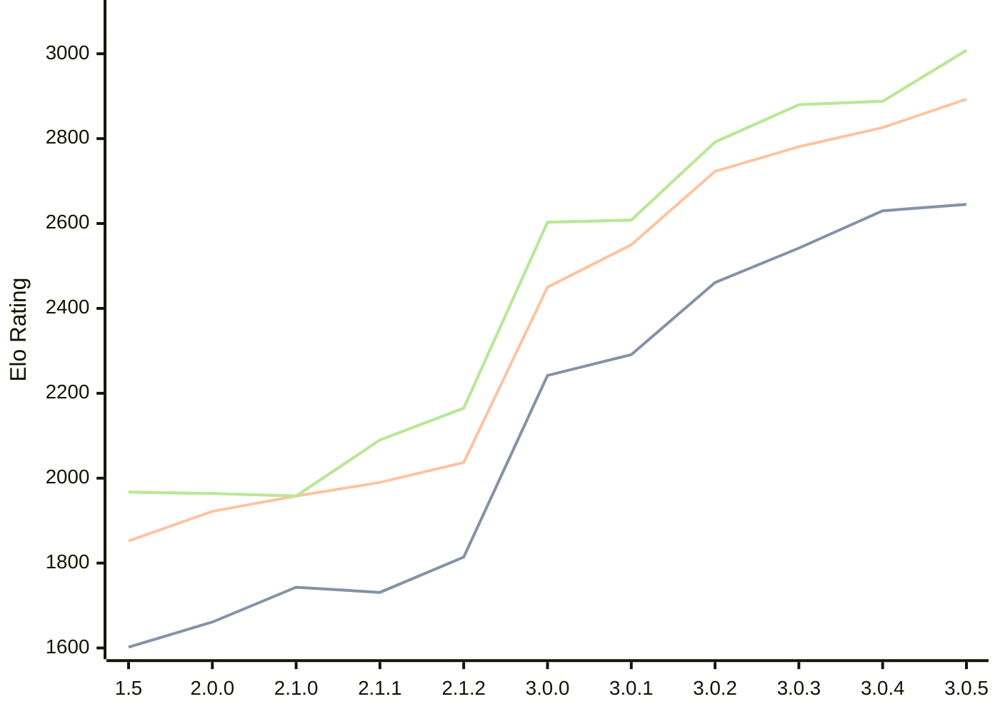

# Engine: Rudim

Author: Vishnu Bhagyanath

Home: https://github.com/znxftw/rudim

## Elo Ratings E1

| Version | Published | STC 8.0+0.08s  | LTC 60.0+0.60s | VLTC 2m24s+1.12s | Comment |
| --- | --- | --- | --- | --- | --- |
| 3.0.5 | 2026-07-06 | 2569 | 2846 | 2900 |  |
 | | | cElo (∆ prev) | cElo (∆ prev) | cElo (∆ prev) | 

## Elo Ratings P1

| Version | Published | STC 8.0+0.08s  | LTC 60.0+0.60s | VLTC 2m24s+1.12s | Comment |
| --- | --- | --- | --- | --- | --- |
| 3.0.5 | 2026-07-06 | 2816 | 3038 | 3151 |  |
 | | | cElo (∆ prev) | cElo (∆ prev) | cElo (∆ prev) | 

## Elo Ratings T1

| Version | Published | STC 8.0+0.08s  | LTC 60.0+0.60s | VLTC 2m24s+1.12s | Comment |
| --- | --- | --- | --- | --- | --- |
| 3.0.5 | 2026-07-06 | 2645(+15) | 2893(+67) | 3008(+120) |  |
| 3.0.4 | 2026-06-20 | 2630(+88) | 2826(+45) | 2888(+8) |  |
| 3.0.3 | 2026-06-18 | 2542(+81) | 2781(+58) | 2880(+88) |  |
| 3.0.2 | 2026-06-13 | 2461(+170) | 2723(+173) | 2792(+184) |  |
| 3.0.1 | 2026-06-09 | 2291(+49) | 2550(+100) | 2608(+5) |  |
| 3.0.0 | 2026-06-06 | 2242(+428) | 2450(+413) | 2603(+438) |  |
| 2.1.2 | 2026-05-20 | 1814(+83) | 2037(+47) | 2165(+75) |  |
| 2.1.1 | 2026-05-16 | 1731(-12) | 1990(+32) | 2090(+132) |  |
| 2.1.0 | 2026-05-14 | 1743(+82) | 1958(+36) | 1958(-6) |  |
| 2.0.0 | 2026-05-03 | 1661(+59) | 1922(+70) | 1964(-3) |  |
| 1.5 | 2026-04-28 | 1602 | 1852 | 1967 |  |
 | | | cElo (∆ prev) | cElo (∆ prev) | cElo (∆ prev) | 

<a href="https://github.com/computer-chess-index/cci/issues/new?template=submit-version.yml&title=[VERSION]+Rudim+<version>&body=###%20Engine%20name%0ARudim%0A%0A###%20Version%0A3.0.5" target="_blank">Submit new version</a>

 Test Conditions:

GUI/CLI: <a href=https://github.com/cutechess/cutechess target="_blank">Cute-Chess</a> 
Elo Calculation: <a href=https://www.remi-coulom.fr/Bayesian-Elo/ target="_blank">Bayesian-Elo</a> 
CPU for P1: Intel(R) Core(TM) Ultra 7 265T (1.50 GHz) - P-Core 
CPU for E1: Intel(R) Core(TM) Ultra 7 265T (1.50 GHz) - E-Core 
CPU for T1: Intel(R) Core(TM) i5-7500T 2.70GHz 
Opening book: 8_moves_v3 
\* STC: 8.0+0.08s, LTC: 60.0+0.60s, VLTC: 2m24s+1.12s

 Lists:
Ratings: <a href=https://github.com/computer-chess-index/cci/blob/main/lists/CCIRatings.csv target="_blank">Complete list</a>

Generated: 2026-10-10 04:42:17

## Ratings Verlauf

```mermaid
%%{init: {"theme":"base","themeVariables":{"seriesColors:['#a3a3a3','#222221','#faa371']}}}%%
xychart-beta
  x-axis ["1.5", "2.0.0", "2.1.0", "2.1.1", "2.1.2", "3.0.0", "3.0.1", "3.0.2", "3.0.3", "3.0.4", "3.0.5"]
  y-axis "Elo Rating" 1600 --> 3100
  line "" [1602, 1661, 1743, 1731, 1814, 2242, 2291, 2461, 2542, 2630, 2645]
  line "STC (8.0+0.08s)" [1602, 1661, 1743, 1731, 1814, 2242, 2291, 2461, 2542, 2630, 2645]
  line "LTC (60.0+0.60s)" [1852, 1922, 1958, 1990, 2037, 2450, 2550, 2723, 2781, 2826, 2893]
  line "" [1967, 1964, 1958, 2090, 2165, 2603, 2608, 2792, 2880, 2888, 3008]
  line "VLTC (2m24s+1.12s)" [1967, 1964, 1958, 2090, 2165, 2603, 2608, 2792, 2880, 2888, 3008]
```

## Detailed Evaluation Results

| Version | Time Control | Elo  | Range +/- | Matches | Score | Average Opponent Elo | Draws |
| --- | --- | --- | --- | --- | --- | --- | --- |
| 3.0.5 | VLTC (2m24s+1.12s) | 3151 | 38 | 200 | 49% | 3160 | 49% |
| 3.0.5 | VLTC (2m24s+1.12s) | 2900 | 31 | 288 | 47% | 2924 | 53% |
| 3.0.5 | VLTC (2m24s+1.12s) | 3008 | 27 | 398 | 48% | 3020 | 46% |
| 3.0.5 | LTC (60.0+0.60s) | 3038 | 43 | 158 | 52% | 3025 | 49% |
| 3.0.5 | LTC (60.0+0.60s) | 2846 | 34 | 252 | 48% | 2869 | 47% |
| 3.0.5 | LTC (60.0+0.60s) | 2893 | 28 | 380 | 50% | 2897 | 43% |
| 3.0.5 | STC (8.0+0.08s) | 2569 | 37 | 236 | 50% | 2569 | 33% |
| --- | --- | --- | --- | --- | --- | --- | --- |
| 3.0.5 | STC (8.0+0.08s) | 2645 | 29 | 378 | 50% | 2647 | 31% |
| --- | --- | --- | --- | --- | --- | --- | --- |
| 3.0.5 | STC (8.0+0.08s) | 2816 | 41 | 184 | 51% | 2804 | 35% |
| --- | --- | --- | --- | --- | --- | --- | --- |
| 3.0.4 | VLTC (2m24s+1.12s) | 2888 | 47 | 132 | 51% | 2878 | 45% |
| 3.0.4 | LTC (60.0+0.60s) | 2826 | 39 | 192 | 51% | 2817 | 46% |
| 3.0.4 | STC (8.0+0.08s) | 2630 | 44 | 170 | 51% | 2622 | 31% |
| --- | --- | --- | --- | --- | --- | --- | --- |
| 3.0.3 | VLTC (2m24s+1.12s) | 2880 | 38 | 208 | 53% | 2853 | 45% |
| 3.0.3 | LTC (60.0+0.60s) | 2781 | 42 | 174 | 50% | 2781 | 39% |
| 3.0.3 | STC (8.0+0.08s) | 2542 | 40 | 204 | 50% | 2538 | 30% |
| --- | --- | --- | --- | --- | --- | --- | --- |
| 3.0.2 | VLTC (2m24s+1.12s) | 2792 | 37 | 220 | 51% | 2785 | 43% |
| 3.0.2 | LTC (60.0+0.60s) | 2723 | 35 | 248 | 52% | 2708 | 46% |
| 3.0.2 | STC (8.0+0.08s) | 2461 | 38 | 220 | 51% | 2453 | 32% |
| --- | --- | --- | --- | --- | --- | --- | --- |
| 3.0.1 | VLTC (2m24s+1.12s) | 2608 | 37 | 232 | 50% | 2615 | 33% |
| 3.0.1 | LTC (60.0+0.60s) | 2550 | 36 | 252 | 51% | 2537 | 34% |
| 3.0.1 | STC (8.0+0.08s) | 2291 | 37 | 246 | 49% | 2302 | 30% |
| --- | --- | --- | --- | --- | --- | --- | --- |
| 3.0.0 | VLTC (2m24s+1.12s) | 2603 | 48 | 150 | 50% | 2607 | 26% |
| 3.0.0 | LTC (60.0+0.60s) | 2450 | 41 | 200 | 51% | 2435 | 30% |
| 3.0.0 | STC (8.0+0.08s) | 2242 | 32 | 338 | 57% | 2174 | 28% |
| --- | --- | --- | --- | --- | --- | --- | --- |
| 2.1.2 | VLTC (2m24s+1.12s) | 2165 | 35 | 274 | 51% | 2156 | 26% |
| 2.1.2 | LTC (60.0+0.60s) | 2037 | 37 | 244 | 51% | 2026 | 26% |
| 2.1.2 | STC (8.0+0.08s) | 1814 | 40 | 228 | 51% | 1802 | 21% |
| --- | --- | --- | --- | --- | --- | --- | --- |
| 2.1.1 | VLTC (2m24s+1.12s) | 2090 | 36 | 284 | 49% | 2097 | 23% |
| 2.1.1 | LTC (60.0+0.60s) | 1990 | 32 | 340 | 47% | 2007 | 26% |
| 2.1.1 | STC (8.0+0.08s) | 1731 | 37 | 264 | 48% | 1742 | 19% |
| --- | --- | --- | --- | --- | --- | --- | --- |
| 2.1.0 | VLTC (2m24s+1.12s) | 1958 | 34 | 292 | 51% | 1949 | 25% |
| 2.1.0 | LTC (60.0+0.60s) | 1958 | 34 | 288 | 50% | 1959 | 26% |
| 2.1.0 | STC (8.0+0.08s) | 1743 | 35 | 276 | 49% | 1747 | 29% |
| --- | --- | --- | --- | --- | --- | --- | --- |
| 2.0.0 | VLTC (2m24s+1.12s) | 1964 | 35 | 294 | 49% | 1975 | 19% |
| 2.0.0 | LTC (60.0+0.60s) | 1922 | 33 | 336 | 51% | 1912 | 20% |
| 2.0.0 | STC (8.0+0.08s) | 1661 | 34 | 306 | 47% | 1694 | 22% |
| --- | --- | --- | --- | --- | --- | --- | --- |
| 1.5 | VLTC (2m24s+1.12s) | 1967 | 37 | 264 | 47% | 1998 | 24% |
| 1.5 | LTC (60.0+0.60s) | 1852 | 35 | 296 | 50% | 1856 | 18% |
| 1.5 | STC (8.0+0.08s) | 1602 | 34 | 320 | 53% | 1571 | 21% |
| --- | --- | --- | --- | --- | --- | --- | --- |