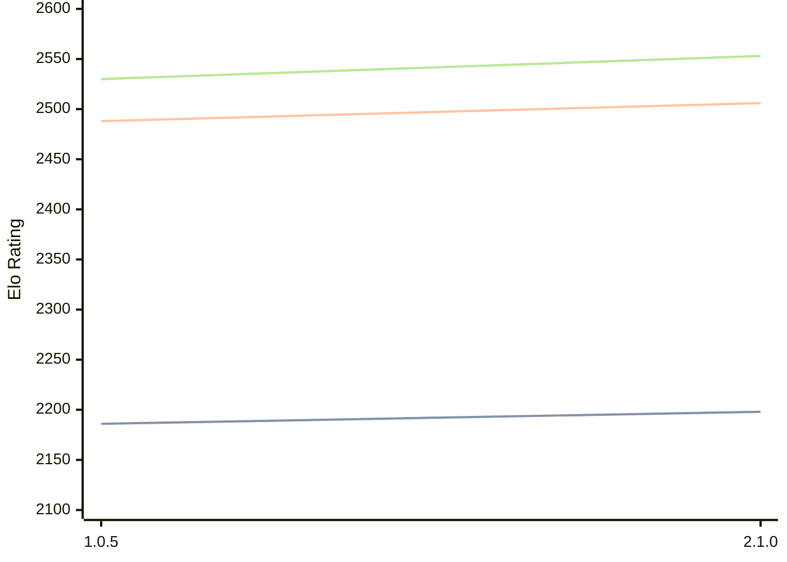

# Engine: Ruffian

Author: Per-Ola Valfridsson

Home: 

## Elo Ratings

| Version | Published | STC 8.0+0.08s  | LTC 60.0+0.60s | VLTC 2m24s+1.12s | Comment |
| --- | --- | --- | --- | --- | --- |
| 2.1.0 | 2004-02-01 | 2198(+12) | 2506(+18) | 2553(+23) |  |
| 1.0.5 | 2003-03-19 | 2186 | 2488 | 2530 |  |
 | | | cElo (∆ prev) | cElo (∆ prev) | cElo (∆ prev) | 

<a href="https://github.com/computer-chess-index/cci/issues/new?template=submit-version.yml&title=[VERSION]+Ruffian+<version>&body=###%20Engine%20name%0ARuffian%0A%0A###%20Version%0A2.1.0" target="_blank">Submit new version</a>

 Test Conditions:

GUI/CLI: <a href=https://github.com/cutechess/cutechess target="_blank">Cute-Chess</a> 
Elo Calculation: <a href=https://www.remi-coulom.fr/Bayesian-Elo/ target="_blank">Bayesian-Elo</a> 
CPU: Intel(R) Core(TM) i5-7500T 2.70GHz 
Opening book: 8_moves_v3 
\* STC: 8.0+0.08s, LTC: 60.0+0.60s, VLTC: 2m24s+1.12s

 Lists:
Ratings: <a href=https://github.com/computer-chess-index/cci/blob/main/lists/CCIRatings.csv target="_blank">Complete list</a>

Generated: 2026-05-03 07:44:35

## Ratings Verlauf

⬛ STC (8.0+0.08s) &nbsp;&nbsp; 🟧 LTC (60.0+0.60s) &nbsp;&nbsp; 🟩 VLTC (2m24s+1.12s)

dark mode: 🟩STC (8.0+0.08s) 🟧LTC (60.0+0.60s) ⬜VLTC (2m24s+1.12s)

## Detailed Evaluation Results

| Version | Time Control | Elo  | Range +/- | Matches | Score | Average Opponent Elo | Draws |
| --- | --- | --- | --- | --- | --- | --- | --- |
| 2.1.0 | VLTC (2m24s+1.12s) | 2553 | 51 | 132 | 50% | 2553 | 26% |
| 2.1.0 | D2 | 1041 | 31 | 368 | 53% | 1011 | 23% |
| 2.1.0 | D3 | 1346 | 32 | 332 | 53% | 1320 | 27% |
| 2.1.0 | D4 | 1542 | 32 | 342 | 49% | 1551 | 20% |
| 2.1.0 | D5 | 1759 | 32 | 360 | 51% | 1752 | 16% |
| 2.1.0 | D6 | 1972 | 29 | 422 | 50% | 1975 | 23% |
| 2.1.0 | D7 | 2157 | 30 | 424 | 50% | 2151 | 17% |
| 2.1.0 | D8 | 2261 | 28 | 476 | 48% | 2280 | 19% |
| 2.1.0 | S10 | 2268 | 28 | 436 | 49% | 2268 | 23% |
| 2.1.0 | S40 | 2454 | 29 | 428 | 51% | 2433 | 21% |
| 2.1.0 | LTC (60.0+0.60s) | 2506 | 32 | 338 | 49% | 2514 | 22% |
| 2.1.0 | STC (8.0+0.08s) | 2198 | 27 | 490 | 50% | 2194 | 22% |
| --- | --- | --- | --- | --- | --- | --- | --- |
| 1.0.5 | VLTC (2m24s+1.12s) | 2530 | 38 | 260 | 48% | 2553 | 22% |
| 1.0.5 | D1 | 698 | 23 | 696 | 56% | 640 | 24% |
| 1.0.5 | D2 | 1040 | 12 | 2381 | 51% | 1029 | 27% |
| 1.0.5 | D3 | 1341 | 13 | 2130 | 50% | 1341 | 16% |
| 1.0.5 | D4 | 1575 | 13 | 2100 | 52% | 1558 | 20% |
| 1.0.5 | D5 | 1805 | 12 | 2504 | 53% | 1770 | 17% |
| 1.0.5 | D6 | 1959 | 13 | 2220 | 49% | 1971 | 21% |
| 1.0.5 | D7 | 2120 | 13 | 2308 | 49% | 2132 | 21% |
| 1.0.5 | D8 | 2253 | 18 | 1133 | 51% | 2248 | 22% |
| 1.0.5 | D9 | 2360 | 44 | 180 | 42% | 2439 | 24% |
| 1.0.5 | S10 | 2255 | 16 | 1370 | 51% | 2242 | 22% |
| 1.0.5 | S40 | 2437 | 16 | 1398 | 50% | 2429 | 25% |
| 1.0.5 | LTC (60.0+0.60s) | 2488 | 15 | 1464 | 50% | 2489 | 24% |
| 1.0.5 | STC (8.0+0.08s) | 2186 | 16 | 1560 | 47% | 2248 | 20% |
| --- | --- | --- | --- | --- | --- | --- | --- |