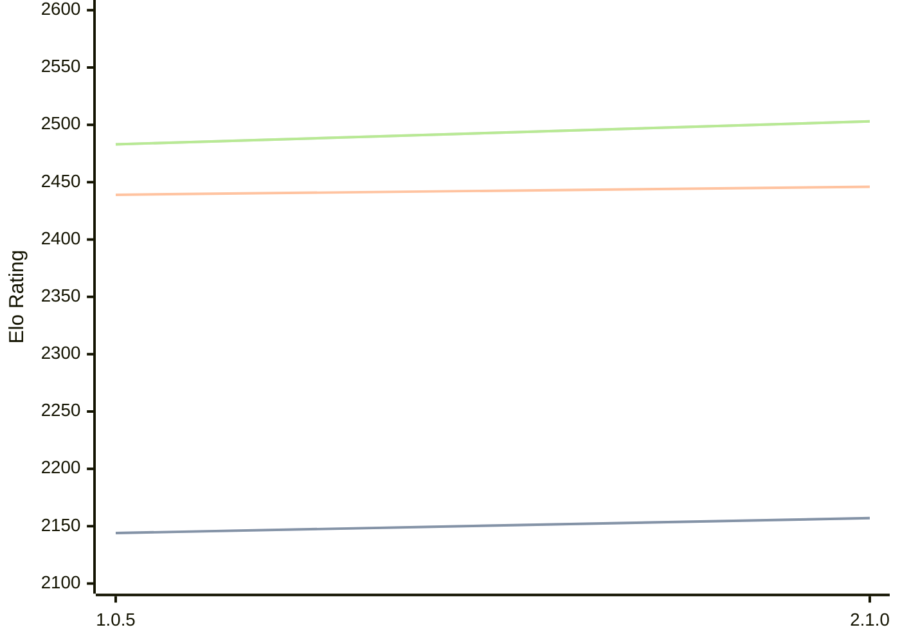

# Engine: Ruffian

Author: Per-Ola Valfridsson

Home: 

## Elo Ratings

| Version | Published | STC 8.0+0.08s  | LTC 60.0+0.60s | VLTC 2m24s+1.12s | Comment |
| --- | --- | --- | --- | --- | --- |
| 2.1.0 | 2004-02-01 | 2157(+13) | 2446(+7) | 2503(+20) |  |
| 1.0.5 | 2003-03-19 | 2144 | 2439 | 2483 |  |
 | | | cElo (∆ prev) | cElo (∆ prev) | cElo (∆ prev) | 

<a href="https://github.com/computer-chess-index/cci/issues/new?template=submit-version.yml&title=[VERSION]+Ruffian+<version>&body=###%20Engine%20name%0ARuffian%0A%0A###%20Version%0A2.1.0" target="_blank">Submit new version</a>

 Test Conditions:

GUI/CLI: <a href=https://github.com/cutechess/cutechess target="_blank">Cute-Chess</a> 
Elo Calculation: <a href=https://www.remi-coulom.fr/Bayesian-Elo/ target="_blank">Bayesian-Elo</a> 
CPU: Intel(R) Core(TM) i5-7500T 2.70GHz 
Opening book: 8_moves_v3 
\* STC: 8.0+0.08s, LTC: 60.0+0.60s, VLTC: 2m24s+1.12s

 Lists:
Ratings: <a href=https://github.com/computer-chess-index/cci/blob/main/lists/CCIRatings.csv target="_blank">Complete list</a>

Generated: 2026-09-10 04:42:04

## Ratings Verlauf

## Detailed Evaluation Results

| Version | Time Control | Elo  | Range +/- | Matches | Score | Average Opponent Elo | Draws |
| --- | --- | --- | --- | --- | --- | --- | --- |
| 2.1.0 | VLTC (2m24s+1.12s) | 2503 | 51 | 132 | 50% | 2503 | 26% |
| 2.1.0 | LTC (60.0+0.60s) | 2446 | 29 | 422 | 48% | 2465 | 22% |
| 2.1.0 | STC (8.0+0.08s) | 2157 | 23 | 654 | 50% | 2153 | 21% |
| --- | --- | --- | --- | --- | --- | --- | --- |
| 1.0.5 | VLTC (2m24s+1.12s) | 2483 | 38 | 260 | 48% | 2507 | 22% |
| 1.0.5 | LTC (60.0+0.60s) | 2439 | 15 | 1464 | 50% | 2441 | 24% |
| 1.0.5 | STC (8.0+0.08s) | 2144 | 16 | 1560 | 47% | 2205 | 20% |
| --- | --- | --- | --- | --- | --- | --- | --- |