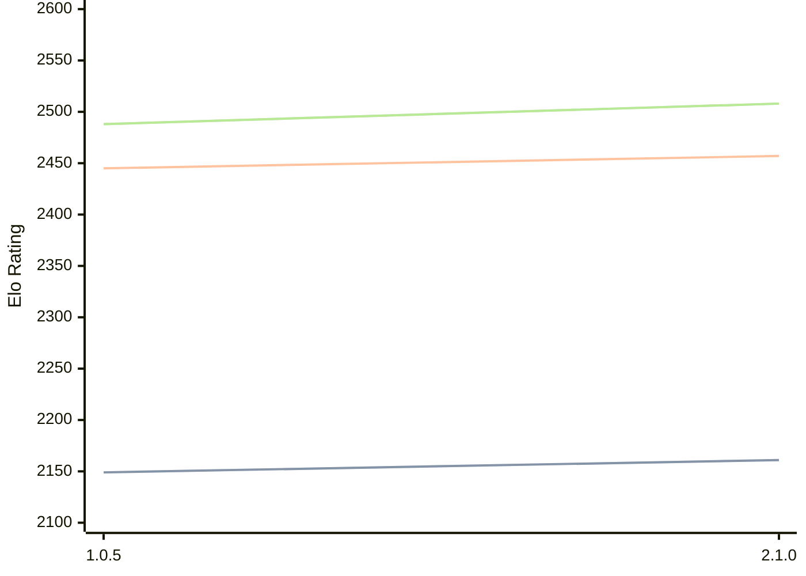

# Engine: Ruffian

Author: Per-Ola Valfridsson

Home: 

## Elo Ratings E1

| Version | Published | STC 8.0+0.08s  | LTC 60.0+0.60s | VLTC 2m24s+1.12s | Comment |
| --- | --- | --- | --- | --- | --- |
|  |  |  |  |  |  |
 | | | cElo (∆ prev) | cElo (∆ prev) | cElo (∆ prev) | 

## Elo Ratings P1

| Version | Published | STC 8.0+0.08s  | LTC 60.0+0.60s | VLTC 2m24s+1.12s | Comment |
| --- | --- | --- | --- | --- | --- |
|  |  |  |  |  |  |
 | | | cElo (∆ prev) | cElo (∆ prev) | cElo (∆ prev) | 

## Elo Ratings T1

| Version | Published | STC 8.0+0.08s  | LTC 60.0+0.60s | VLTC 2m24s+1.12s | Comment |
| --- | --- | --- | --- | --- | --- |
| 2.1.0 | 2004-02-01 | 2161(+12) | 2457(+12) | 2508(+20) |  |
| 1.0.5 | 2003-03-19 | 2149 | 2445 | 2488 |  |
 | | | cElo (∆ prev) | cElo (∆ prev) | cElo (∆ prev) | 

<a href="https://github.com/computer-chess-index/cci/issues/new?template=submit-version.yml&title=[VERSION]+Ruffian+<version>&body=###%20Engine%20name%0ARuffian%0A%0A###%20Version%0A2.1.0" target="_blank">Submit new version</a>

 Test Conditions:

GUI/CLI: <a href=https://github.com/cutechess/cutechess target="_blank">Cute-Chess</a> 
Elo Calculation: <a href=https://www.remi-coulom.fr/Bayesian-Elo/ target="_blank">Bayesian-Elo</a> 
CPU for P1: Intel(R) Core(TM) Ultra 7 265T (1.50 GHz) - P-Core 
CPU for E1: Intel(R) Core(TM) Ultra 7 265T (1.50 GHz) - E-Core 
CPU for T1: Intel(R) Core(TM) i5-7500T 2.70GHz 
Opening book: 8_moves_v3 
\* STC: 8.0+0.08s, LTC: 60.0+0.60s, VLTC: 2m24s+1.12s

 Lists:
Ratings: <a href=https://github.com/computer-chess-index/cci/blob/main/lists/CCIRatings.csv target="_blank">Complete list</a>

Generated: 2026-10-10 04:42:19

## Ratings Verlauf

```mermaid
%%{init: {"theme":"base","themeVariables":{"seriesColors:['#a3a3a3','#222221','#faa371']}}}%%
xychart-beta
  x-axis ["1.0.5", "2.1.0"]
  y-axis "Elo Rating" 2100 --> 2600
  line "" [2149, 2161]
  line "STC (8.0+0.08s)" [2149, 2161]
  line "LTC (60.0+0.60s)" [2445, 2457]
  line "" [2488, 2508]
  line "VLTC (2m24s+1.12s)" [2488, 2508]
```

## Detailed Evaluation Results

| Version | Time Control | Elo  | Range +/- | Matches | Score | Average Opponent Elo | Draws |
| --- | --- | --- | --- | --- | --- | --- | --- |
| 2.1.0 | VLTC (2m24s+1.12s) | 2508 | 51 | 132 | 50% | 2508 | 26% |
| 2.1.0 | LTC (60.0+0.60s) | 2353 | 46 | 182 | 49% | 2360 | 20% |
| 2.1.0 | LTC (60.0+0.60s) | 2583 | 55 | 120 | 47% | 2637 | 26% |
| 2.1.0 | LTC (60.0+0.60s) | 2457 | 28 | 434 | 49% | 2469 | 22% |
| 2.1.0 | STC (8.0+0.08s) | 2242 | 52 | 132 | 51% | 2249 | 21% |
| --- | --- | --- | --- | --- | --- | --- | --- |
| 2.1.0 | STC (8.0+0.08s) | 2161 | 23 | 658 | 50% | 2159 | 21% |
| --- | --- | --- | --- | --- | --- | --- | --- |
| 2.1.0 | STC (8.0+0.08s) | 2034 | 40 | 218 | 49% | 2053 | 22% |
| --- | --- | --- | --- | --- | --- | --- | --- |
| 1.0.5 | VLTC (2m24s+1.12s) | 2488 | 38 | 260 | 48% | 2512 | 22% |
| 1.0.5 | LTC (60.0+0.60s) | 2445 | 15 | 1464 | 50% | 2446 | 24% |
| 1.0.5 | STC (8.0+0.08s) | 2149 | 16 | 1560 | 47% | 2210 | 20% |
| --- | --- | --- | --- | --- | --- | --- | --- |