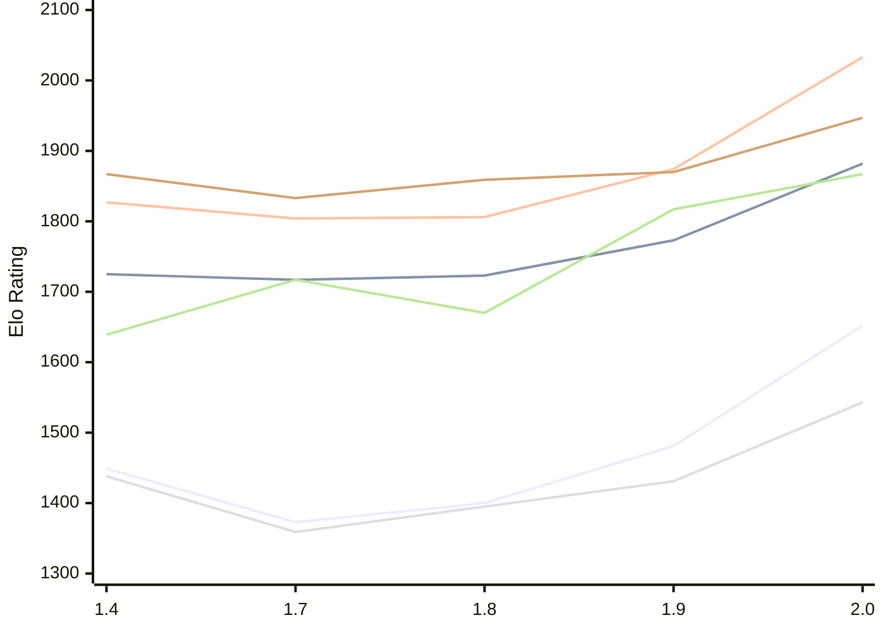

# Engine: Russell

Author: Dominic Fuentes

Home: https://github.com/stup1d1y-0bv10us/russell

## Elo Ratings E1 (Ultra 7 265T (1.50 GHz) - E-Core)

| Version | Published | STC 8.0+0.08s  | LTC 60.0+0.60s | VLTC 2m24s+1.12s | Comment |
| --- | --- | --- | --- | --- | --- |
| 2.0 | 2026-11-05 | 1652(+171) | 1882(+109) | 2033(+159) |  |
| 1.9 | 2026-10-30 | 1481(+81) | 1773(+50) | 1874(+68) |  |
| 1.8 | 2026-10-23 | 1400(+27) | 1723(+6) | 1806(+2) |  |
| 1.7 | 2026-10-16 | 1373(-76) | 1717(-8) | 1804(-23) |  |
| 1.4 | 2026-10-06 | 1449 | 1725 | 1827 |  |
 | | | cElo (∆ prev) | cElo (∆ prev) | cElo (∆ prev) | 

## Elo Ratings P1 (Ultra 7 265T (1.50 GHz) - P-Core)

| Version | Published | STC 8.0+0.08s  | LTC 60.0+0.60s | VLTC 2m24s+1.12s | Comment |
| --- | --- | --- | --- | --- | --- |
| 2.0 | 2026-11-05 | 1543(+112) | 1867(+50) | 1947(+77) |  |
| 1.9 | 2026-10-30 | 1431(+36) | 1817(+147) | 1870(+11) |  |
| 1.8 | 2026-10-23 | 1395(+36) | 1670(-47) | 1859(+26) |  |
| 1.7 | 2026-10-16 | 1359(-79) | 1717(+78) | 1833(-34) |  |
| 1.4 | 2026-10-06 | 1438 | 1639 | 1867 |  |
 | | | cElo (∆ prev) | cElo (∆ prev) | cElo (∆ prev) | 

## Elo Ratings T1 (i5-7500T 2.70GHz)

| Version | Published | STC 8.0+0.08s  | LTC 60.0+0.60s | VLTC 2m24s+1.12s | Comment |
| --- | --- | --- | --- | --- | --- |
| 1.4 | 2026-10-06 | 1438 | 1639 | 1867 |  |
 | | | cElo (∆ prev) | cElo (∆ prev) | cElo (∆ prev) | 

<a href="https://github.com/computer-chess-index/cci/issues/new?template=submit-version.yml&title=[VERSION]+Russell+<version>&body=###%20Engine%20name%0ARussell%0A%0A###%20Version%0A2.0" target="_blank">Submit new version</a>

 Test Conditions:

GUI/CLI: <a href=https://github.com/cutechess/cutechess target="_blank">Cute-Chess</a> 
Elo Calculation: <a href=https://www.remi-coulom.fr/Bayesian-Elo/ target="_blank">Bayesian-Elo</a> 
CPU for P1: Intel(R) Core(TM) Ultra 7 265T (1.50 GHz) - P-Core 
CPU for E1: Intel(R) Core(TM) Ultra 7 265T (1.50 GHz) - E-Core 
CPU for T1: Intel(R) Core(TM) i5-7500T 2.70GHz 
Opening book: 8_moves_v3 
\* STC: 8.0+0.08s, LTC: 60.0+0.60s, VLTC: 2m24s+1.12s

 Lists:
Ratings: <a href=https://github.com/computer-chess-index/cci/blob/main/lists/CCIRatings.csv target="_blank">Complete list</a>

Generated: 2026-11-17 05:42:42

## Ratings Verlauf E1 / P1

```mermaid
%%{init: {"theme":"base","themeVariables":{"seriesColors:['#a3a3a3','#222221','#faa371']}}}%%
xychart-beta
  x-axis ["1.4", "1.7", "1.8", "1.9", "2.0"]
  y-axis "Elo Rating" 1300 --> 2100
  line "E1: STC (8.0+0.08s)" [1449, 1373, 1400, 1481, 1652]
  line "E1: LTC (60.0+0.60s)" [1725, 1717, 1723, 1773, 1882]
  line "E1: VLTC (2m24s+1.12s)" [1827, 1804, 1806, 1874, 2033]
  line "P1: STC (8.0+0.08s)" [1438, 1359, 1395, 1431, 1543]
  line "P1: LTC (60.0+0.60s)" [1639, 1717, 1670, 1817, 1867]
  line "P1: VLTC (2m24s+1.12s)" [1867, 1833, 1859, 1870, 1947]
```

## Detailed Evaluation Results

| Version | Time Control | Variant | Elo  | Range +/- | Matches | Score | Average Opponent Elo | Draws |
| --- | --- |--- | --- | --- | --- | --- | --- | --- |
| 2.0 | VLTC (2m24s+1.12s) | E1 | 2033 | 37 | 242 | 50% | 2032 | 32% |
|  |  | P1 | 1947 | 40 | 196 | 53% | 1920 | 37% |
|  | LTC (60.0+0.60s) | E1 | 1882 | 33 | 284 | 52% | 1872 | 40% |
|  |  | P1 | 1867 | 45 | 160 | 50% | 1872 | 34% |
|  | STC (8.0+0.08s) | P1 | 1543 | 37 | 222 | 55% | 1497 | 39% |
|  |  | E1 | 1652 | 32 | 314 | 51% | 1647 | 30% |
| --- | --- |--- | --- | --- | --- | --- | --- | --- |
| 1.9 | VLTC (2m24s+1.12s) | P1 | 1870 | 47 | 148 | 55% | 1827 | 32% |
|  |  | E1 | 1874 | 36 | 252 | 51% | 1877 | 34% |
|  | LTC (60.0+0.60s) | P1 | 1817 | 43 | 176 | 46% | 1860 | 32% |
|  |  | E1 | 1773 | 34 | 300 | 53% | 1751 | 30% |
|  | STC (8.0+0.08s) | P1 | 1431 | 42 | 182 | 56% | 1370 | 35% |
|  |  | E1 | 1481 | 35 | 260 | 50% | 1482 | 32% |
| --- | --- |--- | --- | --- | --- | --- | --- | --- |
| 1.8 | VLTC (2m24s+1.12s) | P1 | 1859 | 55 | 108 | 53% | 1832 | 31% |
|  |  | E1 | 1806 | 37 | 232 | 51% | 1823 | 36% |
|  | LTC (60.0+0.60s) | P1 | 1670 | 48 | 148 | 51% | 1697 | 30% |
|  |  | E1 | 1723 | 38 | 224 | 49% | 1733 | 31% |
|  | STC (8.0+0.08s) | P1 | 1395 | 56 | 100 | 50% | 1393 | 32% |
|  |  | E1 | 1400 | 39 | 214 | 52% | 1384 | 31% |
| --- | --- |--- | --- | --- | --- | --- | --- | --- |
| 1.7 | VLTC (2m24s+1.12s) | P1 | 1833 | 53 | 120 | 43% | 1914 | 31% |
|  |  | E1 | 1804 | 39 | 214 | 49% | 1813 | 29% |
|  | LTC (60.0+0.60s) | E1 | 1717 | 40 | 208 | 52% | 1706 | 29% |
|  |  | P1 | 1717 | 54 | 108 | 51% | 1708 | 31% |
|  | STC (8.0+0.08s) | E1 | 1373 | 40 | 204 | 53% | 1350 | 28% |
|  |  | P1 | 1359 | 50 | 140 | 50% | 1381 | 25% |
| --- | --- |--- | --- | --- | --- | --- | --- | --- |
| 1.4 | VLTC (2m24s+1.12s) | P1 | 1867 | 50 | 144 | 55% | 1808 | 26% |
|  |  | E1 | 1827 | 39 | 222 | 55% | 1774 | 32% |
|  | LTC (60.0+0.60s) | P1 | 1639 | 59 | 120 | 69% | 1351 | 25% |
|  |  | E1 | 1725 | 41 | 210 | 57% | 1615 | 31% |
|  | STC (8.0+0.08s) | P1 | 1438 | 53 | 128 | 44% | 1551 | 27% |
|  |  | E1 | 1449 | 45 | 168 | 53% | 1427 | 30% |