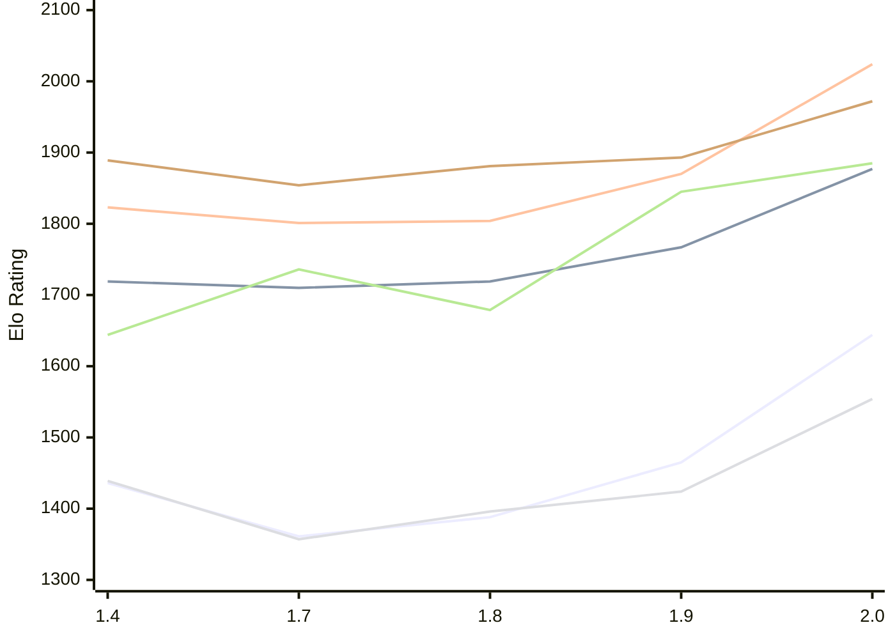

# Engine: Russell

Author: Dominic Fuentes

Home: https://github.com/stup1d1y-0bv10us/russell

## Elo Ratings E1 (Ultra 7 265T (1.50 GHz) - E-Core)

| Version | Published | STC 8.0+0.08s  | LTC 60.0+0.60s | VLTC 2m24s+1.12s | Comment |
| --- | --- | --- | --- | --- | --- |
| 2.0 | 2026-11-05 | 1644(+179) | 1877(+110) | 2024(+154) |  |
| 1.9 | 2026-10-30 | 1465(+77) | 1767(+48) | 1870(+66) |  |
| 1.8 | 2026-10-23 | 1388(+27) | 1719(+9) | 1804(+3) |  |
| 1.7 | 2026-10-16 | 1361(-75) | 1710(-9) | 1801(-22) |  |
| 1.4 | 2026-10-06 | 1436 | 1719 | 1823 |  |
 | | | cElo (∆ prev) | cElo (∆ prev) | cElo (∆ prev) | 

## Elo Ratings P1 (Ultra 7 265T (1.50 GHz) - P-Core)

| Version | Published | STC 8.0+0.08s  | LTC 60.0+0.60s | VLTC 2m24s+1.12s | Comment |
| --- | --- | --- | --- | --- | --- |
| 2.0 | 2026-11-05 | 1554(+130) | 1885(+40) | 1972(+79) |  |
| 1.9 | 2026-10-30 | 1424(+28) | 1845(+166) | 1893(+12) |  |
| 1.8 | 2026-10-23 | 1396(+39) | 1679(-57) | 1881(+27) |  |
| 1.7 | 2026-10-16 | 1357(-82) | 1736(+92) | 1854(-35) |  |
| 1.4 | 2026-10-06 | 1439 | 1644 | 1889 |  |
 | | | cElo (∆ prev) | cElo (∆ prev) | cElo (∆ prev) | 

## Elo Ratings T1 (i5-7500T 2.70GHz)

| Version | Published | STC 8.0+0.08s  | LTC 60.0+0.60s | VLTC 2m24s+1.12s | Comment |
| --- | --- | --- | --- | --- | --- |
| 1.4 | 2026-10-06 | 1439 | 1644 | 1889 |  |
 | | | cElo (∆ prev) | cElo (∆ prev) | cElo (∆ prev) | 

<a href="https://github.com/computer-chess-index/cci/issues/new?template=submit-version.yml&title=[VERSION]+Russell+<version>&body=###%20Engine%20name%0ARussell%0A%0A###%20Version%0A2.0" target="_blank">Submit new version</a>

 Test Conditions:

GUI/CLI: <a href=https://github.com/cutechess/cutechess target="_blank">Cute-Chess</a> 
Elo Calculation: <a href=https://www.remi-coulom.fr/Bayesian-Elo/ target="_blank">Bayesian-Elo</a> 
CPU for P1: Intel(R) Core(TM) Ultra 7 265T (1.50 GHz) - P-Core 
CPU for E1: Intel(R) Core(TM) Ultra 7 265T (1.50 GHz) - E-Core 
CPU for T1: Intel(R) Core(TM) i5-7500T 2.70GHz 
Opening book: 8_moves_v3 
\* STC: 8.0+0.08s, LTC: 60.0+0.60s, VLTC: 2m24s+1.12s

 Lists:
Ratings: <a href=https://github.com/computer-chess-index/cci/blob/main/lists/CCIRatings.csv target="_blank">Complete list</a>

Generated: 2026-11-28 05:42:46

## Ratings Verlauf E1 / P1

```mermaid
%%{init: {"theme":"base","themeVariables":{"seriesColors:['#a3a3a3','#222221','#faa371']}}}%%
xychart-beta
  x-axis ["1.4", "1.7", "1.8", "1.9", "2.0"]
  y-axis "Elo Rating" 1300 --> 2100
  line "E1: STC (8.0+0.08s)" [1436, 1361, 1388, 1465, 1644]
  line "E1: LTC (60.0+0.60s)" [1719, 1710, 1719, 1767, 1877]
  line "E1: VLTC (2m24s+1.12s)" [1823, 1801, 1804, 1870, 2024]
  line "P1: STC (8.0+0.08s)" [1439, 1357, 1396, 1424, 1554]
  line "P1: LTC (60.0+0.60s)" [1644, 1736, 1679, 1845, 1885]
  line "P1: VLTC (2m24s+1.12s)" [1889, 1854, 1881, 1893, 1972]
```

## Detailed Evaluation Results

| Version | Time Control | Variant | Elo  | Range +/- | Matches | Score | Average Opponent Elo | Draws |
| --- | --- |--- | --- | --- | --- | --- | --- | --- |
| 2.0 | VLTC (2m24s+1.12s) | P1 | 1972 | 39 | 204 | 53% | 1941 | 38% |
|  |  | E1 | 2024 | 36 | 250 | 50% | 2026 | 32% |
|  | LTC (60.0+0.60s) | P1 | 1885 | 44 | 168 | 50% | 1890 | 34% |
|  |  | E1 | 1877 | 32 | 300 | 52% | 1867 | 41% |
|  | STC (8.0+0.08s) | P1 | 1554 | 36 | 238 | 55% | 1504 | 41% |
|  |  | E1 | 1644 | 32 | 318 | 51% | 1635 | 31% |
| --- | --- |--- | --- | --- | --- | --- | --- | --- |
| 1.9 | VLTC (2m24s+1.12s) | E1 | 1870 | 36 | 252 | 51% | 1870 | 34% |
|  |  | P1 | 1893 | 46 | 152 | 55% | 1848 | 32% |
|  | LTC (60.0+0.60s) | E1 | 1767 | 33 | 304 | 52% | 1748 | 31% |
|  |  | P1 | 1845 | 41 | 196 | 47% | 1881 | 33% |
|  | STC (8.0+0.08s) | E1 | 1465 | 35 | 268 | 49% | 1470 | 31% |
|  |  | P1 | 1424 | 41 | 202 | 55% | 1376 | 33% |
| --- | --- |--- | --- | --- | --- | --- | --- | --- |
| 1.8 | VLTC (2m24s+1.12s) | P1 | 1881 | 55 | 108 | 53% | 1854 | 31% |
|  |  | E1 | 1804 | 37 | 232 | 51% | 1818 | 36% |
|  | LTC (60.0+0.60s) | P1 | 1679 | 48 | 148 | 51% | 1708 | 30% |
|  |  | E1 | 1719 | 38 | 224 | 49% | 1729 | 31% |
|  | STC (8.0+0.08s) | P1 | 1396 | 56 | 100 | 50% | 1395 | 32% |
|  |  | E1 | 1388 | 39 | 214 | 52% | 1372 | 31% |
| --- | --- |--- | --- | --- | --- | --- | --- | --- |
| 1.7 | VLTC (2m24s+1.12s) | P1 | 1854 | 53 | 120 | 43% | 1935 | 31% |
|  |  | E1 | 1801 | 39 | 214 | 49% | 1810 | 29% |
|  | LTC (60.0+0.60s) | P1 | 1736 | 54 | 108 | 51% | 1725 | 31% |
|  |  | E1 | 1710 | 40 | 208 | 52% | 1700 | 29% |
|  | STC (8.0+0.08s) | P1 | 1357 | 50 | 140 | 50% | 1380 | 25% |
|  |  | E1 | 1361 | 40 | 204 | 53% | 1339 | 28% |
| --- | --- |--- | --- | --- | --- | --- | --- | --- |
| 1.4 | VLTC (2m24s+1.12s) | P1 | 1889 | 50 | 144 | 55% | 1828 | 26% |
|  |  | E1 | 1823 | 39 | 222 | 55% | 1770 | 32% |
|  | LTC (60.0+0.60s) | P1 | 1644 | 59 | 120 | 69% | 1355 | 25% |
|  |  | E1 | 1719 | 41 | 210 | 57% | 1608 | 31% |
|  | STC (8.0+0.08s) | P1 | 1439 | 54 | 128 | 44% | 1557 | 27% |
|  |  | E1 | 1436 | 45 | 168 | 53% | 1415 | 30% |