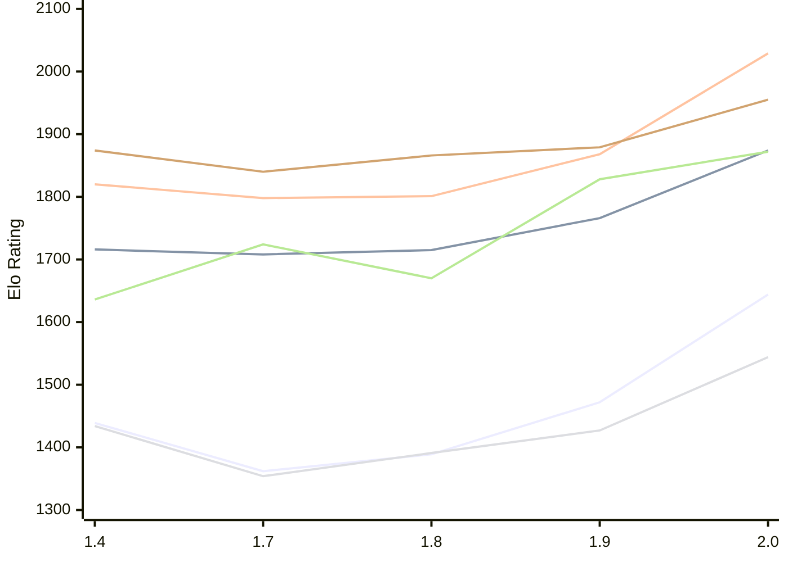

# Engine: Russell

Author: Dominic Fuentes

Home: https://github.com/stup1d1y-0bv10us/russell

## Elo Ratings E1 (Ultra 7 265T (1.50 GHz) - E-Core)

| Version | Published | STC 8.0+0.08s  | LTC 60.0+0.60s | VLTC 2m24s+1.12s | Comment |
| --- | --- | --- | --- | --- | --- |
| 2.0 | 2026-11-05 | 1644(+172) | 1874(+108) | 2029(+161) |  |
| 1.9 | 2026-10-30 | 1472(+83) | 1766(+51) | 1868(+67) |  |
| 1.8 | 2026-10-23 | 1389(+27) | 1715(+7) | 1801(+3) |  |
| 1.7 | 2026-10-16 | 1362(-77) | 1708(-8) | 1798(-22) |  |
| 1.4 | 2026-10-06 | 1439 | 1716 | 1820 |  |
 | | | cElo (∆ prev) | cElo (∆ prev) | cElo (∆ prev) | 

## Elo Ratings P1 (Ultra 7 265T (1.50 GHz) - P-Core)

| Version | Published | STC 8.0+0.08s  | LTC 60.0+0.60s | VLTC 2m24s+1.12s | Comment |
| --- | --- | --- | --- | --- | --- |
| 2.0 | 2026-11-05 | 1544(+117) | 1872(+44) | 1955(+76) |  |
| 1.9 | 2026-10-30 | 1427(+36) | 1828(+158) | 1879(+13) |  |
| 1.8 | 2026-10-23 | 1391(+37) | 1670(-54) | 1866(+26) |  |
| 1.7 | 2026-10-16 | 1354(-80) | 1724(+88) | 1840(-34) |  |
| 1.4 | 2026-10-06 | 1434 | 1636 | 1874 |  |
 | | | cElo (∆ prev) | cElo (∆ prev) | cElo (∆ prev) | 

## Elo Ratings T1 (i5-7500T 2.70GHz)

| Version | Published | STC 8.0+0.08s  | LTC 60.0+0.60s | VLTC 2m24s+1.12s | Comment |
| --- | --- | --- | --- | --- | --- |
| 1.4 | 2026-10-06 | 1434 | 1636 | 1874 |  |
 | | | cElo (∆ prev) | cElo (∆ prev) | cElo (∆ prev) | 

<a href="https://github.com/computer-chess-index/cci/issues/new?template=submit-version.yml&title=[VERSION]+Russell+<version>&body=###%20Engine%20name%0ARussell%0A%0A###%20Version%0A2.0" target="_blank">Submit new version</a>

 Test Conditions:

GUI/CLI: <a href=https://github.com/cutechess/cutechess target="_blank">Cute-Chess</a> 
Elo Calculation: <a href=https://www.remi-coulom.fr/Bayesian-Elo/ target="_blank">Bayesian-Elo</a> 
CPU for P1: Intel(R) Core(TM) Ultra 7 265T (1.50 GHz) - P-Core 
CPU for E1: Intel(R) Core(TM) Ultra 7 265T (1.50 GHz) - E-Core 
CPU for T1: Intel(R) Core(TM) i5-7500T 2.70GHz 
Opening book: 8_moves_v3 
\* STC: 8.0+0.08s, LTC: 60.0+0.60s, VLTC: 2m24s+1.12s

 Lists:
Ratings: <a href=https://github.com/computer-chess-index/cci/blob/main/lists/CCIRatings.csv target="_blank">Complete list</a>

Generated: 2026-11-20 05:42:28

## Ratings Verlauf E1 / P1

```mermaid
%%{init: {"theme":"base","themeVariables":{"seriesColors:['#a3a3a3','#222221','#faa371']}}}%%
xychart-beta
  x-axis ["1.4", "1.7", "1.8", "1.9", "2.0"]
  y-axis "Elo Rating" 1300 --> 2100
  line "E1: STC (8.0+0.08s)" [1439, 1362, 1389, 1472, 1644]
  line "E1: LTC (60.0+0.60s)" [1716, 1708, 1715, 1766, 1874]
  line "E1: VLTC (2m24s+1.12s)" [1820, 1798, 1801, 1868, 2029]
  line "P1: STC (8.0+0.08s)" [1434, 1354, 1391, 1427, 1544]
  line "P1: LTC (60.0+0.60s)" [1636, 1724, 1670, 1828, 1872]
  line "P1: VLTC (2m24s+1.12s)" [1874, 1840, 1866, 1879, 1955]
```

## Detailed Evaluation Results

| Version | Time Control | Variant | Elo  | Range +/- | Matches | Score | Average Opponent Elo | Draws |
| --- | --- |--- | --- | --- | --- | --- | --- | --- |
| 2.0 | VLTC (2m24s+1.12s) | P1 | 1955 | 39 | 200 | 53% | 1925 | 38% |
|  |  | E1 | 2029 | 37 | 242 | 50% | 2028 | 32% |
|  | LTC (60.0+0.60s) | E1 | 1874 | 33 | 288 | 51% | 1864 | 41% |
|  |  | P1 | 1872 | 45 | 160 | 50% | 1878 | 34% |
|  | STC (8.0+0.08s) | E1 | 1644 | 32 | 318 | 51% | 1636 | 31% |
|  |  | P1 | 1544 | 37 | 230 | 55% | 1496 | 40% |
| --- | --- |--- | --- | --- | --- | --- | --- | --- |
| 1.9 | VLTC (2m24s+1.12s) | P1 | 1879 | 46 | 152 | 55% | 1835 | 32% |
|  |  | E1 | 1868 | 36 | 252 | 51% | 1870 | 34% |
|  | LTC (60.0+0.60s) | P1 | 1828 | 42 | 184 | 47% | 1864 | 33% |
|  |  | E1 | 1766 | 34 | 300 | 53% | 1744 | 30% |
|  | STC (8.0+0.08s) | P1 | 1427 | 42 | 182 | 56% | 1366 | 35% |
|  |  | E1 | 1472 | 35 | 260 | 50% | 1472 | 32% |
| --- | --- |--- | --- | --- | --- | --- | --- | --- |
| 1.8 | VLTC (2m24s+1.12s) | P1 | 1866 | 55 | 108 | 53% | 1840 | 31% |
|  |  | E1 | 1801 | 37 | 232 | 51% | 1816 | 36% |
|  | LTC (60.0+0.60s) | P1 | 1670 | 48 | 148 | 51% | 1697 | 30% |
|  |  | E1 | 1715 | 38 | 224 | 49% | 1725 | 31% |
|  | STC (8.0+0.08s) | P1 | 1391 | 56 | 100 | 50% | 1389 | 32% |
|  |  | E1 | 1389 | 39 | 214 | 52% | 1373 | 31% |
| --- | --- |--- | --- | --- | --- | --- | --- | --- |
| 1.7 | VLTC (2m24s+1.12s) | P1 | 1840 | 53 | 120 | 43% | 1921 | 31% |
|  |  | E1 | 1798 | 39 | 214 | 49% | 1808 | 29% |
|  | LTC (60.0+0.60s) | P1 | 1724 | 54 | 108 | 51% | 1713 | 31% |
|  |  | E1 | 1708 | 40 | 208 | 52% | 1697 | 29% |
|  | STC (8.0+0.08s) | P1 | 1354 | 50 | 140 | 50% | 1377 | 25% |
|  |  | E1 | 1362 | 40 | 204 | 53% | 1341 | 28% |
| --- | --- |--- | --- | --- | --- | --- | --- | --- |
| 1.4 | VLTC (2m24s+1.12s) | P1 | 1874 | 50 | 144 | 55% | 1813 | 26% |
|  |  | E1 | 1820 | 39 | 222 | 55% | 1767 | 32% |
|  | LTC (60.0+0.60s) | P1 | 1636 | 59 | 120 | 69% | 1350 | 25% |
|  |  | E1 | 1716 | 41 | 210 | 57% | 1607 | 31% |
|  | STC (8.0+0.08s) | P1 | 1434 | 54 | 128 | 44% | 1550 | 27% |
|  |  | E1 | 1439 | 45 | 168 | 53% | 1418 | 30% |