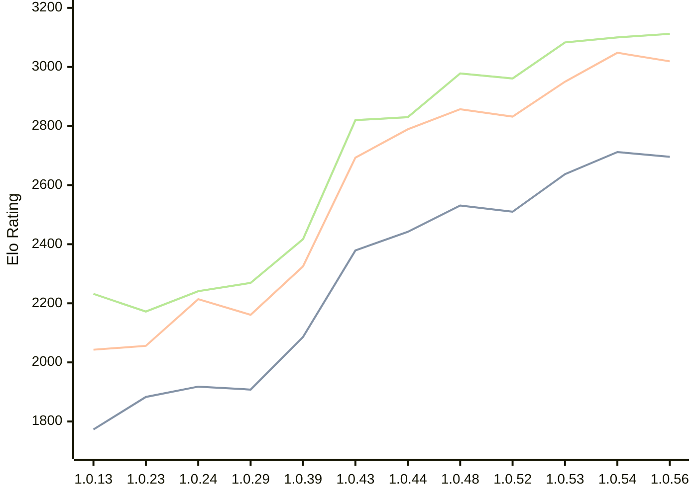

# Engine: RustyRival

Author: Chris Moreton

Home: https://github.com/chris-moreton/rusty-rival

## Elo Ratings

| Version | Published | STC 8.0+0.08s  | LTC 60.0+0.60s | VLTC 2m24s+1.12s | Comment |
| --- | --- | --- | --- | --- | --- |
| 1.0.64 | 2026-09-11 |  |  |  |  |
| 1.0.63 | 2026-09-10 |  |  |  |  |
| 1.0.62 | 2026-09-09 |  |  |  |  |
| 1.0.61 | 2026-09-07 |  |  |  |  |
| 1.0.60 | 2026-09-06 |  |  |  |  |
| 1.0.59 | 2026-09-05 |  |  |  |  |
| 1.0.58 | 2026-09-04 |  |  |  |  |
| 1.0.57 | 2026-09-01 |  |  |  |  |
| 1.0.56 | 2026-08-30 | 2696(-16) | 3019(-29) | 3112(+12) |  |
| 1.0.54 | 2026-08-25 | 2712(+75) | 3048(+98) | 3100(+17) |  |
| 1.0.53 | 2026-08-07 | 2637(+127) | 2950(+118) | 3083(+122) |  |
| 1.0.52 | 2026-08-03 | 2510(+new) | 2832(+new) | 2961(+new) |  |
| 1.0.51 | 2026-08-02 |  |  |  |  |
| 1.0.50 | 2026-08-01 |  |  |  |  |
| 1.0.49 | 2026-08-01 |  |  |  |  |
| 1.0.48 | 2026-07-26 | 2531(+new) | 2857(+new) | 2978(+new) |  |
| 1.0.47 | 2026-07-23 |  |  |  |  |
| 1.0.46 | 2026-07-23 |  |  |  |  |
| 1.0.45 | 2026-07-20 |  |  |  |  |
| 1.0.44 | 2026-07-20 | 2442(+63) | 2789(+96) | 2830(+10) |  |
| 1.0.43 | 2026-04-26 | 2379(+new) | 2693(+new) | 2820(+new) |  |
| 1.0.42 | 2026-04-24 |  |  |  | eval skipped |
| 1.0.40 | 2026-04-02 |  |  |  | eval skipped |
| 1.0.39 | 2026-03-30 | 2086(+new) | 2325(+new) | 2417(+new) |  |
| 1.0.36 | 2026-03-18 |  |  |  | eval skipped |
| 1.0.34 | 2026-03-10 |  |  |  | eval skipped |
| 1.0.29 | 2026-02-10 | 1908(-10) | 2161(-53) | 2269(+28) |  |
| 1.0.24 | 2026-01-30 | 1918(+35) | 2214(+158) | 2241(+69) |  |
| 1.0.23 | 2026-01-19 | 1883(+new) | 2056(-19) | 2172(+15) |  |
| 1.0.19 | 2026-01-12 |  | 2075(+new) | 2157(-162) |  |
| 1.0.17 | 2026-01-11 | 1874(+new) |  | 2319(+48) |  |
| 1.0.15 | 2026-01-11 |  | 2098(+55) | 2271(+39) |  |
| 1.0.13 | 2026-01-10 | 1773(+new) | 2043(+new) | 2232(+new) |  |
| 1.0.7 | 2025-12-30 |  |  |  | thread 'main' (10808) panicked at src\main.rs:17:36: |
 | | | cElo (∆ prev) | cElo (∆ prev) | cElo (∆ prev) | 

<a href="https://github.com/computer-chess-index/cci/issues/new?template=submit-version.yml&title=[VERSION]+RustyRival+<version>&body=###%20Engine%20name%0ARustyRival%0A%0A###%20Version%0A1.0.64" target="_blank">Submit new version</a>

 Test Conditions:

GUI/CLI: <a href=https://github.com/cutechess/cutechess target="_blank">Cute-Chess</a> 
Elo Calculation: <a href=https://www.remi-coulom.fr/Bayesian-Elo/ target="_blank">Bayesian-Elo</a> 
CPU: Intel(R) Core(TM) i5-7500T 2.70GHz 
Opening book: 8_moves_v3 
\* STC: 8.0+0.08s, LTC: 60.0+0.60s, VLTC: 2m24s+1.12s

 Lists:
Ratings: <a href=https://github.com/computer-chess-index/cci/blob/main/lists/CCIRatings.csv target="_blank">Complete list</a>

Generated: 2026-09-14 04:41:57

## Ratings Verlauf

## Detailed Evaluation Results

| Version | Time Control | Elo  | Range +/- | Matches | Score | Average Opponent Elo | Draws |
| --- | --- | --- | --- | --- | --- | --- | --- |
| 1.0.56 | VLTC (2m24s+1.12s) | 3112 | 38 | 180 | 49% | 3124 | 63% |
| 1.0.56 | LTC (60.0+0.60s) | 3019 | 40 | 188 | 53% | 2994 | 43% |
| 1.0.56 | STC (8.0+0.08s) | 2696 | 46 | 140 | 48% | 2711 | 42% |
| --- | --- | --- | --- | --- | --- | --- | --- |
| 1.0.54 | VLTC (2m24s+1.12s) | 3100 | 49 | 114 | 53% | 3077 | 54% |
| 1.0.54 | LTC (60.0+0.60s) | 3048 | 52 | 108 | 50% | 3047 | 44% |
| 1.0.54 | STC (8.0+0.08s) | 2712 | 53 | 112 | 50% | 2714 | 34% |
| --- | --- | --- | --- | --- | --- | --- | --- |
| 1.0.53 | VLTC (2m24s+1.12s) | 3083 | 42 | 160 | 48% | 3093 | 53% |
| 1.0.53 | LTC (60.0+0.60s) | 2950 | 49 | 124 | 49% | 2958 | 43% |
| 1.0.53 | STC (8.0+0.08s) | 2637 | 44 | 172 | 49% | 2646 | 29% |
| --- | --- | --- | --- | --- | --- | --- | --- |
| 1.0.52 | VLTC (2m24s+1.12s) | 2961 | 42 | 172 | 51% | 2947 | 41% |
| 1.0.52 | LTC (60.0+0.60s) | 2832 | 47 | 148 | 49% | 2838 | 31% |
| 1.0.52 | STC (8.0+0.08s) | 2510 | 46 | 164 | 53% | 2479 | 23% |
| --- | --- | --- | --- | --- | --- | --- | --- |
| 1.0.48 | VLTC (2m24s+1.12s) | 2978 | 50 | 122 | 52% | 2965 | 38% |
| 1.0.48 | LTC (60.0+0.60s) | 2857 | 47 | 144 | 50% | 2859 | 37% |
| 1.0.48 | STC (8.0+0.08s) | 2531 | 48 | 156 | 45% | 2576 | 20% |
| --- | --- | --- | --- | --- | --- | --- | --- |
| 1.0.44 | VLTC (2m24s+1.12s) | 2830 | 50 | 140 | 55% | 2780 | 26% |
| 1.0.44 | LTC (60.0+0.60s) | 2789 | 50 | 128 | 52% | 2776 | 33% |
| 1.0.44 | STC (8.0+0.08s) | 2442 | 51 | 136 | 49% | 2453 | 20% |
| --- | --- | --- | --- | --- | --- | --- | --- |
| 1.0.43 | VLTC (2m24s+1.12s) | 2820 | 39 | 220 | 52% | 2800 | 30% |
| 1.0.43 | LTC (60.0+0.60s) | 2693 | 37 | 240 | 54% | 2649 | 29% |
| 1.0.43 | STC (8.0+0.08s) | 2379 | 43 | 192 | 50% | 2375 | 23% |
| --- | --- | --- | --- | --- | --- | --- | --- |
| 1.0.39 | VLTC (2m24s+1.12s) | 2417 | 39 | 228 | 51% | 2408 | 24% |
| 1.0.39 | LTC (60.0+0.60s) | 2325 | 41 | 208 | 52% | 2310 | 25% |
| 1.0.39 | STC (8.0+0.08s) | 2086 | 42 | 208 | 52% | 2052 | 16% |
| --- | --- | --- | --- | --- | --- | --- | --- |
| 1.0.29 | VLTC (2m24s+1.12s) | 2269 | 64 | 82 | 52% | 2250 | 28% |
| 1.0.29 | LTC (60.0+0.60s) | 2161 | 71 | 70 | 51% | 2156 | 19% |
| 1.0.29 | STC (8.0+0.08s) | 1908 | 111 | 28 | 48% | 1921 | 18% |
| --- | --- | --- | --- | --- | --- | --- | --- |
| 1.0.24 | VLTC (2m24s+1.12s) | 2241 | 72 | 64 | 52% | 2215 | 27% |
| 1.0.24 | LTC (60.0+0.60s) | 2214 | 71 | 66 | 54% | 2176 | 26% |
| 1.0.24 | STC (8.0+0.08s) | 1918 | 104 | 32 | 53% | 1897 | 19% |
| --- | --- | --- | --- | --- | --- | --- | --- |
| 1.0.23 | VLTC (2m24s+1.12s) | 2172 | 71 | 64 | 49% | 2178 | 30% |
| 1.0.23 | LTC (60.0+0.60s) | 2056 | 78 | 60 | 42% | 2134 | 17% |
| 1.0.23 | STC (8.0+0.08s) | 1883 | 133 | 20 | 50% | 1881 | 10% |
| --- | --- | --- | --- | --- | --- | --- | --- |
| 1.0.19 | VLTC (2m24s+1.12s) | 2157 | 204 | 8 | 31% | 2318 | 13% |
| 1.0.19 | LTC (60.0+0.60s) | 2075 | 86 | 56 | 36% | 2236 | 18% |
| 1.0.17 | VLTC (2m24s+1.12s) | 2319 | 231 | 4 | 50% | 2319 | 50% |
| 1.0.17 | STC (8.0+0.08s) | 1874 | 227 | 10 | 20% | 2228 | 0% |
| --- | --- | --- | --- | --- | --- | --- | --- |
| 1.0.15 | VLTC (2m24s+1.12s) | 2271 | 84 | 52 | 54% | 2228 | 15% |
| 1.0.15 | LTC (60.0+0.60s) | 2098 | 188 | 8 | 50% | 2110 | 25% |
| 1.0.13 | VLTC (2m24s+1.12s) | 2232 | 143 | 20 | 33% | 2450 | 15% |
| 1.0.13 | LTC (60.0+0.60s) | 2043 | 198 | 8 | 56% | 1995 | 13% |
| 1.0.13 | STC (8.0+0.08s) | 1773 | 210 | 12 | 25% | 2097 | 0% |
| --- | --- | --- | --- | --- | --- | --- | --- |
| 1.0.9 | LTC (60.0+0.60s) | 1962 | 153 | 16 | 34% | 2129 | 19% |