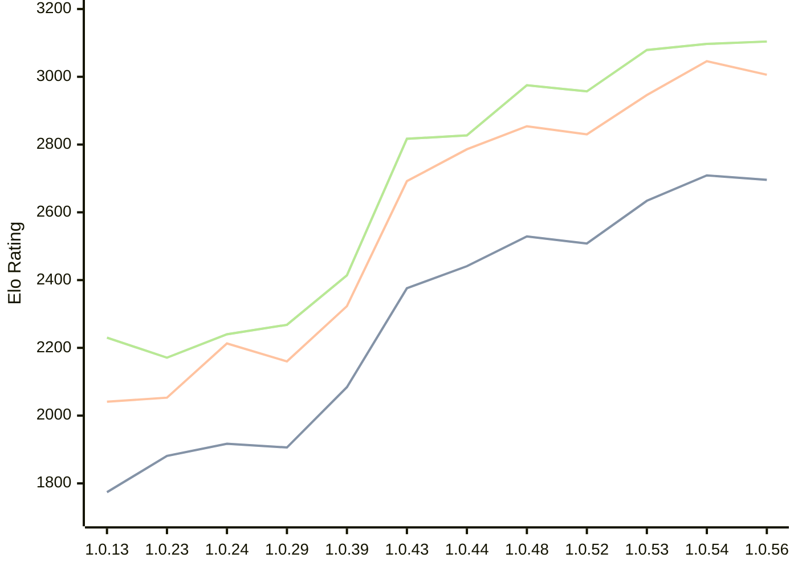

# Engine: RustyRival

Author: Chris Moreton

Home: https://github.com/chris-moreton/rusty-rival

## Elo Ratings

| Version | Published | STC 8.0+0.08s  | LTC 60.0+0.60s | VLTC 2m24s+1.12s | Comment |
| --- | --- | --- | --- | --- | --- |
| 1.0.57 | 2026-09-01 |  |  |  |  |
| 1.0.56 | 2026-08-30 | 2696(-13) | 3006(-40) | 3104(+7) |  |
| 1.0.54 | 2026-08-25 | 2709(+75) | 3046(+100) | 3097(+18) |  |
| 1.0.53 | 2026-08-07 | 2634(+126) | 2946(+116) | 3079(+122) |  |
| 1.0.52 | 2026-08-03 | 2508(+new) | 2830(+new) | 2957(+new) |  |
| 1.0.51 | 2026-08-02 |  |  |  |  |
| 1.0.50 | 2026-08-01 |  |  |  |  |
| 1.0.49 | 2026-08-01 |  |  |  |  |
| 1.0.48 | 2026-07-26 | 2529(+new) | 2854(+new) | 2975(+new) |  |
| 1.0.47 | 2026-07-23 |  |  |  |  |
| 1.0.46 | 2026-07-23 |  |  |  |  |
| 1.0.45 | 2026-07-20 |  |  |  |  |
| 1.0.44 | 2026-07-20 | 2441(+65) | 2786(+94) | 2827(+10) |  |
| 1.0.43 | 2026-04-26 | 2376(+new) | 2692(+new) | 2817(+new) |  |
| 1.0.42 | 2026-04-24 |  |  |  | eval skipped |
| 1.0.40 | 2026-04-02 |  |  |  | eval skipped |
| 1.0.39 | 2026-03-30 | 2084(+new) | 2323(+new) | 2414(+new) |  |
| 1.0.36 | 2026-03-18 |  |  |  | eval skipped |
| 1.0.34 | 2026-03-10 |  |  |  | eval skipped |
| 1.0.29 | 2026-02-10 | 1906(-11) | 2160(-53) | 2268(+28) |  |
| 1.0.24 | 2026-01-30 | 1917(+36) | 2213(+160) | 2240(+69) |  |
| 1.0.23 | 2026-01-19 | 1881(+new) | 2053(-21) | 2171(+16) |  |
| 1.0.19 | 2026-01-12 |  | 2074(+new) | 2155(-163) |  |
| 1.0.17 | 2026-01-11 | 1871(+new) |  | 2318(+49) |  |
| 1.0.15 | 2026-01-11 |  | 2097(+56) | 2269(+39) |  |
| 1.0.13 | 2026-01-10 | 1774(+new) | 2041(+new) | 2230(+new) |  |
| 1.0.7 | 2025-12-30 |  |  |  | thread 'main' (10808) panicked at src\main.rs:17:36: |
 | | | cElo (∆ prev) | cElo (∆ prev) | cElo (∆ prev) | 

<a href="https://github.com/computer-chess-index/cci/issues/new?template=submit-version.yml&title=[VERSION]+RustyRival+<version>&body=###%20Engine%20name%0ARustyRival%0A%0A###%20Version%0A1.0.57" target="_blank">Submit new version</a>

 Test Conditions:

GUI/CLI: <a href=https://github.com/cutechess/cutechess target="_blank">Cute-Chess</a> 
Elo Calculation: <a href=https://www.remi-coulom.fr/Bayesian-Elo/ target="_blank">Bayesian-Elo</a> 
CPU: Intel(R) Core(TM) i5-7500T 2.70GHz 
Opening book: 8_moves_v3 
\* STC: 8.0+0.08s, LTC: 60.0+0.60s, VLTC: 2m24s+1.12s

 Lists:
Ratings: <a href=https://github.com/computer-chess-index/cci/blob/main/lists/CCIRatings.csv target="_blank">Complete list</a>

Generated: 2026-09-04 04:38:59

## Ratings Verlauf

## Detailed Evaluation Results

| Version | Time Control | Elo  | Range +/- | Matches | Score | Average Opponent Elo | Draws |
| --- | --- | --- | --- | --- | --- | --- | --- |
| 1.0.56 | VLTC (2m24s+1.12s) | 3104 | 41 | 156 | 48% | 3123 | 61% |
| 1.0.56 | LTC (60.0+0.60s) | 3006 | 43 | 164 | 52% | 2988 | 41% |
| 1.0.56 | STC (8.0+0.08s) | 2696 | 48 | 128 | 48% | 2712 | 43% |
| --- | --- | --- | --- | --- | --- | --- | --- |
| 1.0.54 | VLTC (2m24s+1.12s) | 3097 | 49 | 114 | 53% | 3074 | 54% |
| 1.0.54 | LTC (60.0+0.60s) | 3046 | 52 | 108 | 50% | 3044 | 44% |
| 1.0.54 | STC (8.0+0.08s) | 2709 | 53 | 112 | 50% | 2711 | 34% |
| --- | --- | --- | --- | --- | --- | --- | --- |
| 1.0.53 | VLTC (2m24s+1.12s) | 3079 | 42 | 160 | 48% | 3090 | 53% |
| 1.0.53 | LTC (60.0+0.60s) | 2946 | 49 | 124 | 49% | 2955 | 43% |
| 1.0.53 | STC (8.0+0.08s) | 2634 | 44 | 172 | 49% | 2645 | 29% |
| --- | --- | --- | --- | --- | --- | --- | --- |
| 1.0.52 | VLTC (2m24s+1.12s) | 2957 | 42 | 172 | 51% | 2944 | 41% |
| 1.0.52 | LTC (60.0+0.60s) | 2830 | 47 | 148 | 49% | 2835 | 31% |
| 1.0.52 | STC (8.0+0.08s) | 2508 | 46 | 164 | 53% | 2476 | 23% |
| --- | --- | --- | --- | --- | --- | --- | --- |
| 1.0.48 | VLTC (2m24s+1.12s) | 2975 | 50 | 122 | 52% | 2962 | 38% |
| 1.0.48 | LTC (60.0+0.60s) | 2854 | 47 | 144 | 50% | 2857 | 37% |
| 1.0.48 | STC (8.0+0.08s) | 2529 | 48 | 156 | 45% | 2573 | 20% |
| --- | --- | --- | --- | --- | --- | --- | --- |
| 1.0.44 | VLTC (2m24s+1.12s) | 2827 | 50 | 140 | 55% | 2776 | 26% |
| 1.0.44 | LTC (60.0+0.60s) | 2786 | 50 | 128 | 52% | 2774 | 33% |
| 1.0.44 | STC (8.0+0.08s) | 2441 | 51 | 136 | 49% | 2452 | 20% |
| --- | --- | --- | --- | --- | --- | --- | --- |
| 1.0.43 | VLTC (2m24s+1.12s) | 2817 | 39 | 220 | 52% | 2797 | 30% |
| 1.0.43 | LTC (60.0+0.60s) | 2692 | 37 | 240 | 54% | 2646 | 29% |
| 1.0.43 | STC (8.0+0.08s) | 2376 | 43 | 192 | 50% | 2373 | 23% |
| --- | --- | --- | --- | --- | --- | --- | --- |
| 1.0.39 | VLTC (2m24s+1.12s) | 2414 | 39 | 228 | 51% | 2406 | 24% |
| 1.0.39 | LTC (60.0+0.60s) | 2323 | 41 | 208 | 52% | 2309 | 25% |
| 1.0.39 | STC (8.0+0.08s) | 2084 | 42 | 208 | 52% | 2051 | 16% |
| --- | --- | --- | --- | --- | --- | --- | --- |
| 1.0.29 | VLTC (2m24s+1.12s) | 2268 | 64 | 82 | 52% | 2249 | 28% |
| 1.0.29 | LTC (60.0+0.60s) | 2160 | 71 | 70 | 51% | 2155 | 19% |
| 1.0.29 | STC (8.0+0.08s) | 1906 | 111 | 28 | 48% | 1920 | 18% |
| --- | --- | --- | --- | --- | --- | --- | --- |
| 1.0.24 | VLTC (2m24s+1.12s) | 2240 | 72 | 64 | 52% | 2213 | 27% |
| 1.0.24 | LTC (60.0+0.60s) | 2213 | 71 | 66 | 54% | 2175 | 26% |
| 1.0.24 | STC (8.0+0.08s) | 1917 | 104 | 32 | 53% | 1895 | 19% |
| --- | --- | --- | --- | --- | --- | --- | --- |
| 1.0.23 | VLTC (2m24s+1.12s) | 2171 | 71 | 64 | 49% | 2176 | 30% |
| 1.0.23 | LTC (60.0+0.60s) | 2053 | 78 | 60 | 42% | 2132 | 17% |
| 1.0.23 | STC (8.0+0.08s) | 1881 | 133 | 20 | 50% | 1879 | 10% |
| --- | --- | --- | --- | --- | --- | --- | --- |
| 1.0.19 | VLTC (2m24s+1.12s) | 2155 | 204 | 8 | 31% | 2317 | 13% |
| 1.0.19 | LTC (60.0+0.60s) | 2074 | 86 | 56 | 36% | 2234 | 18% |
| 1.0.17 | VLTC (2m24s+1.12s) | 2318 | 231 | 4 | 50% | 2318 | 50% |
| 1.0.17 | STC (8.0+0.08s) | 1871 | 227 | 10 | 20% | 2226 | 0% |
| --- | --- | --- | --- | --- | --- | --- | --- |
| 1.0.15 | VLTC (2m24s+1.12s) | 2269 | 84 | 52 | 54% | 2226 | 15% |
| 1.0.15 | LTC (60.0+0.60s) | 2097 | 188 | 8 | 50% | 2109 | 25% |
| 1.0.13 | VLTC (2m24s+1.12s) | 2230 | 143 | 20 | 33% | 2448 | 15% |
| 1.0.13 | LTC (60.0+0.60s) | 2041 | 198 | 8 | 56% | 1994 | 13% |
| 1.0.13 | STC (8.0+0.08s) | 1774 | 210 | 12 | 25% | 2097 | 0% |
| --- | --- | --- | --- | --- | --- | --- | --- |
| 1.0.9 | LTC (60.0+0.60s) | 1960 | 153 | 16 | 34% | 2128 | 19% |