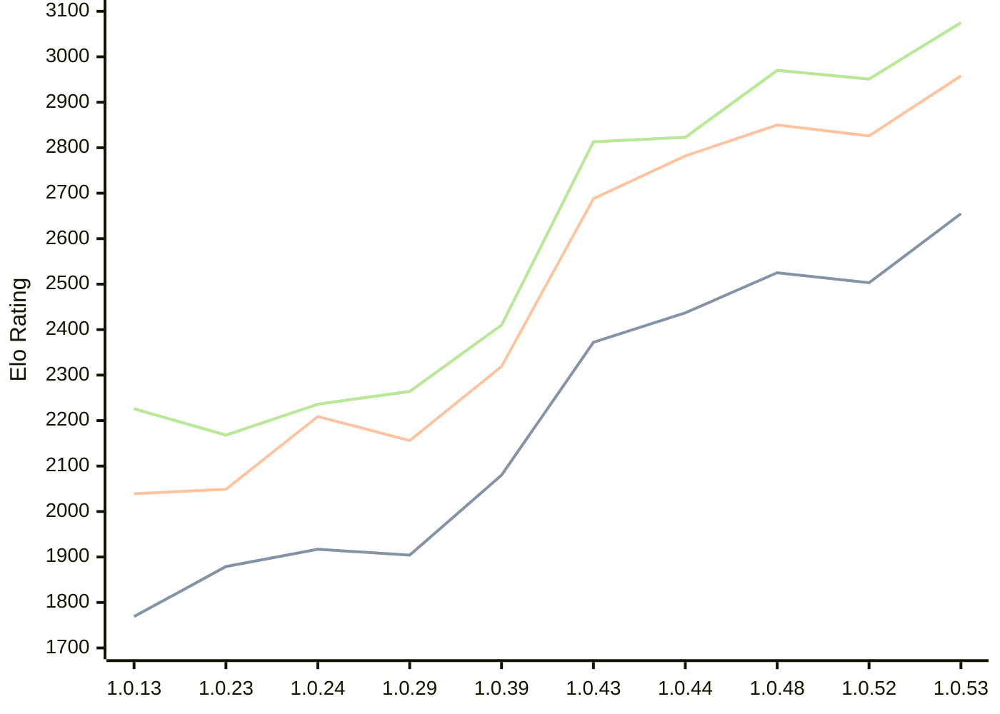

# Engine: RustyRival

Author: Chris Moreton

Home: https://github.com/chris-moreton/rusty-rival

## Elo Ratings

| Version | Published | STC 8.0+0.08s  | LTC 60.0+0.60s | VLTC 2m24s+1.12s | Comment |
| --- | --- | --- | --- | --- | --- |
| 1.0.53 | 2026-08-07 | 2655(+152) | 2958(+132) | 3075(+124) |  |
| 1.0.52 | 2026-08-03 | 2503(+new) | 2826(+new) | 2951(+new) |  |
| 1.0.51 | 2026-08-02 |  |  |  |  |
| 1.0.50 | 2026-08-01 |  |  |  |  |
| 1.0.49 | 2026-08-01 |  |  |  |  |
| 1.0.48 | 2026-07-26 | 2525(+new) | 2850(+new) | 2970(+new) |  |
| 1.0.47 | 2026-07-23 |  |  |  |  |
| 1.0.46 | 2026-07-23 |  |  |  |  |
| 1.0.45 | 2026-07-20 |  |  |  |  |
| 1.0.44 | 2026-07-20 | 2437(+65) | 2782(+94) | 2823(+10) |  |
| 1.0.43 | 2026-04-26 | 2372(+new) | 2688(+new) | 2813(+new) |  |
| 1.0.42 | 2026-04-24 |  |  |  | eval skipped |
| 1.0.40 | 2026-04-02 |  |  |  | eval skipped |
| 1.0.39 | 2026-03-30 | 2080(+new) | 2319(+new) | 2410(+new) |  |
| 1.0.36 | 2026-03-18 |  |  |  | eval skipped |
| 1.0.34 | 2026-03-10 |  |  |  | eval skipped |
| 1.0.29 | 2026-02-10 | 1904(-13) | 2156(-53) | 2264(+28) |  |
| 1.0.24 | 2026-01-30 | 1917(+38) | 2209(+160) | 2236(+68) |  |
| 1.0.23 | 2026-01-19 | 1879(+new) | 2049(-21) | 2168(+17) |  |
| 1.0.19 | 2026-01-12 |  | 2070(+new) | 2151(-163) |  |
| 1.0.17 | 2026-01-11 | 1866(+new) |  | 2314(+49) |  |
| 1.0.15 | 2026-01-11 |  | 2093(+54) | 2265(+39) |  |
| 1.0.13 | 2026-01-10 | 1769(+new) | 2039(+new) | 2226(+new) |  |
| 1.0.7 | 2025-12-30 |  |  |  | thread 'main' (10808) panicked at src\main.rs:17:36: |
 | | | cElo (∆ prev) | cElo (∆ prev) | cElo (∆ prev) | 

<a href="https://github.com/computer-chess-index/cci/issues/new?template=submit-version.yml&title=[VERSION]+RustyRival+<version>&body=###%20Engine%20name%0ARustyRival%0A%0A###%20Version%0A1.0.53" target="_blank">Submit new version</a>

 Test Conditions:

GUI/CLI: <a href=https://github.com/cutechess/cutechess target="_blank">Cute-Chess</a> 
Elo Calculation: <a href=https://www.remi-coulom.fr/Bayesian-Elo/ target="_blank">Bayesian-Elo</a> 
CPU: Intel(R) Core(TM) i5-7500T 2.70GHz 
Opening book: 8_moves_v3 
\* STC: 8.0+0.08s, LTC: 60.0+0.60s, VLTC: 2m24s+1.12s

 Lists:
Ratings: <a href=https://github.com/computer-chess-index/cci/blob/main/lists/CCIRatings.csv target="_blank">Complete list</a>

Generated: 2026-08-22 06:29:39

## Ratings Verlauf

⬛ STC (8.0+0.08s) &nbsp;&nbsp; 🟧 LTC (60.0+0.60s) &nbsp;&nbsp; 🟩 VLTC (2m24s+1.12s)

dark mode: 🟩STC (8.0+0.08s) 🟧LTC (60.0+0.60s) ⬜VLTC (2m24s+1.12s)

## Detailed Evaluation Results

| Version | Time Control | Elo  | Range +/- | Matches | Score | Average Opponent Elo | Draws |
| --- | --- | --- | --- | --- | --- | --- | --- |
| 1.0.53 | VLTC (2m24s+1.12s) | 3075 | 47 | 128 | 48% | 3086 | 52% |
| 1.0.53 | LTC (60.0+0.60s) | 2958 | 54 | 100 | 52% | 2943 | 43% |
| 1.0.53 | STC (8.0+0.08s) | 2655 | 52 | 124 | 51% | 2647 | 29% |
| --- | --- | --- | --- | --- | --- | --- | --- |
| 1.0.52 | VLTC (2m24s+1.12s) | 2951 | 42 | 172 | 51% | 2939 | 41% |
| 1.0.52 | LTC (60.0+0.60s) | 2826 | 47 | 148 | 49% | 2831 | 31% |
| 1.0.52 | STC (8.0+0.08s) | 2503 | 46 | 164 | 53% | 2471 | 23% |
| --- | --- | --- | --- | --- | --- | --- | --- |
| 1.0.48 | VLTC (2m24s+1.12s) | 2970 | 50 | 122 | 52% | 2957 | 38% |
| 1.0.48 | LTC (60.0+0.60s) | 2850 | 47 | 144 | 50% | 2853 | 37% |
| 1.0.48 | STC (8.0+0.08s) | 2525 | 48 | 156 | 45% | 2569 | 20% |
| --- | --- | --- | --- | --- | --- | --- | --- |
| 1.0.44 | VLTC (2m24s+1.12s) | 2823 | 50 | 140 | 55% | 2773 | 26% |
| 1.0.44 | LTC (60.0+0.60s) | 2782 | 50 | 128 | 52% | 2770 | 33% |
| 1.0.44 | STC (8.0+0.08s) | 2437 | 51 | 136 | 49% | 2448 | 20% |
| --- | --- | --- | --- | --- | --- | --- | --- |
| 1.0.43 | VLTC (2m24s+1.12s) | 2813 | 39 | 220 | 52% | 2793 | 30% |
| 1.0.43 | LTC (60.0+0.60s) | 2688 | 37 | 240 | 54% | 2643 | 29% |
| 1.0.43 | STC (8.0+0.08s) | 2372 | 43 | 192 | 50% | 2369 | 23% |
| --- | --- | --- | --- | --- | --- | --- | --- |
| 1.0.39 | VLTC (2m24s+1.12s) | 2410 | 39 | 228 | 51% | 2402 | 24% |
| 1.0.39 | LTC (60.0+0.60s) | 2319 | 41 | 208 | 52% | 2304 | 25% |
| 1.0.39 | STC (8.0+0.08s) | 2080 | 42 | 208 | 52% | 2047 | 16% |
| --- | --- | --- | --- | --- | --- | --- | --- |
| 1.0.29 | VLTC (2m24s+1.12s) | 2264 | 64 | 82 | 52% | 2245 | 28% |
| 1.0.29 | LTC (60.0+0.60s) | 2156 | 71 | 70 | 51% | 2151 | 19% |
| 1.0.29 | STC (8.0+0.08s) | 1904 | 111 | 28 | 48% | 1917 | 18% |
| --- | --- | --- | --- | --- | --- | --- | --- |
| 1.0.24 | VLTC (2m24s+1.12s) | 2236 | 72 | 64 | 52% | 2210 | 27% |
| 1.0.24 | LTC (60.0+0.60s) | 2209 | 71 | 66 | 54% | 2171 | 26% |
| 1.0.24 | STC (8.0+0.08s) | 1917 | 104 | 32 | 53% | 1895 | 19% |
| --- | --- | --- | --- | --- | --- | --- | --- |
| 1.0.23 | VLTC (2m24s+1.12s) | 2168 | 71 | 64 | 49% | 2172 | 30% |
| 1.0.23 | LTC (60.0+0.60s) | 2049 | 78 | 60 | 42% | 2128 | 17% |
| 1.0.23 | STC (8.0+0.08s) | 1879 | 133 | 20 | 50% | 1878 | 10% |
| --- | --- | --- | --- | --- | --- | --- | --- |
| 1.0.19 | VLTC (2m24s+1.12s) | 2151 | 204 | 8 | 31% | 2313 | 13% |
| 1.0.19 | LTC (60.0+0.60s) | 2070 | 86 | 56 | 36% | 2230 | 18% |
| 1.0.17 | VLTC (2m24s+1.12s) | 2314 | 231 | 4 | 50% | 2314 | 50% |
| 1.0.17 | STC (8.0+0.08s) | 1866 | 227 | 10 | 20% | 2221 | 0% |
| --- | --- | --- | --- | --- | --- | --- | --- |
| 1.0.15 | VLTC (2m24s+1.12s) | 2265 | 84 | 52 | 54% | 2222 | 15% |
| 1.0.15 | LTC (60.0+0.60s) | 2093 | 188 | 8 | 50% | 2106 | 25% |
| 1.0.13 | VLTC (2m24s+1.12s) | 2226 | 143 | 20 | 33% | 2444 | 15% |
| 1.0.13 | LTC (60.0+0.60s) | 2039 | 198 | 8 | 56% | 1991 | 13% |
| 1.0.13 | STC (8.0+0.08s) | 1769 | 210 | 12 | 25% | 2093 | 0% |
| --- | --- | --- | --- | --- | --- | --- | --- |
| 1.0.9 | LTC (60.0+0.60s) | 1958 | 153 | 16 | 34% | 2124 | 19% |