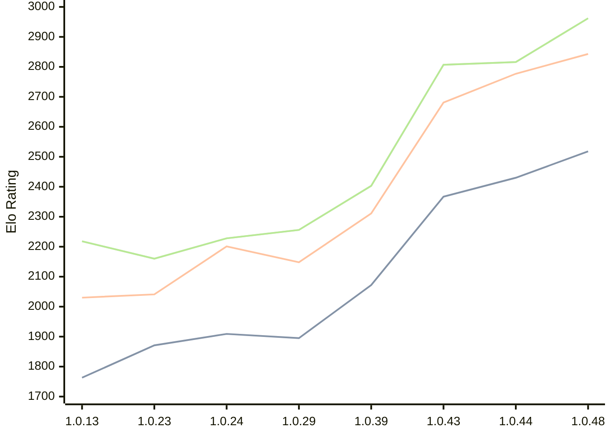

# Engine: RustyRival

Author: Chris Moreton

Home: https://github.com/chris-moreton/rusty-rival

## Elo Ratings

| Version | Published | STC 8.0+0.08s  | LTC 60.0+0.60s | VLTC 2m24s+1.12s | Comment |
| --- | --- | --- | --- | --- | --- |
| 1.0.52 | 2026-08-03 |  |  |  |  |
| 1.0.52 | 2026-08-03 |  |  |  |  |
| 1.0.51 | 2026-08-02 |  |  |  |  |
| 1.0.50 | 2026-08-01 |  |  |  |  |
| 1.0.49 | 2026-08-01 |  |  |  |  |
| 1.0.48 | 2026-07-26 | 2518(+new) | 2843(+new) | 2962(+new) |  |
| 1.0.47 | 2026-07-23 |  |  |  |  |
| 1.0.46 | 2026-07-23 |  |  |  |  |
| 1.0.45 | 2026-07-20 |  |  |  |  |
| 1.0.44 | 2026-07-20 | 2430(+63) | 2777(+96) | 2816(+9) |  |
| 1.0.43 | 2026-04-26 | 2367(+new) | 2681(+new) | 2807(+new) |  |
| 1.0.42 | 2026-04-24 |  |  |  | eval skipped |
| 1.0.40 | 2026-04-02 |  |  |  | eval skipped |
| 1.0.39 | 2026-03-30 | 2072(+new) | 2311(+new) | 2403(+new) |  |
| 1.0.38 | 2026-03-29 |  |  |  | eval skipped |
| 1.0.37 | 2026-03-28 |  |  |  | eval skipped |
| 1.0.36 | 2026-03-18 |  |  |  | eval skipped |
| 1.0.34 | 2026-03-10 |  |  |  | eval skipped |
| 1.0.33 | 2026-03-10 |  |  |  |  |
| 1.0.32 | 2026-03-09 |  |  |  |  |
| 1.0.31 | 2026-03-06 |  |  |  | eval skipped |
| 1.0.30 | 2026-03-06 |  |  |  |  |
| 1.0.29 | 2026-02-10 | 1895(+new) | 2148(+new) | 2256(+new) |  |
| 1.0.28 | 2026-02-10 |  |  |  |  |
| 1.0.27 | 2026-02-09 |  |  |  |  |
| 1.0.26 | 2026-02-01 |  |  |  |  |
| 1.0.25 | 2026-02-01 |  |  |  |  |
| 1.0.24 | 2026-01-30 | 1909(+38) | 2201(+160) | 2228(+68) |  |
| 1.0.23 | 2026-01-19 | 1871(+new) | 2041(+new) | 2160(+new) |  |
| 1.0.21 | 2026-01-19 |  |  |  |  |
| 1.0.20 | 2026-01-17 |  |  |  |  |
| 1.0.19 | 2026-01-12 |  | 2063(+new) | 2144(+new) |  |
| 1.0.18 | 2026-01-12 |  |  |  |  |
| 1.0.17 | 2026-01-11 | 1859(+new) |  | 2306(+49) |  |
| 1.0.15 | 2026-01-11 |  | 2084(+54) | 2257(+39) |  |
| 1.0.13 | 2026-01-10 | 1763(+new) | 2030(+new) | 2218(+new) |  |
| 1.0.12 | 2026-01-10 |  |  |  |  |
| 1.0.11 | 2026-01-10 |  |  |  |  |
| 1.0.10 | 2026-01-09 |  |  |  |  |
| 1.0.9 | 2026-01-01 |  | 1948(+new) |  |  |
| 1.0.8 | 2026-01-01 |  |  |  |  |
| 1.0.7 | 2025-12-30 |  |  |  | thread 'main' (10808) panicked at src\main.rs:17:36: |
| 1.0.6 | 2025-12-30 |  |  |  |  |
| 1.0.4 | 2022-05-29 |  |  |  |  |
| 1.0.3 | 2022-05-03 |  |  |  |  |
| 1.0.2 | 2022-04-13 |  |  |  |  |
| 1.0.1 | 2022-04-05 |  |  |  |  |
| 1.0.0 | 2022-04-03 |  |  |  |  |
 | | | cElo (∆ prev) | cElo (∆ prev) | cElo (∆ prev) | 

<a href="https://github.com/computer-chess-index/cci/issues/new?template=submit-version.yml&title=[VERSION]+RustyRival+<version>&body=###%20Engine%20name%0ARustyRival%0A%0A###%20Version%0A1.0.52" target="_blank">Submit new version</a>

 Test Conditions:

GUI/CLI: <a href=https://github.com/cutechess/cutechess target="_blank">Cute-Chess</a> 
Elo Calculation: <a href=https://www.remi-coulom.fr/Bayesian-Elo/ target="_blank">Bayesian-Elo</a> 
CPU: Intel(R) Core(TM) i5-7500T 2.70GHz 
Opening book: 8_moves_v3 
\* STC: 8.0+0.08s, LTC: 60.0+0.60s, VLTC: 2m24s+1.12s

 Lists:
Ratings: <a href=https://github.com/computer-chess-index/cci/blob/main/lists/CCIRatings.csv target="_blank">Complete list</a>

Generated: 2026-08-06 06:29:20

## Ratings Verlauf

⬛ STC (8.0+0.08s) &nbsp;&nbsp; 🟧 LTC (60.0+0.60s) &nbsp;&nbsp; 🟩 VLTC (2m24s+1.12s)

dark mode: 🟩STC (8.0+0.08s) 🟧LTC (60.0+0.60s) ⬜VLTC (2m24s+1.12s)

## Detailed Evaluation Results

| Version | Time Control | Elo  | Range +/- | Matches | Score | Average Opponent Elo | Draws |
| --- | --- | --- | --- | --- | --- | --- | --- |
| 1.0.48 | VLTC (2m24s+1.12s) | 2962 | 50 | 122 | 52% | 2948 | 38% |
| 1.0.48 | LTC (60.0+0.60s) | 2843 | 46 | 144 | 50% | 2847 | 37% |
| 1.0.48 | STC (8.0+0.08s) | 2518 | 48 | 156 | 45% | 2562 | 20% |
| --- | --- | --- | --- | --- | --- | --- | --- |
| 1.0.44 | VLTC (2m24s+1.12s) | 2816 | 50 | 140 | 55% | 2768 | 26% |
| 1.0.44 | LTC (60.0+0.60s) | 2777 | 50 | 128 | 52% | 2765 | 33% |
| 1.0.44 | STC (8.0+0.08s) | 2430 | 51 | 136 | 49% | 2441 | 20% |
| --- | --- | --- | --- | --- | --- | --- | --- |
| 1.0.43 | VLTC (2m24s+1.12s) | 2807 | 39 | 220 | 52% | 2786 | 30% |
| 1.0.43 | LTC (60.0+0.60s) | 2681 | 37 | 240 | 54% | 2637 | 29% |
| 1.0.43 | STC (8.0+0.08s) | 2367 | 43 | 192 | 50% | 2363 | 23% |
| --- | --- | --- | --- | --- | --- | --- | --- |
| 1.0.39 | VLTC (2m24s+1.12s) | 2403 | 39 | 228 | 51% | 2395 | 24% |
| 1.0.39 | LTC (60.0+0.60s) | 2311 | 41 | 208 | 52% | 2298 | 25% |
| 1.0.39 | STC (8.0+0.08s) | 2072 | 42 | 208 | 52% | 2039 | 16% |
| --- | --- | --- | --- | --- | --- | --- | --- |
| 1.0.29 | VLTC (2m24s+1.12s) | 2256 | 64 | 82 | 52% | 2238 | 28% |
| 1.0.29 | LTC (60.0+0.60s) | 2148 | 71 | 70 | 51% | 2142 | 19% |
| 1.0.29 | STC (8.0+0.08s) | 1895 | 111 | 28 | 48% | 1909 | 18% |
| --- | --- | --- | --- | --- | --- | --- | --- |
| 1.0.24 | VLTC (2m24s+1.12s) | 2228 | 72 | 64 | 52% | 2202 | 27% |
| 1.0.24 | LTC (60.0+0.60s) | 2201 | 71 | 66 | 54% | 2163 | 26% |
| 1.0.24 | STC (8.0+0.08s) | 1909 | 104 | 32 | 53% | 1886 | 19% |
| --- | --- | --- | --- | --- | --- | --- | --- |
| 1.0.23 | VLTC (2m24s+1.12s) | 2160 | 71 | 64 | 49% | 2165 | 30% |
| 1.0.23 | LTC (60.0+0.60s) | 2041 | 78 | 60 | 42% | 2120 | 17% |
| 1.0.23 | STC (8.0+0.08s) | 1871 | 133 | 20 | 50% | 1868 | 10% |
| --- | --- | --- | --- | --- | --- | --- | --- |
| 1.0.19 | VLTC (2m24s+1.12s) | 2144 | 204 | 8 | 31% | 2306 | 13% |
| 1.0.19 | LTC (60.0+0.60s) | 2063 | 86 | 56 | 36% | 2223 | 18% |
| 1.0.17 | VLTC (2m24s+1.12s) | 2306 | 231 | 4 | 50% | 2306 | 50% |
| 1.0.17 | STC (8.0+0.08s) | 1859 | 227 | 10 | 20% | 2214 | 0% |
| --- | --- | --- | --- | --- | --- | --- | --- |
| 1.0.15 | VLTC (2m24s+1.12s) | 2257 | 84 | 52 | 54% | 2214 | 15% |
| 1.0.15 | LTC (60.0+0.60s) | 2084 | 188 | 8 | 50% | 2098 | 25% |
| 1.0.13 | VLTC (2m24s+1.12s) | 2218 | 143 | 20 | 33% | 2435 | 15% |
| 1.0.13 | LTC (60.0+0.60s) | 2030 | 198 | 8 | 56% | 1983 | 13% |
| 1.0.13 | STC (8.0+0.08s) | 1763 | 209 | 12 | 25% | 2087 | 0% |
| --- | --- | --- | --- | --- | --- | --- | --- |
| 1.0.9 | LTC (60.0+0.60s) | 1948 | 153 | 16 | 34% | 2115 | 19% |