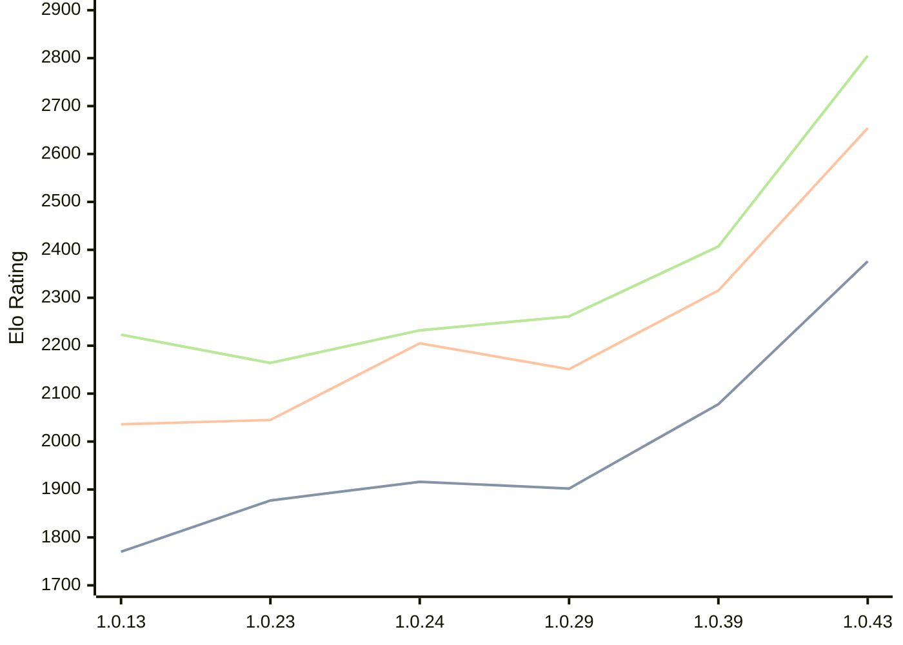

# Engine: RustyRival

Author: Chris Moreton

Home: https://github.com/chris-moreton/rusty-rival

## Elo Ratings

| Version | Published | STC 8.0+0.08s  | LTC 60.0+0.60s | VLTC 2m24s+1.12s | Comment |
| --- | --- | --- | --- | --- | --- |
| 1.0.43 | 2026-04-26 | 2376(+new) | 2654(+new) | 2805(+new) |  |
| 1.0.42 | 2026-04-24 |  |  |  | eval skipped |
| 1.0.40 | 2026-04-02 |  |  |  | eval skipped |
| 1.0.39 | 2026-03-30 | 2078(+new) | 2315(+new) | 2407(+new) |  |
| 1.0.38 | 2026-03-29 |  |  |  | eval skipped |
| 1.0.37 | 2026-03-28 |  |  |  | eval skipped |
| 1.0.36 | 2026-03-18 |  |  |  | eval skipped |
| 1.0.34 | 2026-03-10 |  |  |  | eval skipped |
| 1.0.33 | 2026-03-10 |  |  |  |  |
| 1.0.32 | 2026-03-09 |  |  |  |  |
| 1.0.31 | 2026-03-06 |  |  |  | eval skipped |
| 1.0.30 | 2026-03-06 |  |  |  |  |
| 1.0.29 | 2026-02-10 | 1902(+new) | 2151(+new) | 2261(+new) |  |
| 1.0.28 | 2026-02-10 |  |  |  |  |
| 1.0.27 | 2026-02-09 |  |  |  |  |
| 1.0.26 | 2026-02-01 |  |  |  |  |
| 1.0.25 | 2026-02-01 |  |  |  |  |
| 1.0.24 | 2026-01-30 | 1916(+39) | 2205(+160) | 2232(+68) |  |
| 1.0.23 | 2026-01-19 | 1877(+new) | 2045(+new) | 2164(+new) |  |
| 1.0.21 | 2026-01-19 |  |  |  |  |
| 1.0.20 | 2026-01-17 |  |  |  |  |
| 1.0.19 | 2026-01-12 |  | 2064(+new) | 2149(+new) |  |
| 1.0.18 | 2026-01-12 |  |  |  |  |
| 1.0.17 | 2026-01-11 | 1863(+new) |  | 2311(+47) |  |
| 1.0.15 | 2026-01-11 |  | 2090(+54) | 2264(+41) |  |
| 1.0.13 | 2026-01-10 | 1770(+new) | 2036(+new) | 2223(+new) |  |
| 1.0.12 | 2026-01-10 |  |  |  |  |
| 1.0.11 | 2026-01-10 |  |  |  |  |
| 1.0.10 | 2026-01-09 |  |  |  |  |
| 1.0.9 | 2026-01-01 |  | 1955(+new) |  |  |
| 1.0.8 | 2026-01-01 |  |  |  |  |
| 1.0.7 | 2025-12-30 |  |  |  | thread 'main' (10808) panicked at src\main.rs:17:36: |
| 1.0.6 | 2025-12-30 |  |  |  |  |
| 1.0.4 | 2022-05-29 |  |  |  |  |
| 1.0.3 | 2022-05-03 |  |  |  |  |
| 1.0.2 | 2022-04-13 |  |  |  |  |
| 1.0.1 | 2022-04-05 |  |  |  |  |
| 1.0.0 | 2022-04-03 |  |  |  |  |
 | | | cElo (∆ prev) | cElo (∆ prev) | cElo (∆ prev) | 

<a href="https://github.com/computer-chess-index/cci/issues/new?template=submit-version.yml&title=[VERSION]+RustyRival+<version>&body=###%20Engine%20name%0ARustyRival%0A%0A###%20Version%0A1.0.43" target="_blank">Submit new version</a>

 Test Conditions:

GUI/CLI: <a href=https://github.com/cutechess/cutechess target="_blank">Cute-Chess</a> 
Elo Calculation: <a href=https://www.remi-coulom.fr/Bayesian-Elo/ target="_blank">Bayesian-Elo</a> 
CPU: Intel(R) Core(TM) i5-7500T 2.70GHz 
Opening book: 8_moves_v3 
\* STC: 8.0+0.08s, LTC: 60.0+0.60s, VLTC: 2m24s+1.12s

 Lists:
Ratings: <a href=https://github.com/computer-chess-index/cci/blob/main/lists/CCIRatings.csv target="_blank">Complete list</a>

Generated: 2026-06-07 06:27:53

## Ratings Verlauf

⬛ STC (8.0+0.08s) &nbsp;&nbsp; 🟧 LTC (60.0+0.60s) &nbsp;&nbsp; 🟩 VLTC (2m24s+1.12s)

dark mode: 🟩STC (8.0+0.08s) 🟧LTC (60.0+0.60s) ⬜VLTC (2m24s+1.12s)

## Detailed Evaluation Results

| Version | Time Control | Elo  | Range +/- | Matches | Score | Average Opponent Elo | Draws |
| --- | --- | --- | --- | --- | --- | --- | --- |
| 1.0.43 | VLTC (2m24s+1.12s) | 2805 | 42 | 180 | 52% | 2778 | 33% |
| 1.0.43 | LTC (60.0+0.60s) | 2654 | 44 | 176 | 53% | 2626 | 29% |
| 1.0.43 | STC (8.0+0.08s) | 2376 | 48 | 152 | 51% | 2358 | 22% |
| --- | --- | --- | --- | --- | --- | --- | --- |
| 1.0.39 | VLTC (2m24s+1.12s) | 2407 | 39 | 228 | 51% | 2399 | 24% |
| 1.0.39 | LTC (60.0+0.60s) | 2315 | 41 | 208 | 52% | 2302 | 25% |
| 1.0.39 | STC (8.0+0.08s) | 2078 | 42 | 208 | 52% | 2043 | 16% |
| --- | --- | --- | --- | --- | --- | --- | --- |
| 1.0.29 | VLTC (2m24s+1.12s) | 2261 | 64 | 82 | 52% | 2242 | 28% |
| 1.0.29 | LTC (60.0+0.60s) | 2151 | 71 | 70 | 51% | 2147 | 19% |
| 1.0.29 | STC (8.0+0.08s) | 1902 | 111 | 28 | 48% | 1914 | 18% |
| --- | --- | --- | --- | --- | --- | --- | --- |
| 1.0.24 | VLTC (2m24s+1.12s) | 2232 | 72 | 64 | 52% | 2206 | 27% |
| 1.0.24 | LTC (60.0+0.60s) | 2205 | 71 | 66 | 54% | 2165 | 26% |
| 1.0.24 | STC (8.0+0.08s) | 1916 | 104 | 32 | 53% | 1893 | 19% |
| --- | --- | --- | --- | --- | --- | --- | --- |
| 1.0.23 | VLTC (2m24s+1.12s) | 2164 | 71 | 64 | 49% | 2169 | 30% |
| 1.0.23 | LTC (60.0+0.60s) | 2045 | 78 | 60 | 42% | 2124 | 17% |
| 1.0.23 | STC (8.0+0.08s) | 1877 | 133 | 20 | 50% | 1875 | 10% |
| --- | --- | --- | --- | --- | --- | --- | --- |
| 1.0.19 | VLTC (2m24s+1.12s) | 2149 | 204 | 8 | 31% | 2311 | 13% |
| 1.0.19 | LTC (60.0+0.60s) | 2064 | 86 | 56 | 36% | 2225 | 18% |
| 1.0.17 | VLTC (2m24s+1.12s) | 2311 | 231 | 4 | 50% | 2311 | 50% |
| 1.0.17 | STC (8.0+0.08s) | 1863 | 227 | 10 | 20% | 2218 | 0% |
| --- | --- | --- | --- | --- | --- | --- | --- |
| 1.0.15 | VLTC (2m24s+1.12s) | 2264 | 84 | 52 | 54% | 2221 | 15% |
| 1.0.15 | LTC (60.0+0.60s) | 2090 | 188 | 8 | 50% | 2102 | 25% |
| 1.0.13 | VLTC (2m24s+1.12s) | 2223 | 143 | 20 | 33% | 2439 | 15% |
| 1.0.13 | LTC (60.0+0.60s) | 2036 | 198 | 8 | 56% | 1989 | 13% |
| 1.0.13 | STC (8.0+0.08s) | 1770 | 209 | 12 | 25% | 2093 | 0% |
| --- | --- | --- | --- | --- | --- | --- | --- |
| 1.0.9 | LTC (60.0+0.60s) | 1955 | 153 | 16 | 34% | 2122 | 19% |