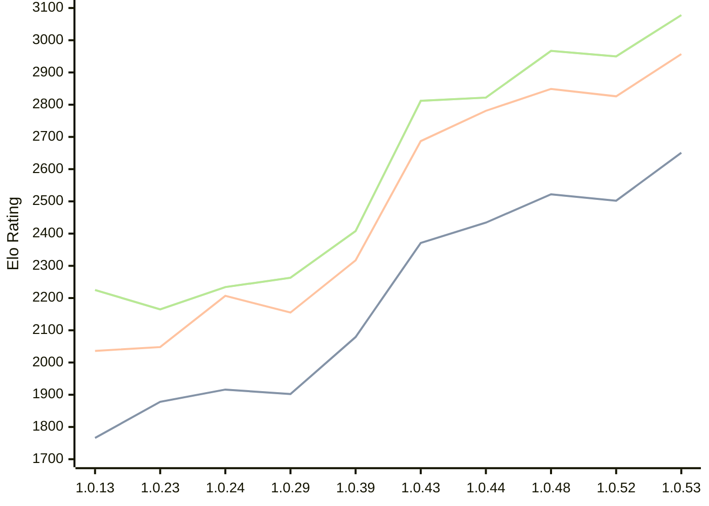

# Engine: RustyRival

Author: Chris Moreton

Home: https://github.com/chris-moreton/rusty-rival

## Elo Ratings

| Version | Published | STC 8.0+0.08s  | LTC 60.0+0.60s | VLTC 2m24s+1.12s | Comment |
| --- | --- | --- | --- | --- | --- |
| 1.0.53 | 2026-08-07 | 2651(+149) | 2957(+131) | 3078(+128) |  |
| 1.0.52 | 2026-08-03 | 2502(+new) | 2826(+new) | 2950(+new) |  |
| 1.0.51 | 2026-08-02 |  |  |  |  |
| 1.0.50 | 2026-08-01 |  |  |  |  |
| 1.0.49 | 2026-08-01 |  |  |  |  |
| 1.0.48 | 2026-07-26 | 2522(+new) | 2849(+new) | 2967(+new) |  |
| 1.0.47 | 2026-07-23 |  |  |  |  |
| 1.0.46 | 2026-07-23 |  |  |  |  |
| 1.0.45 | 2026-07-20 |  |  |  |  |
| 1.0.44 | 2026-07-20 | 2434(+63) | 2781(+94) | 2822(+10) |  |
| 1.0.43 | 2026-04-26 | 2371(+new) | 2687(+new) | 2812(+new) |  |
| 1.0.42 | 2026-04-24 |  |  |  | eval skipped |
| 1.0.40 | 2026-04-02 |  |  |  | eval skipped |
| 1.0.39 | 2026-03-30 | 2079(+new) | 2317(+new) | 2408(+new) |  |
| 1.0.36 | 2026-03-18 |  |  |  | eval skipped |
| 1.0.34 | 2026-03-10 |  |  |  | eval skipped |
| 1.0.29 | 2026-02-10 | 1902(-14) | 2155(-52) | 2263(+29) |  |
| 1.0.24 | 2026-01-30 | 1916(+38) | 2207(+159) | 2234(+69) |  |
| 1.0.23 | 2026-01-19 | 1878(+new) | 2048(-20) | 2165(+16) |  |
| 1.0.19 | 2026-01-12 |  | 2068(+new) | 2149(-162) |  |
| 1.0.17 | 2026-01-11 | 1864(+new) |  | 2311(+47) |  |
| 1.0.15 | 2026-01-11 |  | 2091(+55) | 2264(+39) |  |
| 1.0.13 | 2026-01-10 | 1766(+new) | 2036(+new) | 2225(+new) |  |
| 1.0.7 | 2025-12-30 |  |  |  | thread 'main' (10808) panicked at src\main.rs:17:36: |
 | | | cElo (∆ prev) | cElo (∆ prev) | cElo (∆ prev) | 

<a href="https://github.com/computer-chess-index/cci/issues/new?template=submit-version.yml&title=[VERSION]+RustyRival+<version>&body=###%20Engine%20name%0ARustyRival%0A%0A###%20Version%0A1.0.53" target="_blank">Submit new version</a>

 Test Conditions:

GUI/CLI: <a href=https://github.com/cutechess/cutechess target="_blank">Cute-Chess</a> 
Elo Calculation: <a href=https://www.remi-coulom.fr/Bayesian-Elo/ target="_blank">Bayesian-Elo</a> 
CPU: Intel(R) Core(TM) i5-7500T 2.70GHz 
Opening book: 8_moves_v3 
\* STC: 8.0+0.08s, LTC: 60.0+0.60s, VLTC: 2m24s+1.12s

 Lists:
Ratings: <a href=https://github.com/computer-chess-index/cci/blob/main/lists/CCIRatings.csv target="_blank">Complete list</a>

Generated: 2026-08-21 06:30:55

## Ratings Verlauf

⬛ STC (8.0+0.08s) &nbsp;&nbsp; 🟧 LTC (60.0+0.60s) &nbsp;&nbsp; 🟩 VLTC (2m24s+1.12s)

dark mode: 🟩STC (8.0+0.08s) 🟧LTC (60.0+0.60s) ⬜VLTC (2m24s+1.12s)

## Detailed Evaluation Results

| Version | Time Control | Elo  | Range +/- | Matches | Score | Average Opponent Elo | Draws |
| --- | --- | --- | --- | --- | --- | --- | --- |
| 1.0.53 | VLTC (2m24s+1.12s) | 3078 | 53 | 100 | 48% | 3096 | 53% |
| 1.0.53 | LTC (60.0+0.60s) | 2957 | 56 | 96 | 52% | 2940 | 43% |
| 1.0.53 | STC (8.0+0.08s) | 2651 | 55 | 112 | 51% | 2643 | 27% |
| --- | --- | --- | --- | --- | --- | --- | --- |
| 1.0.52 | VLTC (2m24s+1.12s) | 2950 | 42 | 172 | 51% | 2938 | 41% |
| 1.0.52 | LTC (60.0+0.60s) | 2826 | 47 | 148 | 49% | 2831 | 31% |
| 1.0.52 | STC (8.0+0.08s) | 2502 | 46 | 164 | 53% | 2469 | 23% |
| --- | --- | --- | --- | --- | --- | --- | --- |
| 1.0.48 | VLTC (2m24s+1.12s) | 2967 | 50 | 122 | 52% | 2954 | 38% |
| 1.0.48 | LTC (60.0+0.60s) | 2849 | 47 | 144 | 50% | 2853 | 37% |
| 1.0.48 | STC (8.0+0.08s) | 2522 | 48 | 156 | 45% | 2566 | 20% |
| --- | --- | --- | --- | --- | --- | --- | --- |
| 1.0.44 | VLTC (2m24s+1.12s) | 2822 | 50 | 140 | 55% | 2772 | 26% |
| 1.0.44 | LTC (60.0+0.60s) | 2781 | 50 | 128 | 52% | 2769 | 33% |
| 1.0.44 | STC (8.0+0.08s) | 2434 | 51 | 136 | 49% | 2445 | 20% |
| --- | --- | --- | --- | --- | --- | --- | --- |
| 1.0.43 | VLTC (2m24s+1.12s) | 2812 | 39 | 220 | 52% | 2792 | 30% |
| 1.0.43 | LTC (60.0+0.60s) | 2687 | 37 | 240 | 54% | 2641 | 29% |
| 1.0.43 | STC (8.0+0.08s) | 2371 | 43 | 192 | 50% | 2368 | 23% |
| --- | --- | --- | --- | --- | --- | --- | --- |
| 1.0.39 | VLTC (2m24s+1.12s) | 2408 | 39 | 228 | 51% | 2400 | 24% |
| 1.0.39 | LTC (60.0+0.60s) | 2317 | 41 | 208 | 52% | 2303 | 25% |
| 1.0.39 | STC (8.0+0.08s) | 2079 | 42 | 208 | 52% | 2045 | 16% |
| --- | --- | --- | --- | --- | --- | --- | --- |
| 1.0.29 | VLTC (2m24s+1.12s) | 2263 | 64 | 82 | 52% | 2244 | 28% |
| 1.0.29 | LTC (60.0+0.60s) | 2155 | 71 | 70 | 51% | 2149 | 19% |
| 1.0.29 | STC (8.0+0.08s) | 1902 | 111 | 28 | 48% | 1916 | 18% |
| --- | --- | --- | --- | --- | --- | --- | --- |
| 1.0.24 | VLTC (2m24s+1.12s) | 2234 | 72 | 64 | 52% | 2207 | 27% |
| 1.0.24 | LTC (60.0+0.60s) | 2207 | 71 | 66 | 54% | 2168 | 26% |
| 1.0.24 | STC (8.0+0.08s) | 1916 | 104 | 32 | 53% | 1894 | 19% |
| --- | --- | --- | --- | --- | --- | --- | --- |
| 1.0.23 | VLTC (2m24s+1.12s) | 2165 | 71 | 64 | 49% | 2171 | 30% |
| 1.0.23 | LTC (60.0+0.60s) | 2048 | 78 | 60 | 42% | 2126 | 17% |
| 1.0.23 | STC (8.0+0.08s) | 1878 | 133 | 20 | 50% | 1875 | 10% |
| --- | --- | --- | --- | --- | --- | --- | --- |
| 1.0.19 | VLTC (2m24s+1.12s) | 2149 | 204 | 8 | 31% | 2311 | 13% |
| 1.0.19 | LTC (60.0+0.60s) | 2068 | 86 | 56 | 36% | 2229 | 18% |
| 1.0.17 | VLTC (2m24s+1.12s) | 2311 | 231 | 4 | 50% | 2311 | 50% |
| 1.0.17 | STC (8.0+0.08s) | 1864 | 227 | 10 | 20% | 2219 | 0% |
| --- | --- | --- | --- | --- | --- | --- | --- |
| 1.0.15 | VLTC (2m24s+1.12s) | 2264 | 84 | 52 | 54% | 2221 | 15% |
| 1.0.15 | LTC (60.0+0.60s) | 2091 | 188 | 8 | 50% | 2103 | 25% |
| 1.0.13 | VLTC (2m24s+1.12s) | 2225 | 143 | 20 | 33% | 2442 | 15% |
| 1.0.13 | LTC (60.0+0.60s) | 2036 | 198 | 8 | 56% | 1989 | 13% |
| 1.0.13 | STC (8.0+0.08s) | 1766 | 210 | 12 | 25% | 2090 | 0% |
| --- | --- | --- | --- | --- | --- | --- | --- |
| 1.0.9 | LTC (60.0+0.60s) | 1955 | 153 | 16 | 34% | 2122 | 19% |