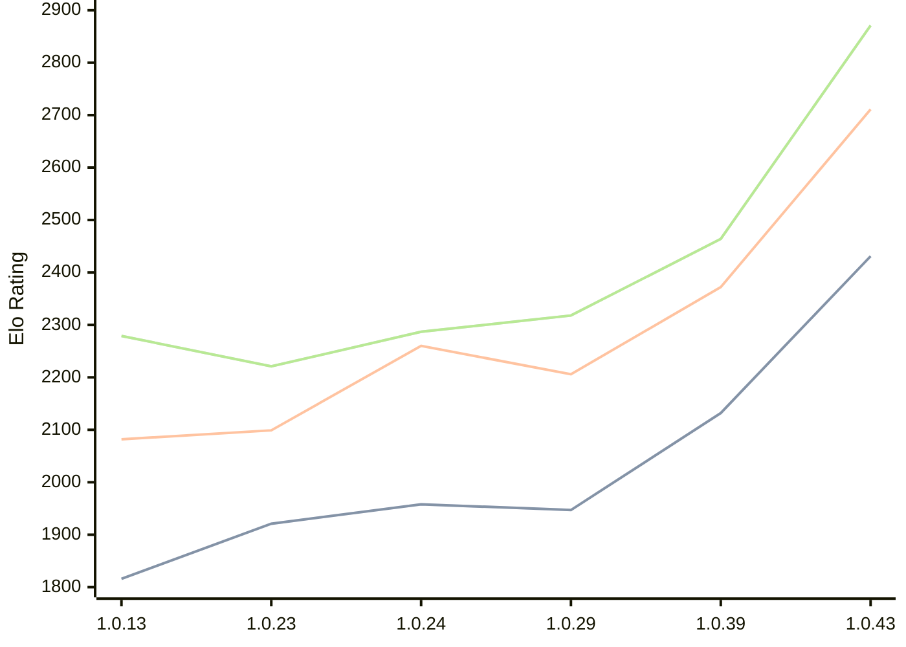

# Engine: RustyRival

Author: Chris Moreton

Home: https://github.com/chris-moreton/rusty-rival

## Elo Ratings

| Version | Published | STC 8.0+0.08s  | LTC 60.0+0.60s | VLTC 2m24s+1.12s | Comment |
| --- | --- | --- | --- | --- | --- |
| 1.0.43 | 2026-04-26 | 2431(+new) | 2711(+new) | 2871(+new) |  |
| 1.0.42 | 2026-04-24 |  |  |  | eval skipped |
| 1.0.40 | 2026-04-02 |  |  |  | eval skipped |
| 1.0.39 | 2026-03-30 | 2132(+new) | 2372(+new) | 2464(+new) |  |
| 1.0.38 | 2026-03-29 |  |  |  | eval skipped |
| 1.0.37 | 2026-03-28 |  |  |  | eval skipped |
| 1.0.36 | 2026-03-18 |  |  |  | eval skipped |
| 1.0.34 | 2026-03-10 |  |  |  | eval skipped |
| 1.0.33 | 2026-03-10 |  |  |  |  |
| 1.0.32 | 2026-03-09 |  |  |  |  |
| 1.0.31 | 2026-03-06 |  |  |  | eval skipped |
| 1.0.30 | 2026-03-06 |  |  |  |  |
| 1.0.29 | 2026-02-10 | 1947(+new) | 2206(+new) | 2318(+new) |  |
| 1.0.28 | 2026-02-10 |  |  |  |  |
| 1.0.27 | 2026-02-09 |  |  |  |  |
| 1.0.26 | 2026-02-01 |  |  |  |  |
| 1.0.25 | 2026-02-01 |  |  |  |  |
| 1.0.24 | 2026-01-30 | 1958(+37) | 2260(+161) | 2287(+66) |  |
| 1.0.23 | 2026-01-19 | 1921(+new) | 2099(+new) | 2221(+new) |  |
| 1.0.21 | 2026-01-19 |  |  |  |  |
| 1.0.20 | 2026-01-17 |  |  |  |  |
| 1.0.19 | 2026-01-12 |  | 2121(+new) | 2205(+new) |  |
| 1.0.18 | 2026-01-12 |  |  |  |  |
| 1.0.17 | 2026-01-11 | 1917(+new) |  | 2367(+49) |  |
| 1.0.15 | 2026-01-11 |  | 2141(+59) | 2318(+39) |  |
| 1.0.13 | 2026-01-10 | 1816(+new) | 2082(+new) | 2279(+new) |  |
| 1.0.12 | 2026-01-10 |  |  |  |  |
| 1.0.11 | 2026-01-10 |  |  |  |  |
| 1.0.10 | 2026-01-09 |  |  |  |  |
| 1.0.9 | 2026-01-01 |  | 2005(+new) |  |  |
| 1.0.8 | 2026-01-01 |  |  |  |  |
| 1.0.7 | 2025-12-30 |  |  |  | thread 'main' (10808) panicked at src\main.rs:17:36: |
| 1.0.6 | 2025-12-30 |  |  |  |  |
| 1.0.4 | 2022-05-29 |  |  |  |  |
| 1.0.3 | 2022-05-03 |  |  |  |  |
| 1.0.2 | 2022-04-13 |  |  |  |  |
| 1.0.1 | 2022-04-05 |  |  |  |  |
| 1.0.0 | 2022-04-03 |  |  |  |  |
 | | | cElo (∆ prev) | cElo (∆ prev) | cElo (∆ prev) | 

<a href="https://github.com/computer-chess-index/cci/issues/new?template=submit-version.yml&title=[VERSION]+RustyRival+<version>&body=###%20Engine%20name%0ARustyRival%0A%0A###%20Version%0A1.0.43" target="_blank">Submit new version</a>

 Test Conditions:

GUI/CLI: <a href=https://github.com/cutechess/cutechess target="_blank">Cute-Chess</a> 
Elo Calculation: <a href=https://www.remi-coulom.fr/Bayesian-Elo/ target="_blank">Bayesian-Elo</a> 
CPU: Intel(R) Core(TM) i5-7500T 2.70GHz 
Opening book: 8_moves_v3 
\* STC: 8.0+0.08s, LTC: 60.0+0.60s, VLTC: 2m24s+1.12s

 Lists:
Ratings: <a href=https://github.com/computer-chess-index/cci/blob/main/lists/CCIRatings.csv target="_blank">Complete list</a>

Generated: 2026-05-13 06:29:28

## Ratings Verlauf

⬛ STC (8.0+0.08s) &nbsp;&nbsp; 🟧 LTC (60.0+0.60s) &nbsp;&nbsp; 🟩 VLTC (2m24s+1.12s)

dark mode: 🟩STC (8.0+0.08s) 🟧LTC (60.0+0.60s) ⬜VLTC (2m24s+1.12s)

## Detailed Evaluation Results

| Version | Time Control | Elo  | Range +/- | Matches | Score | Average Opponent Elo | Draws |
| --- | --- | --- | --- | --- | --- | --- | --- |
| 1.0.43 | VLTC (2m24s+1.12s) | 2871 | 43 | 172 | 53% | 2835 | 33% |
| 1.0.43 | LTC (60.0+0.60s) | 2711 | 47 | 152 | 51% | 2692 | 29% |
| 1.0.43 | STC (8.0+0.08s) | 2431 | 49 | 144 | 51% | 2414 | 22% |
| --- | --- | --- | --- | --- | --- | --- | --- |
| 1.0.39 | VLTC (2m24s+1.12s) | 2464 | 39 | 228 | 51% | 2456 | 24% |
| 1.0.39 | LTC (60.0+0.60s) | 2372 | 41 | 208 | 52% | 2357 | 25% |
| 1.0.39 | STC (8.0+0.08s) | 2132 | 42 | 208 | 52% | 2097 | 16% |
| --- | --- | --- | --- | --- | --- | --- | --- |
| 1.0.29 | VLTC (2m24s+1.12s) | 2318 | 64 | 82 | 52% | 2299 | 28% |
| 1.0.29 | LTC (60.0+0.60s) | 2206 | 71 | 70 | 51% | 2202 | 19% |
| 1.0.29 | STC (8.0+0.08s) | 1947 | 111 | 28 | 48% | 1960 | 18% |
| --- | --- | --- | --- | --- | --- | --- | --- |
| 1.0.24 | VLTC (2m24s+1.12s) | 2287 | 72 | 64 | 52% | 2261 | 27% |
| 1.0.24 | LTC (60.0+0.60s) | 2260 | 71 | 66 | 54% | 2222 | 26% |
| 1.0.24 | STC (8.0+0.08s) | 1958 | 104 | 32 | 53% | 1936 | 19% |
| --- | --- | --- | --- | --- | --- | --- | --- |
| 1.0.23 | VLTC (2m24s+1.12s) | 2221 | 71 | 64 | 49% | 2225 | 30% |
| 1.0.23 | LTC (60.0+0.60s) | 2099 | 78 | 60 | 42% | 2179 | 17% |
| 1.0.23 | STC (8.0+0.08s) | 1921 | 133 | 20 | 50% | 1918 | 10% |
| --- | --- | --- | --- | --- | --- | --- | --- |
| 1.0.19 | VLTC (2m24s+1.12s) | 2205 | 204 | 8 | 31% | 2367 | 13% |
| 1.0.19 | LTC (60.0+0.60s) | 2121 | 86 | 56 | 36% | 2282 | 18% |
| 1.0.17 | VLTC (2m24s+1.12s) | 2367 | 231 | 4 | 50% | 2367 | 50% |
| 1.0.17 | STC (8.0+0.08s) | 1917 | 227 | 10 | 20% | 2272 | 0% |
| --- | --- | --- | --- | --- | --- | --- | --- |
| 1.0.15 | VLTC (2m24s+1.12s) | 2318 | 84 | 52 | 54% | 2276 | 15% |
| 1.0.15 | LTC (60.0+0.60s) | 2141 | 188 | 8 | 50% | 2153 | 25% |
| 1.0.13 | VLTC (2m24s+1.12s) | 2279 | 143 | 20 | 33% | 2496 | 15% |
| 1.0.13 | LTC (60.0+0.60s) | 2082 | 198 | 8 | 56% | 2034 | 13% |
| 1.0.13 | STC (8.0+0.08s) | 1816 | 210 | 12 | 25% | 2141 | 0% |
| --- | --- | --- | --- | --- | --- | --- | --- |
| 1.0.9 | LTC (60.0+0.60s) | 2005 | 153 | 16 | 34% | 2172 | 19% |