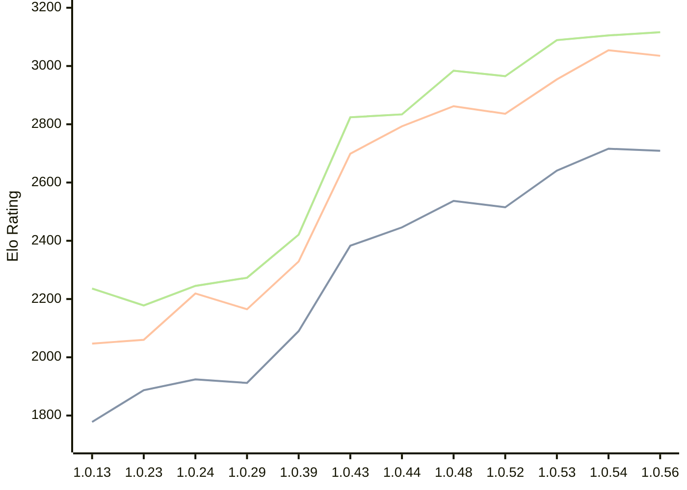

# Engine: RustyRival

Author: Chris Moreton

Home: https://github.com/chris-moreton/rusty-rival

## Elo Ratings E1

| Version | Published | STC 8.0+0.08s  | LTC 60.0+0.60s | VLTC 2m24s+1.12s | Comment |
| --- | --- | --- | --- | --- | --- |
|  |  |  |  |  |  |
 | | | cElo (∆ prev) | cElo (∆ prev) | cElo (∆ prev) | 

## Elo Ratings P1

| Version | Published | STC 8.0+0.08s  | LTC 60.0+0.60s | VLTC 2m24s+1.12s | Comment |
| --- | --- | --- | --- | --- | --- |
|  |  |  |  |  |  |
 | | | cElo (∆ prev) | cElo (∆ prev) | cElo (∆ prev) | 

## Elo Ratings T1

| Version | Published | STC 8.0+0.08s  | LTC 60.0+0.60s | VLTC 2m24s+1.12s | Comment |
| --- | --- | --- | --- | --- | --- |
| 1.0.56 | 2026-08-30 | 2709(-7) | 3035(-19) | 3116(+11) |  |
| 1.0.54 | 2026-08-25 | 2716(+75) | 3054(+100) | 3105(+16) |  |
| 1.0.53 | 2026-08-07 | 2641(+126) | 2954(+118) | 3089(+124) |  |
| 1.0.52 | 2026-08-03 | 2515(-22) | 2836(-26) | 2965(-19) |  |
| 1.0.48 | 2026-07-26 | 2537(+91) | 2862(+69) | 2984(+150) |  |
| 1.0.44 | 2026-07-20 | 2446(+63) | 2793(+94) | 2834(+10) |  |
| 1.0.43 | 2026-04-26 | 2383(+293) | 2699(+370) | 2824(+403) |  |
| 1.0.39 | 2026-03-30 | 2090(+178) | 2329(+164) | 2421(+148) |  |
| 1.0.29 | 2026-02-10 | 1912(-12) | 2165(-54) | 2273(+28) |  |
| 1.0.24 | 2026-01-30 | 1924(+37) | 2219(+159) | 2245(+67) |  |
| 1.0.23 | 2026-01-19 | 1887(+new) | 2060(-20) | 2178(+17) |  |
| 1.0.19 | 2026-01-12 |  | 2080(+new) | 2161(-162) |  |
| 1.0.17 | 2026-01-11 | 1878(+new) |  | 2323(+47) |  |
| 1.0.15 | 2026-01-11 |  | 2102(+55) | 2276(+40) |  |
| 1.0.13 | 2026-01-10 | 1778 | 2047 | 2236 |  |
 | | | cElo (∆ prev) | cElo (∆ prev) | cElo (∆ prev) | 

<a href="https://github.com/computer-chess-index/cci/issues/new?template=submit-version.yml&title=[VERSION]+RustyRival+<version>&body=###%20Engine%20name%0ARustyRival%0A%0A###%20Version%0A1.0.56" target="_blank">Submit new version</a>

 Test Conditions:

GUI/CLI: <a href=https://github.com/cutechess/cutechess target="_blank">Cute-Chess</a> 
Elo Calculation: <a href=https://www.remi-coulom.fr/Bayesian-Elo/ target="_blank">Bayesian-Elo</a> 
CPU for P1: Intel(R) Core(TM) Ultra 7 265T (1.50 GHz) - P-Core 
CPU for E1: Intel(R) Core(TM) Ultra 7 265T (1.50 GHz) - E-Core 
CPU for T1: Intel(R) Core(TM) i5-7500T 2.70GHz 
Opening book: 8_moves_v3 
\* STC: 8.0+0.08s, LTC: 60.0+0.60s, VLTC: 2m24s+1.12s

 Lists:
Ratings: <a href=https://github.com/computer-chess-index/cci/blob/main/lists/CCIRatings.csv target="_blank">Complete list</a>

Generated: 2026-10-10 04:42:27

## Ratings Verlauf

```mermaid
%%{init: {"theme":"base","themeVariables":{"seriesColors:['#a3a3a3','#222221','#faa371']}}}%%
xychart-beta
  x-axis ["1.0.13", "1.0.23", "1.0.24", "1.0.29", "1.0.39", "1.0.43", "1.0.44", "1.0.48", "1.0.52", "1.0.53", "1.0.54", "1.0.56"]
  y-axis "Elo Rating" 1700 --> 3200
  line "" [1778, 1887, 1924, 1912, 2090, 2383, 2446, 2537, 2515, 2641, 2716, 2709]
  line "STC (8.0+0.08s)" [1778, 1887, 1924, 1912, 2090, 2383, 2446, 2537, 2515, 2641, 2716, 2709]
  line "LTC (60.0+0.60s)" [2047, 2060, 2219, 2165, 2329, 2699, 2793, 2862, 2836, 2954, 3054, 3035]
  line "" [2236, 2178, 2245, 2273, 2421, 2824, 2834, 2984, 2965, 3089, 3105, 3116]
  line "VLTC (2m24s+1.12s)" [2236, 2178, 2245, 2273, 2421, 2824, 2834, 2984, 2965, 3089, 3105, 3116]
```

## Detailed Evaluation Results

| Version | Time Control | Elo  | Range +/- | Matches | Score | Average Opponent Elo | Draws |
| --- | --- | --- | --- | --- | --- | --- | --- |
| 1.0.56 | VLTC (2m24s+1.12s) | 3116 | 38 | 180 | 49% | 3128 | 63% |
| 1.0.56 | LTC (60.0+0.60s) | 3035 | 39 | 200 | 54% | 3001 | 42% |
| 1.0.56 | STC (8.0+0.08s) | 2709 | 44 | 152 | 49% | 2715 | 42% |
| --- | --- | --- | --- | --- | --- | --- | --- |
| 1.0.54 | VLTC (2m24s+1.12s) | 3105 | 49 | 114 | 53% | 3082 | 54% |
| 1.0.54 | LTC (60.0+0.60s) | 3054 | 52 | 108 | 50% | 3054 | 44% |
| 1.0.54 | STC (8.0+0.08s) | 2716 | 53 | 112 | 50% | 2718 | 34% |
| --- | --- | --- | --- | --- | --- | --- | --- |
| 1.0.53 | VLTC (2m24s+1.12s) | 3089 | 42 | 160 | 48% | 3100 | 53% |
| 1.0.53 | LTC (60.0+0.60s) | 2954 | 49 | 124 | 49% | 2963 | 43% |
| 1.0.53 | STC (8.0+0.08s) | 2641 | 44 | 172 | 49% | 2651 | 29% |
| --- | --- | --- | --- | --- | --- | --- | --- |
| 1.0.52 | VLTC (2m24s+1.12s) | 2965 | 42 | 172 | 51% | 2952 | 41% |
| 1.0.52 | LTC (60.0+0.60s) | 2836 | 47 | 148 | 49% | 2842 | 31% |
| 1.0.52 | STC (8.0+0.08s) | 2515 | 46 | 164 | 53% | 2483 | 23% |
| --- | --- | --- | --- | --- | --- | --- | --- |
| 1.0.48 | VLTC (2m24s+1.12s) | 2984 | 50 | 122 | 52% | 2970 | 38% |
| 1.0.48 | LTC (60.0+0.60s) | 2862 | 47 | 144 | 50% | 2865 | 37% |
| 1.0.48 | STC (8.0+0.08s) | 2537 | 48 | 156 | 45% | 2581 | 20% |
| --- | --- | --- | --- | --- | --- | --- | --- |
| 1.0.44 | VLTC (2m24s+1.12s) | 2834 | 50 | 140 | 55% | 2784 | 26% |
| 1.0.44 | LTC (60.0+0.60s) | 2793 | 50 | 128 | 52% | 2781 | 33% |
| 1.0.44 | STC (8.0+0.08s) | 2446 | 51 | 136 | 49% | 2457 | 20% |
| --- | --- | --- | --- | --- | --- | --- | --- |
| 1.0.43 | VLTC (2m24s+1.12s) | 2824 | 39 | 220 | 52% | 2804 | 30% |
| 1.0.43 | LTC (60.0+0.60s) | 2699 | 37 | 240 | 54% | 2654 | 29% |
| 1.0.43 | STC (8.0+0.08s) | 2383 | 43 | 192 | 50% | 2380 | 23% |
| --- | --- | --- | --- | --- | --- | --- | --- |
| 1.0.39 | VLTC (2m24s+1.12s) | 2421 | 39 | 228 | 51% | 2412 | 24% |
| 1.0.39 | LTC (60.0+0.60s) | 2329 | 41 | 208 | 52% | 2314 | 25% |
| 1.0.39 | STC (8.0+0.08s) | 2090 | 42 | 208 | 52% | 2056 | 16% |
| --- | --- | --- | --- | --- | --- | --- | --- |
| 1.0.29 | VLTC (2m24s+1.12s) | 2273 | 64 | 82 | 52% | 2255 | 28% |
| 1.0.29 | LTC (60.0+0.60s) | 2165 | 71 | 70 | 51% | 2160 | 19% |
| 1.0.29 | STC (8.0+0.08s) | 1912 | 111 | 28 | 48% | 1925 | 18% |
| --- | --- | --- | --- | --- | --- | --- | --- |
| 1.0.24 | VLTC (2m24s+1.12s) | 2245 | 72 | 64 | 52% | 2219 | 27% |
| 1.0.24 | LTC (60.0+0.60s) | 2219 | 71 | 66 | 54% | 2180 | 26% |
| 1.0.24 | STC (8.0+0.08s) | 1924 | 104 | 32 | 53% | 1901 | 19% |
| --- | --- | --- | --- | --- | --- | --- | --- |
| 1.0.23 | VLTC (2m24s+1.12s) | 2178 | 71 | 64 | 49% | 2183 | 30% |
| 1.0.23 | LTC (60.0+0.60s) | 2060 | 78 | 60 | 42% | 2138 | 17% |
| 1.0.23 | STC (8.0+0.08s) | 1887 | 133 | 20 | 50% | 1886 | 10% |
| --- | --- | --- | --- | --- | --- | --- | --- |
| 1.0.19 | VLTC (2m24s+1.12s) | 2161 | 204 | 8 | 31% | 2323 | 13% |
| 1.0.19 | LTC (60.0+0.60s) | 2080 | 86 | 56 | 36% | 2241 | 18% |
| 1.0.17 | VLTC (2m24s+1.12s) | 2323 | 231 | 4 | 50% | 2323 | 50% |
| 1.0.17 | STC (8.0+0.08s) | 1878 | 227 | 10 | 20% | 2232 | 0% |
| --- | --- | --- | --- | --- | --- | --- | --- |
| 1.0.15 | VLTC (2m24s+1.12s) | 2276 | 84 | 52 | 54% | 2233 | 15% |
| 1.0.15 | LTC (60.0+0.60s) | 2102 | 188 | 8 | 50% | 2115 | 25% |
| 1.0.13 | VLTC (2m24s+1.12s) | 2236 | 143 | 20 | 33% | 2454 | 15% |
| 1.0.13 | LTC (60.0+0.60s) | 2047 | 198 | 8 | 56% | 1999 | 13% |
| 1.0.13 | STC (8.0+0.08s) | 1778 | 210 | 12 | 25% | 2102 | 0% |
| --- | --- | --- | --- | --- | --- | --- | --- |
| 1.0.9 | LTC (60.0+0.60s) | 1966 | 153 | 16 | 34% | 2133 | 19% |