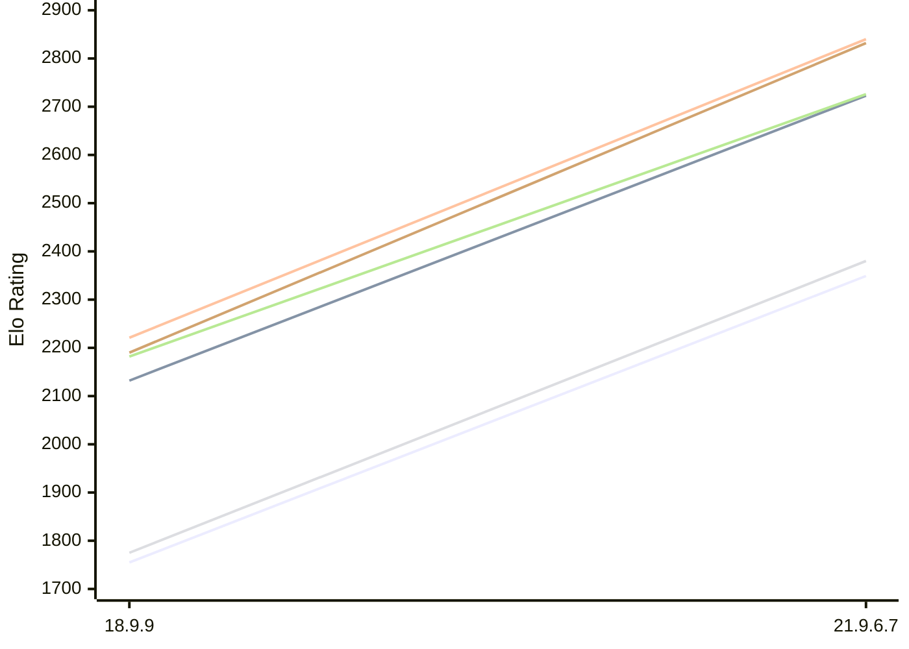

# Engine: RuthIron

Author: Emre Kalkan

Home: https://github.com/themreKalkan/RuthIron

## Elo Ratings E1 (Ultra 7 265T (1.50 GHz) - E-Core)

| Version | Published | STC 8.0+0.08s  | LTC 60.0+0.60s | VLTC 2m24s+1.12s | Comment |
| --- | --- | --- | --- | --- | --- |
| 21.9.6.7 | 2026-02-28 | 2349(+594) | 2723(+591) | 2840(+619) |  |
| 18.9.9 | 2026-01-16 | 1755 | 2132 | 2221 | Loses on time |
 | | | cElo (∆ prev) | cElo (∆ prev) | cElo (∆ prev) | 

## Elo Ratings P1 (Ultra 7 265T (1.50 GHz) - P-Core)

| Version | Published | STC 8.0+0.08s  | LTC 60.0+0.60s | VLTC 2m24s+1.12s | Comment |
| --- | --- | --- | --- | --- | --- |
| 21.9.6.7 | 2026-02-28 | 2380(+605) | 2726(+544) | 2832(+642) |  |
| 18.9.9 | 2026-01-16 | 1775 | 2182 | 2190 | Loses on time |
 | | | cElo (∆ prev) | cElo (∆ prev) | cElo (∆ prev) | 

## Elo Ratings T1 (i5-7500T 2.70GHz)

| Version | Published | STC 8.0+0.08s  | LTC 60.0+0.60s | VLTC 2m24s+1.12s | Comment |
| --- | --- | --- | --- | --- | --- |
| 21.9.6.7 | 2026-02-28 | 2415 | 2754 | 2861 |  |
 | | | cElo (∆ prev) | cElo (∆ prev) | cElo (∆ prev) | 

<a href="https://github.com/computer-chess-index/cci/issues/new?template=submit-version.yml&title=[VERSION]+RuthIron+<version>&body=###%20Engine%20name%0ARuthIron%0A%0A###%20Version%0A21.9.6.7" target="_blank">Submit new version</a>

 Test Conditions:

GUI/CLI: <a href=https://github.com/cutechess/cutechess target="_blank">Cute-Chess</a> 
Elo Calculation: <a href=https://www.remi-coulom.fr/Bayesian-Elo/ target="_blank">Bayesian-Elo</a> 
CPU for P1: Intel(R) Core(TM) Ultra 7 265T (1.50 GHz) - P-Core 
CPU for E1: Intel(R) Core(TM) Ultra 7 265T (1.50 GHz) - E-Core 
CPU for T1: Intel(R) Core(TM) i5-7500T 2.70GHz 
Opening book: 8_moves_v3 
\* STC: 8.0+0.08s, LTC: 60.0+0.60s, VLTC: 2m24s+1.12s

 Lists:
Ratings: <a href=https://github.com/computer-chess-index/cci/blob/main/lists/CCIRatings.csv target="_blank">Complete list</a>

Generated: 2026-11-20 05:42:36

## Ratings Verlauf E1 / P1

```mermaid
%%{init: {"theme":"base","themeVariables":{"seriesColors:['#a3a3a3','#222221','#faa371']}}}%%
xychart-beta
  x-axis ["18.9.9", "21.9.6.7"]
  y-axis "Elo Rating" 1700 --> 2900
  line "E1: STC (8.0+0.08s)" [1755, 2349]
  line "E1: LTC (60.0+0.60s)" [2132, 2723]
  line "E1: VLTC (2m24s+1.12s)" [2221, 2840]
  line "P1: STC (8.0+0.08s)" [1775, 2380]
  line "P1: LTC (60.0+0.60s)" [2182, 2726]
  line "P1: VLTC (2m24s+1.12s)" [2190, 2832]
```

## Detailed Evaluation Results

| Version | Time Control | Variant | Elo  | Range +/- | Matches | Score | Average Opponent Elo | Draws |
| --- | --- |--- | --- | --- | --- | --- | --- | --- |
| 21.9.6.7 | VLTC (2m24s+1.12s) | T1 | 2861 | 24 | 534 | 50% | 2861 | 41% |
|  |  | P1 | 2832 | 32 | 312 | 50% | 2853 | 43% |
|  |  | E1 | 2840 | 30 | 370 | 50% | 2820 | 33% |
|  | LTC (60.0+0.60s) | T1 | 2754 | 24 | 564 | 50% | 2758 | 38% |
|  |  | P1 | 2726 | 35 | 276 | 52% | 2707 | 34% |
|  |  | E1 | 2723 | 29 | 420 | 50% | 2700 | 31% |
|  | STC (8.0+0.08s) | T1 | 2415 | 23 | 686 | 49% | 2433 | 28% |
|  |  | P1 | 2380 | 35 | 278 | 48% | 2411 | 33% |
|  |  | E1 | 2349 | 30 | 368 | 46% | 2395 | 31% |
| --- | --- |--- | --- | --- | --- | --- | --- | --- |
| 18.9.9 | VLTC (2m24s+1.12s) | E1 | 2221 | 61 | 98 | 48% | 2242 | 19% |
|  |  | P1 | 2190 | 67 | 84 | 50% | 2167 | 21% |
|  | LTC (60.0+0.60s) | P1 | 2182 | 70 | 76 | 49% | 2199 | 24% |
|  |  | E1 | 2132 | 56 | 114 | 46% | 2192 | 23% |
|  | STC (8.0+0.08s) | P1 | 1775 | 61 | 102 | 47% | 1835 | 17% |
|  |  | E1 | 1755 | 56 | 116 | 41% | 1867 | 24% |