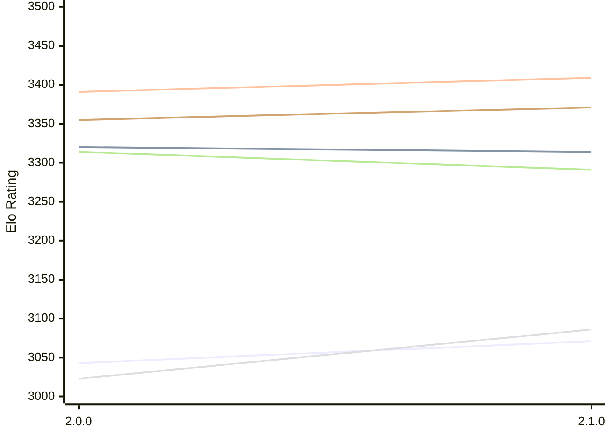

# Engine: Sapling

Author: Timothy Jones

Home: https://github.com/Timmoth/Sapling

## Elo Ratings E1 (Ultra 7 265T (1.50 GHz) - E-Core)

| Version | Published | STC 8.0+0.08s  | LTC 60.0+0.60s | VLTC 2m24s+1.12s | Comment |
| --- | --- | --- | --- | --- | --- |
| 2.1.0 | 2026-10-31 | 3071(+28) | 3314(-6) | 3409(+18) |  |
| 2.0.0 | 2026-10-21 | 3043 | 3320 | 3391 |  |
 | | | cElo (∆ prev) | cElo (∆ prev) | cElo (∆ prev) | 

## Elo Ratings P1 (Ultra 7 265T (1.50 GHz) - P-Core)

| Version | Published | STC 8.0+0.08s  | LTC 60.0+0.60s | VLTC 2m24s+1.12s | Comment |
| --- | --- | --- | --- | --- | --- |
| 2.1.0 | 2026-10-31 | 3086(+63) | 3291(-23) | 3371(+16) |  |
| 2.0.0 | 2026-10-21 | 3023 | 3314 | 3355 |  |
 | | | cElo (∆ prev) | cElo (∆ prev) | cElo (∆ prev) | 

## Elo Ratings T1 (i5-7500T 2.70GHz)

| Version | Published | STC 8.0+0.08s  | LTC 60.0+0.60s | VLTC 2m24s+1.12s | Comment |
| --- | --- | --- | --- | --- | --- |
| 2.0.0 | 2026-10-21 | 3023 | 3314 | 3355 |  |
 | | | cElo (∆ prev) | cElo (∆ prev) | cElo (∆ prev) | 

<a href="https://github.com/computer-chess-index/cci/issues/new?template=submit-version.yml&title=[VERSION]+Sapling+<version>&body=###%20Engine%20name%0ASapling%0A%0A###%20Version%0A2.1.0" target="_blank">Submit new version</a>

 Test Conditions:

GUI/CLI: <a href=https://github.com/cutechess/cutechess target="_blank">Cute-Chess</a> 
Elo Calculation: <a href=https://www.remi-coulom.fr/Bayesian-Elo/ target="_blank">Bayesian-Elo</a> 
CPU for P1: Intel(R) Core(TM) Ultra 7 265T (1.50 GHz) - P-Core 
CPU for E1: Intel(R) Core(TM) Ultra 7 265T (1.50 GHz) - E-Core 
CPU for T1: Intel(R) Core(TM) i5-7500T 2.70GHz 
Opening book: 8_moves_v3 
\* STC: 8.0+0.08s, LTC: 60.0+0.60s, VLTC: 2m24s+1.12s

 Lists:
Ratings: <a href=https://github.com/computer-chess-index/cci/blob/main/lists/CCIRatings.csv target="_blank">Complete list</a>

Generated: 2026-11-25 05:42:58

## Ratings Verlauf E1 / P1

```mermaid
%%{init: {"theme":"base","themeVariables":{"seriesColors:['#a3a3a3','#222221','#faa371']}}}%%
xychart-beta
  x-axis ["2.0.0", "2.1.0"]
  y-axis "Elo Rating" 3000 --> 3500
  line "E1: STC (8.0+0.08s)" [3043, 3071]
  line "E1: LTC (60.0+0.60s)" [3320, 3314]
  line "E1: VLTC (2m24s+1.12s)" [3391, 3409]
  line "P1: STC (8.0+0.08s)" [3023, 3086]
  line "P1: LTC (60.0+0.60s)" [3314, 3291]
  line "P1: VLTC (2m24s+1.12s)" [3355, 3371]
```

## Detailed Evaluation Results

| Version | Time Control | Variant | Elo  | Range +/- | Matches | Score | Average Opponent Elo | Draws |
| --- | --- |--- | --- | --- | --- | --- | --- | --- |
| 2.1.0 | VLTC (2m24s+1.12s) | P1 | 3371 | 39 | 160 | 49% | 3380 | 74% |
|  |  | E1 | 3409 | 28 | 312 | 50% | 3410 | 74% |
|  | LTC (60.0+0.60s) | P1 | 3291 | 31 | 280 | 52% | 3276 | 62% |
|  |  | E1 | 3314 | 27 | 366 | 48% | 3329 | 66% |
|  | STC (8.0+0.08s) | P1 | 3086 | 36 | 202 | 52% | 3067 | 61% |
|  |  | E1 | 3071 | 31 | 296 | 52% | 3059 | 49% |
| --- | --- |--- | --- | --- | --- | --- | --- | --- |
| 2.0.0 | VLTC (2m24s+1.12s) | P1 | 3355 | 38 | 254 | 67% | 2720 | 47% |
|  |  | E1 | 3391 | 31 | 340 | 62% | 3000 | 53% |
|  | LTC (60.0+0.60s) | P1 | 3314 | 39 | 238 | 68% | 2672 | 47% |
|  |  | E1 | 3320 | 27 | 424 | 61% | 3015 | 54% |
|  | STC (8.0+0.08s) | E1 | 3043 | 33 | 316 | 57% | 2777 | 42% |
|  |  | P1 | 3023 | 40 | 240 | 66% | 2487 | 40% |