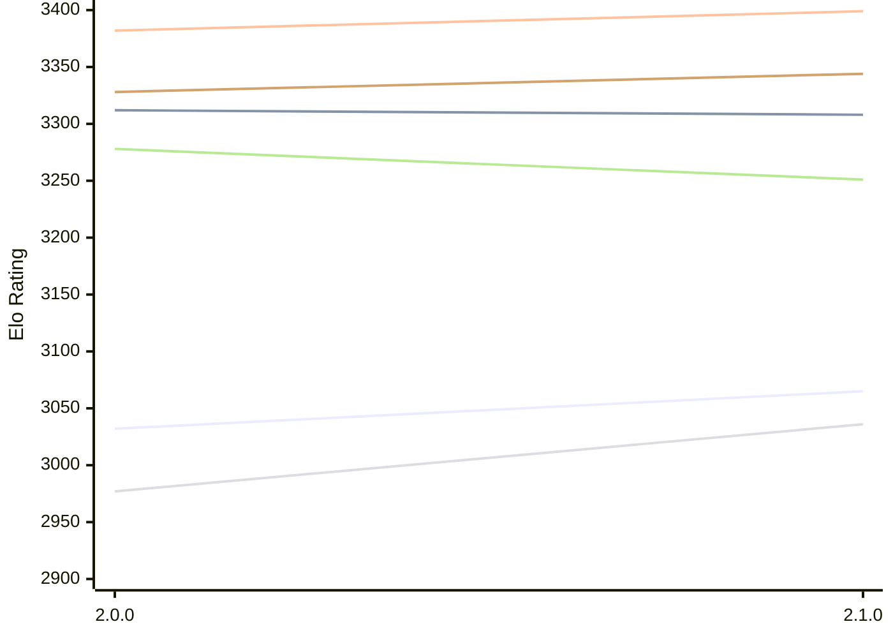

# Engine: Sapling

Author: Timothy Jones

Home: https://github.com/Timmoth/Sapling

## Elo Ratings E1 (Ultra 7 265T (1.50 GHz) - E-Core)

| Version | Published | STC 8.0+0.08s  | LTC 60.0+0.60s | VLTC 2m24s+1.12s | Comment |
| --- | --- | --- | --- | --- | --- |
| 2.1.0 | 2026-10-31 | 3065(+33) | 3308(-4) | 3399(+17) |  |
| 2.0.0 | 2026-10-21 | 3032 | 3312 | 3382 |  |
 | | | cElo (∆ prev) | cElo (∆ prev) | cElo (∆ prev) | 

## Elo Ratings P1 (Ultra 7 265T (1.50 GHz) - P-Core)

| Version | Published | STC 8.0+0.08s  | LTC 60.0+0.60s | VLTC 2m24s+1.12s | Comment |
| --- | --- | --- | --- | --- | --- |
| 2.1.0 | 2026-10-31 | 3036(+59) | 3251(-27) | 3344(+16) |  |
| 2.0.0 | 2026-10-21 | 2977 | 3278 | 3328 |  |
 | | | cElo (∆ prev) | cElo (∆ prev) | cElo (∆ prev) | 

## Elo Ratings T1 (i5-7500T 2.70GHz)

| Version | Published | STC 8.0+0.08s  | LTC 60.0+0.60s | VLTC 2m24s+1.12s | Comment |
| --- | --- | --- | --- | --- | --- |
| 2.0.0 | 2026-10-21 | 2977 | 3278 | 3328 |  |
 | | | cElo (∆ prev) | cElo (∆ prev) | cElo (∆ prev) | 

<a href="https://github.com/computer-chess-index/cci/issues/new?template=submit-version.yml&title=[VERSION]+Sapling+<version>&body=###%20Engine%20name%0ASapling%0A%0A###%20Version%0A2.1.0" target="_blank">Submit new version</a>

 Test Conditions:

GUI/CLI: <a href=https://github.com/cutechess/cutechess target="_blank">Cute-Chess</a> 
Elo Calculation: <a href=https://www.remi-coulom.fr/Bayesian-Elo/ target="_blank">Bayesian-Elo</a> 
CPU for P1: Intel(R) Core(TM) Ultra 7 265T (1.50 GHz) - P-Core 
CPU for E1: Intel(R) Core(TM) Ultra 7 265T (1.50 GHz) - E-Core 
CPU for T1: Intel(R) Core(TM) i5-7500T 2.70GHz 
Opening book: 8_moves_v3 
\* STC: 8.0+0.08s, LTC: 60.0+0.60s, VLTC: 2m24s+1.12s

 Lists:
Ratings: <a href=https://github.com/computer-chess-index/cci/blob/main/lists/CCIRatings.csv target="_blank">Complete list</a>

Generated: 2026-11-15 05:42:36

## Ratings Verlauf E1 / P1

```mermaid
%%{init: {"theme":"base","themeVariables":{"seriesColors:['#a3a3a3','#222221','#faa371']}}}%%
xychart-beta
  x-axis ["2.0.0", "2.1.0"]
  y-axis "Elo Rating" 2900 --> 3400
  line "E1: STC (8.0+0.08s)" [3032, 3065]
  line "E1: LTC (60.0+0.60s)" [3312, 3308]
  line "E1: VLTC (2m24s+1.12s)" [3382, 3399]
  line "P1: STC (8.0+0.08s)" [2977, 3036]
  line "P1: LTC (60.0+0.60s)" [3278, 3251]
  line "P1: VLTC (2m24s+1.12s)" [3328, 3344]
```

## Detailed Evaluation Results

| Version | Time Control | Variant | Elo  | Range +/- | Matches | Score | Average Opponent Elo | Draws |
| --- | --- |--- | --- | --- | --- | --- | --- | --- |
| 2.1.0 | VLTC (2m24s+1.12s) | P1 | 3344 | 40 | 156 | 49% | 3348 | 74% |
|  |  | E1 | 3399 | 29 | 296 | 50% | 3401 | 74% |
|  | LTC (60.0+0.60s) | P1 | 3251 | 35 | 220 | 51% | 3245 | 61% |
|  |  | E1 | 3308 | 27 | 338 | 48% | 3320 | 68% |
|  | STC (8.0+0.08s) | P1 | 3036 | 40 | 170 | 53% | 3019 | 58% |
|  |  | E1 | 3065 | 33 | 268 | 51% | 3054 | 50% |
| --- | --- |--- | --- | --- | --- | --- | --- | --- |
| 2.0.0 | VLTC (2m24s+1.12s) | E1 | 3382 | 31 | 332 | 62% | 2984 | 52% |
|  |  | P1 | 3328 | 38 | 254 | 67% | 2697 | 47% |
|  | LTC (60.0+0.60s) | E1 | 3312 | 28 | 392 | 62% | 2982 | 54% |
|  |  | P1 | 3278 | 42 | 218 | 69% | 2589 | 44% |
|  | STC (8.0+0.08s) | E1 | 3032 | 34 | 286 | 57% | 2745 | 43% |
|  |  | P1 | 2977 | 42 | 224 | 68% | 2414 | 39% |