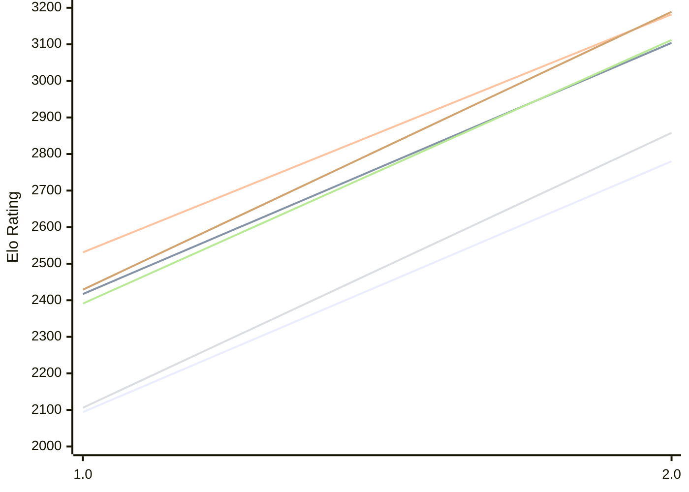

# Engine: Scarlet

Author: Evan Guerra

Home: https://github.com/EIG520/scarlet

## Elo Ratings E1 (Ultra 7 265T (1.50 GHz) - E-Core)

| Version | Published | STC 8.0+0.08s  | LTC 60.0+0.60s | VLTC 2m24s+1.12s | Comment |
| --- | --- | --- | --- | --- | --- |
| 2.0 | 2026-10-13 | 2780(+686) | 3104(+687) | 3182(+651) |  |
| 1.0 | 2026-07-26 | 2094 | 2417 | 2531 |  |
 | | | cElo (∆ prev) | cElo (∆ prev) | cElo (∆ prev) | 

## Elo Ratings P1 (Ultra 7 265T (1.50 GHz) - P-Core)

| Version | Published | STC 8.0+0.08s  | LTC 60.0+0.60s | VLTC 2m24s+1.12s | Comment |
| --- | --- | --- | --- | --- | --- |
| 2.0 | 2026-10-13 | 2858(+752) | 3112(+721) | 3189(+760) |  |
| 1.0 | 2026-07-26 | 2106 | 2391 | 2429 |  |
 | | | cElo (∆ prev) | cElo (∆ prev) | cElo (∆ prev) | 

## Elo Ratings T1 (i5-7500T 2.70GHz)

| Version | Published | STC 8.0+0.08s  | LTC 60.0+0.60s | VLTC 2m24s+1.12s | Comment |
| --- | --- | --- | --- | --- | --- |
| 1.0 | 2026-07-26 | 2194 | 2468 | 2520 |  |
 | | | cElo (∆ prev) | cElo (∆ prev) | cElo (∆ prev) | 

<a href="https://github.com/computer-chess-index/cci/issues/new?template=submit-version.yml&title=[VERSION]+Scarlet+<version>&body=###%20Engine%20name%0AScarlet%0A%0A###%20Version%0A1.0" target="_blank">Submit new version</a>

 Test Conditions:

GUI/CLI: <a href=https://github.com/cutechess/cutechess target="_blank">Cute-Chess</a> 
Elo Calculation: <a href=https://www.remi-coulom.fr/Bayesian-Elo/ target="_blank">Bayesian-Elo</a> 
CPU for P1: Intel(R) Core(TM) Ultra 7 265T (1.50 GHz) - P-Core 
CPU for E1: Intel(R) Core(TM) Ultra 7 265T (1.50 GHz) - E-Core 
CPU for T1: Intel(R) Core(TM) i5-7500T 2.70GHz 
Opening book: 8_moves_v3 
\* STC: 8.0+0.08s, LTC: 60.0+0.60s, VLTC: 2m24s+1.12s

 Lists:
Ratings: <a href=https://github.com/computer-chess-index/cci/blob/main/lists/CCIRatings.csv target="_blank">Complete list</a>

Generated: 2026-11-13 05:42:46

## Ratings Verlauf E1 / P1

```mermaid
%%{init: {"theme":"base","themeVariables":{"seriesColors:['#a3a3a3','#222221','#faa371']}}}%%
xychart-beta
  x-axis ["1.0", "2.0"]
  y-axis "Elo Rating" 2000 --> 3200
  line "E1: STC (8.0+0.08s)" [2094, 2780]
  line "E1: LTC (60.0+0.60s)" [2417, 3104]
  line "E1: VLTC (2m24s+1.12s)" [2531, 3182]
  line "P1: STC (8.0+0.08s)" [2106, 2858]
  line "P1: LTC (60.0+0.60s)" [2391, 3112]
  line "P1: VLTC (2m24s+1.12s)" [2429, 3189]
```

## Detailed Evaluation Results

| Version | Time Control | Variant | Elo  | Range +/- | Matches | Score | Average Opponent Elo | Draws |
| --- | --- |--- | --- | --- | --- | --- | --- | --- |
| 2.0 | VLTC (2m24s+1.12s) | P1 | 3189 | 35 | 244 | 53% | 3146 | 50% |
|  |  | E1 | 3182 | 28 | 360 | 53% | 3152 | 51% |
|  | LTC (60.0+0.60s) | P1 | 3112 | 39 | 208 | 54% | 3062 | 40% |
|  |  | E1 | 3104 | 30 | 340 | 52% | 3073 | 45% |
|  | STC (8.0+0.08s) | P1 | 2858 | 32 | 306 | 47% | 2874 | 37% |
|  |  | E1 | 2780 | 30 | 380 | 55% | 2720 | 28% |
| --- | --- |--- | --- | --- | --- | --- | --- | --- |
| 1.0 | VLTC (2m24s+1.12s) | P1 | 2429 | 44 | 206 | 47% | 2458 | 20% |
|  |  | E1 | 2531 | 37 | 262 | 48% | 2539 | 26% |
|  |  | T1 | 2520 | 37 | 252 | 50% | 2525 | 24% |
|  | LTC (60.0+0.60s) | E1 | 2417 | 37 | 266 | 51% | 2388 | 24% |
|  |  | T1 | 2468 | 37 | 250 | 51% | 2437 | 25% |
|  |  | P1 | 2391 | 44 | 192 | 47% | 2430 | 22% |
|  | STC (8.0+0.08s) | E1 | 2094 | 35 | 288 | 47% | 2122 | 20% |
|  |  | T1 | 2194 | 39 | 244 | 50% | 2187 | 18% |
|  |  | P1 | 2106 | 43 | 196 | 49% | 2114 | 21% |