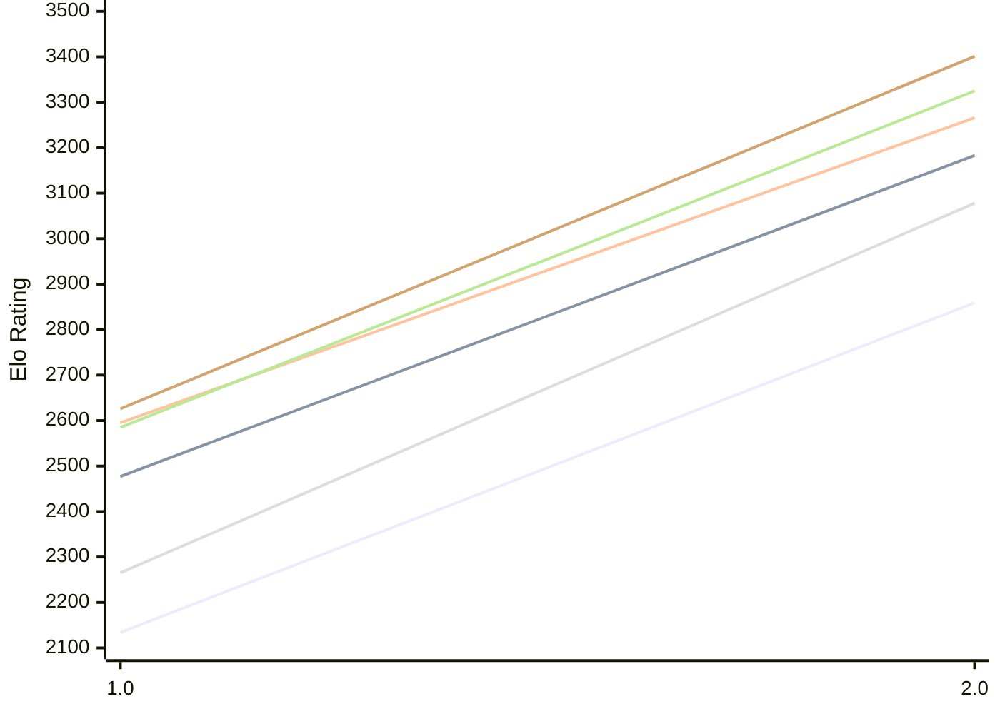

# Engine: Scarlet

Author: Evan Guerra

Home: https://github.com/EIG520/scarlet

## Elo Ratings E1 (Ultra 7 265T (1.50 GHz) - E-Core)

| Version | Published | STC 8.0+0.08s  | LTC 60.0+0.60s | VLTC 2m24s+1.12s | Comment |
| --- | --- | --- | --- | --- | --- |
| 2.0 | 2026-10-13 | 2859(+725) | 3183(+706) | 3266(+671) |  |
| 1.0 | 2026-07-26 | 2134 | 2477 | 2595 |  |
 | | | cElo (∆ prev) | cElo (∆ prev) | cElo (∆ prev) | 

## Elo Ratings P1 (Ultra 7 265T (1.50 GHz) - P-Core)

| Version | Published | STC 8.0+0.08s  | LTC 60.0+0.60s | VLTC 2m24s+1.12s | Comment |
| --- | --- | --- | --- | --- | --- |
| 2.0 | 2026-10-13 | 3078(+813) | 3325(+740) | 3401(+775) |  |
| 1.0 | 2026-07-26 | 2265 | 2585 | 2626 |  |
 | | | cElo (∆ prev) | cElo (∆ prev) | cElo (∆ prev) | 

## Elo Ratings T1 (i5-7500T 2.70GHz)

| Version | Published | STC 8.0+0.08s  | LTC 60.0+0.60s | VLTC 2m24s+1.12s | Comment |
| --- | --- | --- | --- | --- | --- |
| 1.0 | 2026-07-26 | 2194 | 2468 | 2520 |  |
 | | | cElo (∆ prev) | cElo (∆ prev) | cElo (∆ prev) | 

<a href="https://github.com/computer-chess-index/cci/issues/new?template=submit-version.yml&title=[VERSION]+Scarlet+<version>&body=###%20Engine%20name%0AScarlet%0A%0A###%20Version%0A1.0" target="_blank">Submit new version</a>

 Test Conditions:

GUI/CLI: <a href=https://github.com/cutechess/cutechess target="_blank">Cute-Chess</a> 
Elo Calculation: <a href=https://www.remi-coulom.fr/Bayesian-Elo/ target="_blank">Bayesian-Elo</a> 
CPU for P1: Intel(R) Core(TM) Ultra 7 265T (1.50 GHz) - P-Core 
CPU for E1: Intel(R) Core(TM) Ultra 7 265T (1.50 GHz) - E-Core 
CPU for T1: Intel(R) Core(TM) i5-7500T 2.70GHz 
Opening book: 8_moves_v3 
\* STC: 8.0+0.08s, LTC: 60.0+0.60s, VLTC: 2m24s+1.12s

 Lists:
Ratings: <a href=https://github.com/computer-chess-index/cci/blob/main/lists/CCIRatings.csv target="_blank">Complete list</a>

Generated: 2026-11-05 05:42:27

## Ratings Verlauf E1 / P1

```mermaid
%%{init: {"theme":"base","themeVariables":{"seriesColors:['#a3a3a3','#222221','#faa371']}}}%%
xychart-beta
  x-axis ["1.0", "2.0"]
  y-axis "Elo Rating" 2100 --> 3500
  line "E1: STC (8.0+0.08s)" [2134, 2859]
  line "E1: LTC (60.0+0.60s)" [2477, 3183]
  line "E1: VLTC (2m24s+1.12s)" [2595, 3266]
  line "P1: STC (8.0+0.08s)" [2265, 3078]
  line "P1: LTC (60.0+0.60s)" [2585, 3325]
  line "P1: VLTC (2m24s+1.12s)" [2626, 3401]
```

## Detailed Evaluation Results

| Version | Time Control | Variant | Elo  | Range +/- | Matches | Score | Average Opponent Elo | Draws |
| --- | --- |--- | --- | --- | --- | --- | --- | --- |
| 2.0 | VLTC (2m24s+1.12s) | P1 | 3401 | 37 | 216 | 54% | 3349 | 47% |
|  |  | E1 | 3266 | 31 | 312 | 53% | 3231 | 49% |
|  | LTC (60.0+0.60s) | P1 | 3325 | 41 | 188 | 55% | 3263 | 39% |
|  |  | E1 | 3183 | 31 | 308 | 51% | 3155 | 45% |
|  | STC (8.0+0.08s) | P1 | 3078 | 34 | 272 | 48% | 3086 | 37% |
|  |  | E1 | 2859 | 31 | 360 | 56% | 2795 | 29% |
| --- | --- |--- | --- | --- | --- | --- | --- | --- |
| 1.0 | VLTC (2m24s+1.12s) | P1 | 2626 | 44 | 194 | 45% | 2691 | 20% |
|  |  | E1 | 2595 | 39 | 238 | 48% | 2616 | 26% |
|  |  | T1 | 2520 | 37 | 252 | 50% | 2525 | 24% |
|  | LTC (60.0+0.60s) | P1 | 2585 | 46 | 180 | 48% | 2624 | 22% |
|  |  | E1 | 2477 | 38 | 246 | 50% | 2469 | 26% |
|  |  | T1 | 2468 | 37 | 250 | 51% | 2437 | 25% |
|  | STC (8.0+0.08s) | E1 | 2134 | 36 | 276 | 47% | 2165 | 21% |
|  |  | T1 | 2194 | 39 | 244 | 50% | 2187 | 18% |
|  |  | P1 | 2265 | 44 | 184 | 49% | 2272 | 21% |