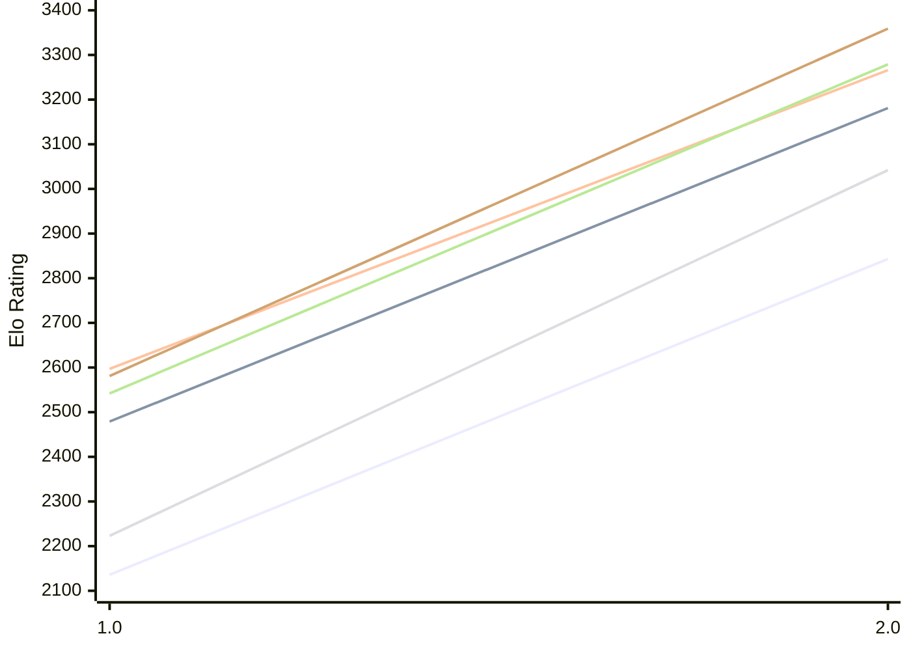

# Engine: Scarlet

Author: Evan Guerra

Home: https://github.com/EIG520/scarlet

## Elo Ratings E1 (Ultra 7 265T (1.50 GHz) - E-Core)

| Version | Published | STC 8.0+0.08s  | LTC 60.0+0.60s | VLTC 2m24s+1.12s | Comment |
| --- | --- | --- | --- | --- | --- |
| 2.0 | 2026-10-13 | 2843(+707) | 3181(+702) | 3266(+669) |  |
| 1.0 | 2026-07-26 | 2136 | 2479 | 2597 |  |
 | | | cElo (∆ prev) | cElo (∆ prev) | cElo (∆ prev) | 

## Elo Ratings P1 (Ultra 7 265T (1.50 GHz) - P-Core)

| Version | Published | STC 8.0+0.08s  | LTC 60.0+0.60s | VLTC 2m24s+1.12s | Comment |
| --- | --- | --- | --- | --- | --- |
| 2.0 | 2026-10-13 | 3042(+819) | 3279(+737) | 3359(+778) |  |
| 1.0 | 2026-07-26 | 2223 | 2542 | 2581 |  |
 | | | cElo (∆ prev) | cElo (∆ prev) | cElo (∆ prev) | 

## Elo Ratings T1 (i5-7500T 2.70GHz)

| Version | Published | STC 8.0+0.08s  | LTC 60.0+0.60s | VLTC 2m24s+1.12s | Comment |
| --- | --- | --- | --- | --- | --- |
| 1.0 | 2026-07-26 | 2194 | 2468 | 2520 |  |
 | | | cElo (∆ prev) | cElo (∆ prev) | cElo (∆ prev) | 

<a href="https://github.com/computer-chess-index/cci/issues/new?template=submit-version.yml&title=[VERSION]+Scarlet+<version>&body=###%20Engine%20name%0AScarlet%0A%0A###%20Version%0A1.0" target="_blank">Submit new version</a>

 Test Conditions:

GUI/CLI: <a href=https://github.com/cutechess/cutechess target="_blank">Cute-Chess</a> 
Elo Calculation: <a href=https://www.remi-coulom.fr/Bayesian-Elo/ target="_blank">Bayesian-Elo</a> 
CPU for P1: Intel(R) Core(TM) Ultra 7 265T (1.50 GHz) - P-Core 
CPU for E1: Intel(R) Core(TM) Ultra 7 265T (1.50 GHz) - E-Core 
CPU for T1: Intel(R) Core(TM) i5-7500T 2.70GHz 
Opening book: 8_moves_v3 
\* STC: 8.0+0.08s, LTC: 60.0+0.60s, VLTC: 2m24s+1.12s

 Lists:
Ratings: <a href=https://github.com/computer-chess-index/cci/blob/main/lists/CCIRatings.csv target="_blank">Complete list</a>

Generated: 2026-11-01 05:42:44

## Ratings Verlauf E1 / P1

```mermaid
%%{init: {"theme":"base","themeVariables":{"seriesColors:['#a3a3a3','#222221','#faa371']}}}%%
xychart-beta
  x-axis ["1.0", "2.0"]
  y-axis "Elo Rating" 2100 --> 3400
  line "E1: STC (8.0+0.08s)" [2136, 2843]
  line "E1: LTC (60.0+0.60s)" [2479, 3181]
  line "E1: VLTC (2m24s+1.12s)" [2597, 3266]
  line "P1: STC (8.0+0.08s)" [2223, 3042]
  line "P1: LTC (60.0+0.60s)" [2542, 3279]
  line "P1: VLTC (2m24s+1.12s)" [2581, 3359]
```

## Detailed Evaluation Results

| Version | Time Control | Variant | Elo  | Range +/- | Matches | Score | Average Opponent Elo | Draws |
| --- | --- |--- | --- | --- | --- | --- | --- | --- |
| 2.0 | VLTC (2m24s+1.12s) | E1 | 3266 | 32 | 290 | 53% | 3227 | 49% |
|  |  | P1 | 3359 | 39 | 196 | 55% | 3298 | 47% |
|  | LTC (60.0+0.60s) | E1 | 3181 | 33 | 284 | 51% | 3152 | 45% |
|  |  | P1 | 3279 | 42 | 180 | 56% | 3213 | 38% |
|  | STC (8.0+0.08s) | E1 | 2843 | 35 | 288 | 56% | 2774 | 29% |
|  |  | P1 | 3042 | 38 | 224 | 48% | 3040 | 37% |
| --- | --- |--- | --- | --- | --- | --- | --- | --- |
| 1.0 | VLTC (2m24s+1.12s) | T1 | 2520 | 37 | 252 | 50% | 2525 | 24% |
|  |  | P1 | 2581 | 44 | 194 | 45% | 2647 | 20% |
|  |  | E1 | 2597 | 39 | 238 | 48% | 2619 | 26% |
|  | LTC (60.0+0.60s) | T1 | 2468 | 37 | 250 | 51% | 2437 | 25% |
|  |  | P1 | 2542 | 46 | 180 | 48% | 2581 | 22% |
|  |  | E1 | 2479 | 38 | 246 | 50% | 2469 | 26% |
|  | STC (8.0+0.08s) | T1 | 2194 | 39 | 244 | 50% | 2187 | 18% |
|  |  | P1 | 2223 | 44 | 184 | 49% | 2230 | 21% |
|  |  | E1 | 2136 | 36 | 276 | 47% | 2167 | 21% |