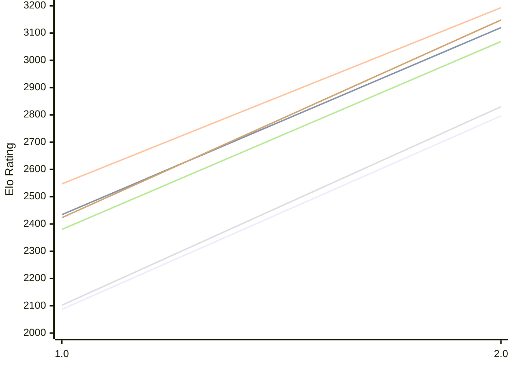

# Engine: Scarlet

Author: Evan Guerra

Home: https://github.com/EIG520/scarlet

## Elo Ratings E1 (Ultra 7 265T (1.50 GHz) - E-Core)

| Version | Published | STC 8.0+0.08s  | LTC 60.0+0.60s | VLTC 2m24s+1.12s | Comment |
| --- | --- | --- | --- | --- | --- |
| 2.0 | 2026-10-13 | 2796(+709) | 3120(+686) | 3193(+646) |  |
| 1.0 | 2026-07-26 | 2087 | 2434 | 2547 |  |
 | | | cElo (∆ prev) | cElo (∆ prev) | cElo (∆ prev) | 

## Elo Ratings P1 (Ultra 7 265T (1.50 GHz) - P-Core)

| Version | Published | STC 8.0+0.08s  | LTC 60.0+0.60s | VLTC 2m24s+1.12s | Comment |
| --- | --- | --- | --- | --- | --- |
| 2.0 | 2026-10-13 | 2830(+728) | 3069(+689) | 3148(+725) |  |
| 1.0 | 2026-07-26 | 2102 | 2380 | 2423 |  |
 | | | cElo (∆ prev) | cElo (∆ prev) | cElo (∆ prev) | 

## Elo Ratings T1 (i5-7500T 2.70GHz)

| Version | Published | STC 8.0+0.08s  | LTC 60.0+0.60s | VLTC 2m24s+1.12s | Comment |
| --- | --- | --- | --- | --- | --- |
| 1.0 | 2026-07-26 | 2194 | 2468 | 2520 |  |
 | | | cElo (∆ prev) | cElo (∆ prev) | cElo (∆ prev) | 

<a href="https://github.com/computer-chess-index/cci/issues/new?template=submit-version.yml&title=[VERSION]+Scarlet+<version>&body=###%20Engine%20name%0AScarlet%0A%0A###%20Version%0A1.0" target="_blank">Submit new version</a>

 Test Conditions:

GUI/CLI: <a href=https://github.com/cutechess/cutechess target="_blank">Cute-Chess</a> 
Elo Calculation: <a href=https://www.remi-coulom.fr/Bayesian-Elo/ target="_blank">Bayesian-Elo</a> 
CPU for P1: Intel(R) Core(TM) Ultra 7 265T (1.50 GHz) - P-Core 
CPU for E1: Intel(R) Core(TM) Ultra 7 265T (1.50 GHz) - E-Core 
CPU for T1: Intel(R) Core(TM) i5-7500T 2.70GHz 
Opening book: 8_moves_v3 
\* STC: 8.0+0.08s, LTC: 60.0+0.60s, VLTC: 2m24s+1.12s

 Lists:
Ratings: <a href=https://github.com/computer-chess-index/cci/blob/main/lists/CCIRatings.csv target="_blank">Complete list</a>

Generated: 2026-11-14 05:42:19

## Ratings Verlauf E1 / P1

```mermaid
%%{init: {"theme":"base","themeVariables":{"seriesColors:['#a3a3a3','#222221','#faa371']}}}%%
xychart-beta
  x-axis ["1.0", "2.0"]
  y-axis "Elo Rating" 2000 --> 3200
  line "E1: STC (8.0+0.08s)" [2087, 2796]
  line "E1: LTC (60.0+0.60s)" [2434, 3120]
  line "E1: VLTC (2m24s+1.12s)" [2547, 3193]
  line "P1: STC (8.0+0.08s)" [2102, 2830]
  line "P1: LTC (60.0+0.60s)" [2380, 3069]
  line "P1: VLTC (2m24s+1.12s)" [2423, 3148]
```

## Detailed Evaluation Results

| Version | Time Control | Variant | Elo  | Range +/- | Matches | Score | Average Opponent Elo | Draws |
| --- | --- |--- | --- | --- | --- | --- | --- | --- |
| 2.0 | VLTC (2m24s+1.12s) | P1 | 3148 | 34 | 252 | 53% | 3114 | 50% |
|  |  | E1 | 3193 | 28 | 368 | 52% | 3171 | 50% |
|  | LTC (60.0+0.60s) | P1 | 3069 | 39 | 212 | 53% | 3031 | 39% |
|  |  | E1 | 3120 | 29 | 348 | 52% | 3089 | 45% |
|  | STC (8.0+0.08s) | P1 | 2830 | 32 | 310 | 47% | 2846 | 36% |
|  |  | E1 | 2796 | 30 | 380 | 55% | 2736 | 28% |
| --- | --- |--- | --- | --- | --- | --- | --- | --- |
| 1.0 | VLTC (2m24s+1.12s) | T1 | 2520 | 37 | 252 | 50% | 2525 | 24% |
|  |  | P1 | 2423 | 43 | 214 | 47% | 2442 | 21% |
|  |  | E1 | 2547 | 37 | 270 | 49% | 2552 | 26% |
|  | LTC (60.0+0.60s) | P1 | 2380 | 44 | 192 | 47% | 2418 | 22% |
|  |  | E1 | 2434 | 36 | 278 | 52% | 2403 | 25% |
|  |  | T1 | 2468 | 37 | 250 | 51% | 2437 | 25% |
|  | STC (8.0+0.08s) | P1 | 2102 | 41 | 216 | 49% | 2105 | 21% |
|  |  | E1 | 2087 | 35 | 300 | 47% | 2125 | 20% |
|  |  | T1 | 2194 | 39 | 244 | 50% | 2187 | 18% |