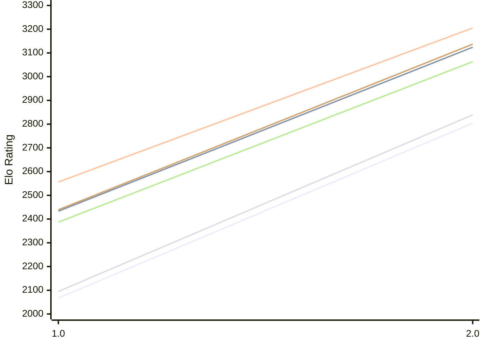

# Engine: Scarlet

Author: Evan Guerra

Home: https://github.com/EIG520/scarlet

## Elo Ratings E1 (Ultra 7 265T (1.50 GHz) - E-Core)

| Version | Published | STC 8.0+0.08s  | LTC 60.0+0.60s | VLTC 2m24s+1.12s | Comment |
| --- | --- | --- | --- | --- | --- |
| 2.0 | 2026-10-13 | 2804(+737) | 3124(+691) | 3205(+649) |  |
| 1.0 | 2026-07-26 | 2067 | 2433 | 2556 |  |
 | | | cElo (∆ prev) | cElo (∆ prev) | cElo (∆ prev) | 

## Elo Ratings P1 (Ultra 7 265T (1.50 GHz) - P-Core)

| Version | Published | STC 8.0+0.08s  | LTC 60.0+0.60s | VLTC 2m24s+1.12s | Comment |
| --- | --- | --- | --- | --- | --- |
| 2.0 | 2026-10-13 | 2839(+744) | 3063(+676) | 3137(+698) |  |
| 1.0 | 2026-07-26 | 2095 | 2387 | 2439 |  |
 | | | cElo (∆ prev) | cElo (∆ prev) | cElo (∆ prev) | 

## Elo Ratings T1 (i5-7500T 2.70GHz)

| Version | Published | STC 8.0+0.08s  | LTC 60.0+0.60s | VLTC 2m24s+1.12s | Comment |
| --- | --- | --- | --- | --- | --- |
| 1.0 | 2026-07-26 | 2194 | 2468 | 2520 |  |
 | | | cElo (∆ prev) | cElo (∆ prev) | cElo (∆ prev) | 

<a href="https://github.com/computer-chess-index/cci/issues/new?template=submit-version.yml&title=[VERSION]+Scarlet+<version>&body=###%20Engine%20name%0AScarlet%0A%0A###%20Version%0A1.0" target="_blank">Submit new version</a>

 Test Conditions:

GUI/CLI: <a href=https://github.com/cutechess/cutechess target="_blank">Cute-Chess</a> 
Elo Calculation: <a href=https://www.remi-coulom.fr/Bayesian-Elo/ target="_blank">Bayesian-Elo</a> 
CPU for P1: Intel(R) Core(TM) Ultra 7 265T (1.50 GHz) - P-Core 
CPU for E1: Intel(R) Core(TM) Ultra 7 265T (1.50 GHz) - E-Core 
CPU for T1: Intel(R) Core(TM) i5-7500T 2.70GHz 
Opening book: 8_moves_v3 
\* STC: 8.0+0.08s, LTC: 60.0+0.60s, VLTC: 2m24s+1.12s

 Lists:
Ratings: <a href=https://github.com/computer-chess-index/cci/blob/main/lists/CCIRatings.csv target="_blank">Complete list</a>

Generated: 2026-11-17 05:42:55

## Ratings Verlauf E1 / P1

```mermaid
%%{init: {"theme":"base","themeVariables":{"seriesColors:['#a3a3a3','#222221','#faa371']}}}%%
xychart-beta
  x-axis ["1.0", "2.0"]
  y-axis "Elo Rating" 2000 --> 3300
  line "E1: STC (8.0+0.08s)" [2067, 2804]
  line "E1: LTC (60.0+0.60s)" [2433, 3124]
  line "E1: VLTC (2m24s+1.12s)" [2556, 3205]
  line "P1: STC (8.0+0.08s)" [2095, 2839]
  line "P1: LTC (60.0+0.60s)" [2387, 3063]
  line "P1: VLTC (2m24s+1.12s)" [2439, 3137]
```

## Detailed Evaluation Results

| Version | Time Control | Variant | Elo  | Range +/- | Matches | Score | Average Opponent Elo | Draws |
| --- | --- |--- | --- | --- | --- | --- | --- | --- |
| 2.0 | VLTC (2m24s+1.12s) | P1 | 3137 | 33 | 264 | 52% | 3109 | 50% |
|  |  | E1 | 3205 | 28 | 380 | 51% | 3186 | 50% |
|  | LTC (60.0+0.60s) | P1 | 3063 | 37 | 232 | 52% | 3038 | 40% |
|  |  | E1 | 3124 | 29 | 368 | 51% | 3104 | 44% |
|  | STC (8.0+0.08s) | P1 | 2839 | 31 | 334 | 47% | 2855 | 35% |
|  |  | E1 | 2804 | 29 | 396 | 55% | 2745 | 28% |
| --- | --- |--- | --- | --- | --- | --- | --- | --- |
| 1.0 | VLTC (2m24s+1.12s) | T1 | 2520 | 37 | 252 | 50% | 2525 | 24% |
|  |  | P1 | 2439 | 41 | 226 | 47% | 2456 | 21% |
|  |  | E1 | 2556 | 35 | 292 | 49% | 2554 | 28% |
|  | LTC (60.0+0.60s) | T1 | 2468 | 37 | 250 | 51% | 2437 | 25% |
|  |  | P1 | 2387 | 43 | 200 | 47% | 2433 | 22% |
|  |  | E1 | 2433 | 36 | 278 | 52% | 2399 | 25% |
|  | STC (8.0+0.08s) | T1 | 2194 | 39 | 244 | 50% | 2187 | 18% |
|  |  | P1 | 2095 | 39 | 240 | 48% | 2101 | 22% |
|  |  | E1 | 2067 | 33 | 336 | 46% | 2113 | 21% |