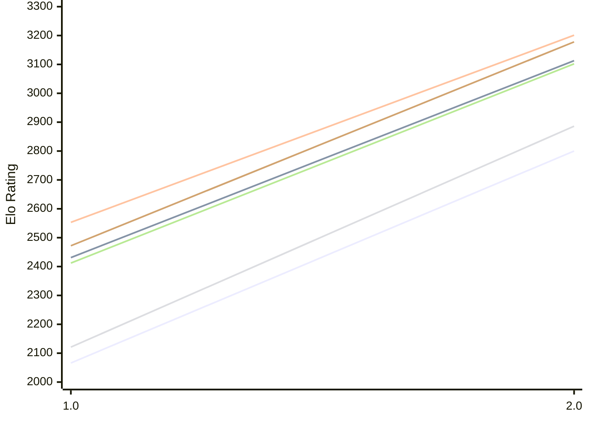

# Engine: Scarlet

Author: Evan Guerra

Home: https://github.com/EIG520/scarlet

## Elo Ratings E1 (Ultra 7 265T (1.50 GHz) - E-Core)

| Version | Published | STC 8.0+0.08s  | LTC 60.0+0.60s | VLTC 2m24s+1.12s | Comment |
| --- | --- | --- | --- | --- | --- |
| 2.0 | 2026-10-13 | 2800(+734) | 3113(+682) | 3201(+648) |  |
| 1.0 | 2026-07-26 | 2066 | 2431 | 2553 |  |
 | | | cElo (∆ prev) | cElo (∆ prev) | cElo (∆ prev) | 

## Elo Ratings P1 (Ultra 7 265T (1.50 GHz) - P-Core)

| Version | Published | STC 8.0+0.08s  | LTC 60.0+0.60s | VLTC 2m24s+1.12s | Comment |
| --- | --- | --- | --- | --- | --- |
| 2.0 | 2026-10-13 | 2886(+765) | 3102(+690) | 3178(+706) |  |
| 1.0 | 2026-07-26 | 2121 | 2412 | 2472 |  |
 | | | cElo (∆ prev) | cElo (∆ prev) | cElo (∆ prev) | 

## Elo Ratings T1 (i5-7500T 2.70GHz)

| Version | Published | STC 8.0+0.08s  | LTC 60.0+0.60s | VLTC 2m24s+1.12s | Comment |
| --- | --- | --- | --- | --- | --- |
| 1.0 | 2026-07-26 | 2194 | 2468 | 2520 |  |
 | | | cElo (∆ prev) | cElo (∆ prev) | cElo (∆ prev) | 

<a href="https://github.com/computer-chess-index/cci/issues/new?template=submit-version.yml&title=[VERSION]+Scarlet+<version>&body=###%20Engine%20name%0AScarlet%0A%0A###%20Version%0A1.0" target="_blank">Submit new version</a>

 Test Conditions:

GUI/CLI: <a href=https://github.com/cutechess/cutechess target="_blank">Cute-Chess</a> 
Elo Calculation: <a href=https://www.remi-coulom.fr/Bayesian-Elo/ target="_blank">Bayesian-Elo</a> 
CPU for P1: Intel(R) Core(TM) Ultra 7 265T (1.50 GHz) - P-Core 
CPU for E1: Intel(R) Core(TM) Ultra 7 265T (1.50 GHz) - E-Core 
CPU for T1: Intel(R) Core(TM) i5-7500T 2.70GHz 
Opening book: 8_moves_v3 
\* STC: 8.0+0.08s, LTC: 60.0+0.60s, VLTC: 2m24s+1.12s

 Lists:
Ratings: <a href=https://github.com/computer-chess-index/cci/blob/main/lists/CCIRatings.csv target="_blank">Complete list</a>

Generated: 2026-11-28 05:42:59

## Ratings Verlauf E1 / P1

```mermaid
%%{init: {"theme":"base","themeVariables":{"seriesColors:['#a3a3a3','#222221','#faa371']}}}%%
xychart-beta
  x-axis ["1.0", "2.0"]
  y-axis "Elo Rating" 2000 --> 3300
  line "E1: STC (8.0+0.08s)" [2066, 2800]
  line "E1: LTC (60.0+0.60s)" [2431, 3113]
  line "E1: VLTC (2m24s+1.12s)" [2553, 3201]
  line "P1: STC (8.0+0.08s)" [2121, 2886]
  line "P1: LTC (60.0+0.60s)" [2412, 3102]
  line "P1: VLTC (2m24s+1.12s)" [2472, 3178]
```

## Detailed Evaluation Results

| Version | Time Control | Variant | Elo  | Range +/- | Matches | Score | Average Opponent Elo | Draws |
| --- | --- |--- | --- | --- | --- | --- | --- | --- |
| 2.0 | VLTC (2m24s+1.12s) | E1 | 3201 | 26 | 412 | 52% | 3181 | 51% |
|  |  | P1 | 3178 | 32 | 292 | 53% | 3147 | 49% |
|  | LTC (60.0+0.60s) | E1 | 3113 | 26 | 436 | 50% | 3106 | 44% |
|  |  | P1 | 3102 | 34 | 266 | 52% | 3079 | 39% |
|  | STC (8.0+0.08s) | P1 | 2886 | 29 | 390 | 48% | 2890 | 35% |
|  |  | E1 | 2800 | 27 | 464 | 54% | 2751 | 30% |
| --- | --- |--- | --- | --- | --- | --- | --- | --- |
| 1.0 | VLTC (2m24s+1.12s) | T1 | 2520 | 37 | 252 | 50% | 2525 | 24% |
|  |  | P1 | 2472 | 41 | 226 | 47% | 2487 | 21% |
|  |  | E1 | 2553 | 35 | 296 | 49% | 2552 | 27% |
|  | LTC (60.0+0.60s) | T1 | 2468 | 37 | 250 | 51% | 2437 | 25% |
|  |  | P1 | 2412 | 42 | 208 | 47% | 2457 | 21% |
|  |  | E1 | 2431 | 35 | 286 | 52% | 2398 | 26% |
|  | STC (8.0+0.08s) | T1 | 2194 | 39 | 244 | 50% | 2187 | 18% |
|  |  | P1 | 2121 | 38 | 252 | 48% | 2128 | 21% |
|  |  | E1 | 2066 | 32 | 348 | 46% | 2109 | 22% |