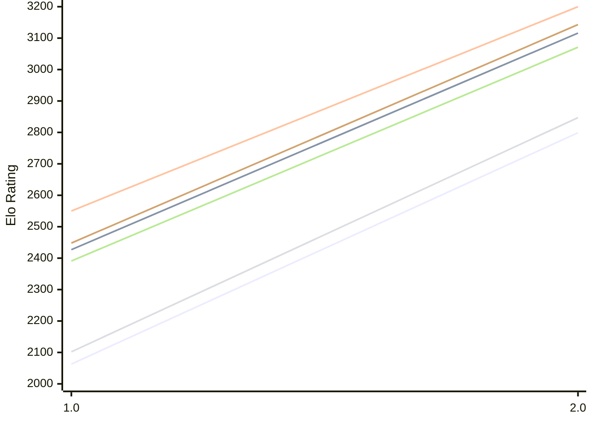

# Engine: Scarlet

Author: Evan Guerra

Home: https://github.com/EIG520/scarlet

## Elo Ratings E1 (Ultra 7 265T (1.50 GHz) - E-Core)

| Version | Published | STC 8.0+0.08s  | LTC 60.0+0.60s | VLTC 2m24s+1.12s | Comment |
| --- | --- | --- | --- | --- | --- |
| 2.0 | 2026-10-13 | 2799(+736) | 3116(+689) | 3200(+650) |  |
| 1.0 | 2026-07-26 | 2063 | 2427 | 2550 |  |
 | | | cElo (∆ prev) | cElo (∆ prev) | cElo (∆ prev) | 

## Elo Ratings P1 (Ultra 7 265T (1.50 GHz) - P-Core)

| Version | Published | STC 8.0+0.08s  | LTC 60.0+0.60s | VLTC 2m24s+1.12s | Comment |
| --- | --- | --- | --- | --- | --- |
| 2.0 | 2026-10-13 | 2847(+745) | 3071(+680) | 3143(+695) |  |
| 1.0 | 2026-07-26 | 2102 | 2391 | 2448 |  |
 | | | cElo (∆ prev) | cElo (∆ prev) | cElo (∆ prev) | 

## Elo Ratings T1 (i5-7500T 2.70GHz)

| Version | Published | STC 8.0+0.08s  | LTC 60.0+0.60s | VLTC 2m24s+1.12s | Comment |
| --- | --- | --- | --- | --- | --- |
| 1.0 | 2026-07-26 | 2194 | 2468 | 2520 |  |
 | | | cElo (∆ prev) | cElo (∆ prev) | cElo (∆ prev) | 

<a href="https://github.com/computer-chess-index/cci/issues/new?template=submit-version.yml&title=[VERSION]+Scarlet+<version>&body=###%20Engine%20name%0AScarlet%0A%0A###%20Version%0A1.0" target="_blank">Submit new version</a>

 Test Conditions:

GUI/CLI: <a href=https://github.com/cutechess/cutechess target="_blank">Cute-Chess</a> 
Elo Calculation: <a href=https://www.remi-coulom.fr/Bayesian-Elo/ target="_blank">Bayesian-Elo</a> 
CPU for P1: Intel(R) Core(TM) Ultra 7 265T (1.50 GHz) - P-Core 
CPU for E1: Intel(R) Core(TM) Ultra 7 265T (1.50 GHz) - E-Core 
CPU for T1: Intel(R) Core(TM) i5-7500T 2.70GHz 
Opening book: 8_moves_v3 
\* STC: 8.0+0.08s, LTC: 60.0+0.60s, VLTC: 2m24s+1.12s

 Lists:
Ratings: <a href=https://github.com/computer-chess-index/cci/blob/main/lists/CCIRatings.csv target="_blank">Complete list</a>

Generated: 2026-11-19 05:43:06

## Ratings Verlauf E1 / P1

```mermaid
%%{init: {"theme":"base","themeVariables":{"seriesColors:['#a3a3a3','#222221','#faa371']}}}%%
xychart-beta
  x-axis ["1.0", "2.0"]
  y-axis "Elo Rating" 2000 --> 3200
  line "E1: STC (8.0+0.08s)" [2063, 2799]
  line "E1: LTC (60.0+0.60s)" [2427, 3116]
  line "E1: VLTC (2m24s+1.12s)" [2550, 3200]
  line "P1: STC (8.0+0.08s)" [2102, 2847]
  line "P1: LTC (60.0+0.60s)" [2391, 3071]
  line "P1: VLTC (2m24s+1.12s)" [2448, 3143]
```

## Detailed Evaluation Results

| Version | Time Control | Variant | Elo  | Range +/- | Matches | Score | Average Opponent Elo | Draws |
| --- | --- |--- | --- | --- | --- | --- | --- | --- |
| 2.0 | VLTC (2m24s+1.12s) | P1 | 3143 | 33 | 264 | 52% | 3114 | 50% |
|  |  | E1 | 3200 | 27 | 384 | 52% | 3179 | 50% |
|  | LTC (60.0+0.60s) | P1 | 3071 | 36 | 236 | 52% | 3044 | 41% |
|  |  | E1 | 3116 | 29 | 372 | 51% | 3097 | 44% |
|  | STC (8.0+0.08s) | P1 | 2847 | 30 | 350 | 47% | 2861 | 36% |
|  |  | E1 | 2799 | 29 | 404 | 55% | 2745 | 28% |
| --- | --- |--- | --- | --- | --- | --- | --- | --- |
| 1.0 | VLTC (2m24s+1.12s) | T1 | 2520 | 37 | 252 | 50% | 2525 | 24% |
|  |  | P1 | 2448 | 41 | 226 | 47% | 2462 | 21% |
|  |  | E1 | 2550 | 35 | 292 | 49% | 2549 | 28% |
|  | LTC (60.0+0.60s) | T1 | 2468 | 37 | 250 | 51% | 2437 | 25% |
|  |  | P1 | 2391 | 43 | 200 | 47% | 2437 | 22% |
|  |  | E1 | 2427 | 36 | 278 | 52% | 2394 | 25% |
|  | STC (8.0+0.08s) | T1 | 2194 | 39 | 244 | 50% | 2187 | 18% |
|  |  | P1 | 2102 | 39 | 240 | 48% | 2109 | 22% |
|  |  | E1 | 2063 | 33 | 336 | 46% | 2107 | 21% |