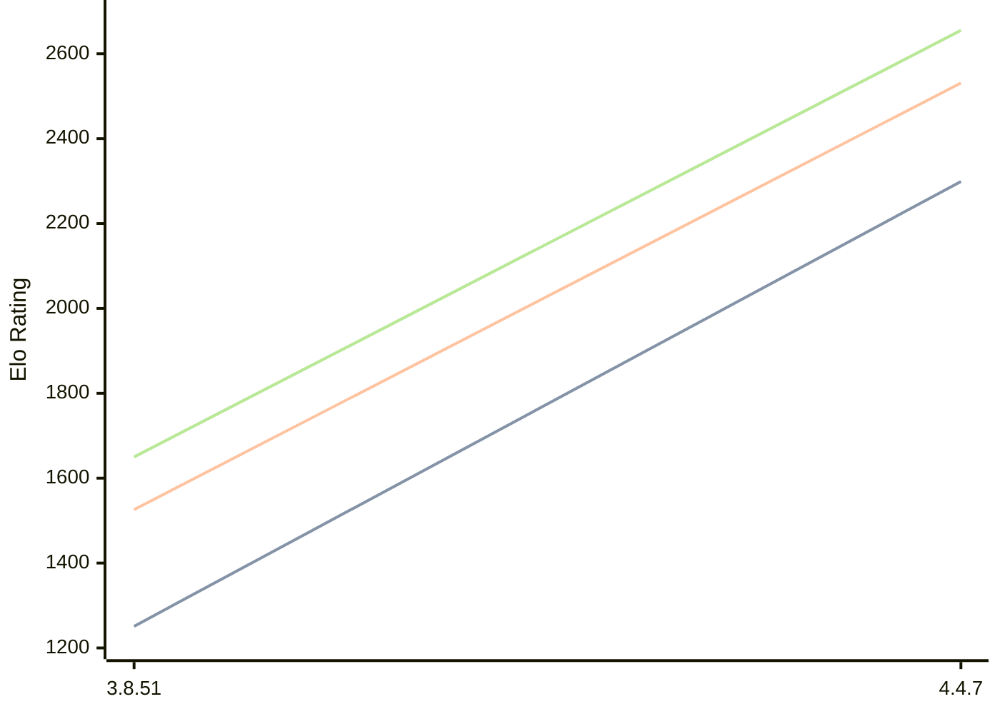

# Engine: Scoria

Author: Ian Nathan Kusmiantoro

Home: https://github.com/iannathan-k/scoria

## Elo Ratings

| Version | Published | STC 8.0+0.08s  | LTC 60.0+0.60s | VLTC 2m24s+1.12s | Comment |
| --- | --- | --- | --- | --- | --- |
| 4.4.7 | 2026-08-10 | 2299(+1048) | 2531(+1005) | 2655(+1005) |  |
| 3.8.51 | 2025-08-10 | 1251 | 1526 | 1650 |  |
 | | | cElo (∆ prev) | cElo (∆ prev) | cElo (∆ prev) | 

<a href="https://github.com/computer-chess-index/cci/issues/new?template=submit-version.yml&title=[VERSION]+Scoria+<version>&body=###%20Engine%20name%0AScoria%0A%0A###%20Version%0A4.4.7" target="_blank">Submit new version</a>

 Test Conditions:

GUI/CLI: <a href=https://github.com/cutechess/cutechess target="_blank">Cute-Chess</a> 
Elo Calculation: <a href=https://www.remi-coulom.fr/Bayesian-Elo/ target="_blank">Bayesian-Elo</a> 
CPU: Intel(R) Core(TM) i5-7500T 2.70GHz 
Opening book: 8_moves_v3 
\* STC: 8.0+0.08s, LTC: 60.0+0.60s, VLTC: 2m24s+1.12s

 Lists:
Ratings: <a href=https://github.com/computer-chess-index/cci/blob/main/lists/CCIRatings.csv target="_blank">Complete list</a>

Generated: 2026-09-15 04:42:22

## Ratings Verlauf

## Detailed Evaluation Results

| Version | Time Control | Elo  | Range +/- | Matches | Score | Average Opponent Elo | Draws |
| --- | --- | --- | --- | --- | --- | --- | --- |
| 4.4.7 | VLTC (2m24s+1.12s) | 2655 | 31 | 356 | 50% | 2643 | 29% |
| 4.4.7 | LTC (60.0+0.60s) | 2531 | 33 | 316 | 55% | 2461 | 31% |
| 4.4.7 | STC (8.0+0.08s) | 2299 | 34 | 296 | 52% | 2255 | 31% |
| --- | --- | --- | --- | --- | --- | --- | --- |
| 3.8.51 | VLTC (2m24s+1.12s) | 1650 | 24 | 554 | 45% | 1720 | 42% |
| 3.8.51 | LTC (60.0+0.60s) | 1526 | 26 | 498 | 49% | 1561 | 38% |
| 3.8.51 | STC (8.0+0.08s) | 1251 | 25 | 576 | 54% | 1191 | 34% |
| --- | --- | --- | --- | --- | --- | --- | --- |