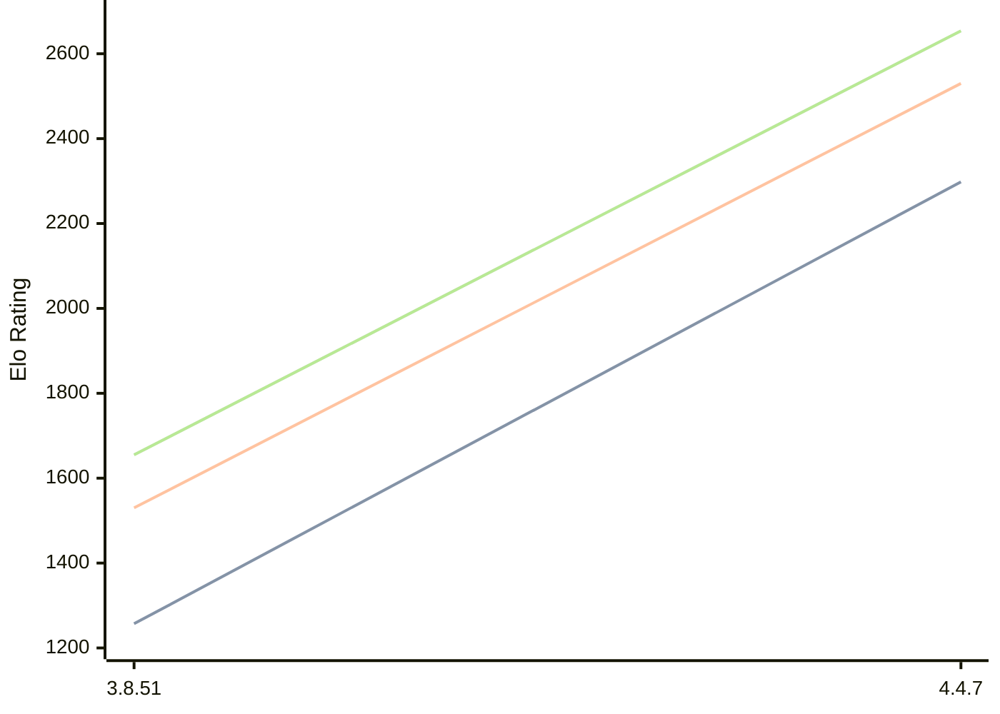

# Engine: Scoria

Author: Ian Nathan Kusmiantoro

Home: https://github.com/iannathan-k/scoria

## Elo Ratings E1

| Version | Published | STC 8.0+0.08s  | LTC 60.0+0.60s | VLTC 2m24s+1.12s | Comment |
| --- | --- | --- | --- | --- | --- |
| 4.4.7 | 2026-08-10 | 1906 | 2415 | 2574 |  |
 | | | cElo (∆ prev) | cElo (∆ prev) | cElo (∆ prev) | 

## Elo Ratings P1

| Version | Published | STC 8.0+0.08s  | LTC 60.0+0.60s | VLTC 2m24s+1.12s | Comment |
| --- | --- | --- | --- | --- | --- |
| 4.4.7 | 2026-08-10 | 2195 | 2712 | 2801 |  |
 | | | cElo (∆ prev) | cElo (∆ prev) | cElo (∆ prev) | 

## Elo Ratings T1

| Version | Published | STC 8.0+0.08s  | LTC 60.0+0.60s | VLTC 2m24s+1.12s | Comment |
| --- | --- | --- | --- | --- | --- |
| 4.4.7 | 2026-08-10 | 2298(+1041) | 2530(+1000) | 2654(+999) |  |
| 3.8.51 | 2025-08-10 | 1257 | 1530 | 1655 |  |
 | | | cElo (∆ prev) | cElo (∆ prev) | cElo (∆ prev) | 

<a href="https://github.com/computer-chess-index/cci/issues/new?template=submit-version.yml&title=[VERSION]+Scoria+<version>&body=###%20Engine%20name%0AScoria%0A%0A###%20Version%0A4.4.7" target="_blank">Submit new version</a>

 Test Conditions:

GUI/CLI: <a href=https://github.com/cutechess/cutechess target="_blank">Cute-Chess</a> 
Elo Calculation: <a href=https://www.remi-coulom.fr/Bayesian-Elo/ target="_blank">Bayesian-Elo</a> 
CPU for P1: Intel(R) Core(TM) Ultra 7 265T (1.50 GHz) - P-Core 
CPU for E1: Intel(R) Core(TM) Ultra 7 265T (1.50 GHz) - E-Core 
CPU for T1: Intel(R) Core(TM) i5-7500T 2.70GHz 
Opening book: 8_moves_v3 
\* STC: 8.0+0.08s, LTC: 60.0+0.60s, VLTC: 2m24s+1.12s

 Lists:
Ratings: <a href=https://github.com/computer-chess-index/cci/blob/main/lists/CCIRatings.csv target="_blank">Complete list</a>

Generated: 2026-10-09 14:16:25

## Ratings Verlauf

```mermaid
%%{init: {"theme":"base","themeVariables":{"seriesColors:['#a3a3a3','#222221','#faa371']}}}%%
xychart-beta
  x-axis ["3.8.51", "4.4.7"]
  y-axis "Elo Rating" 1200 --> 2700
  line "" [1257, 2298]
  line "STC (8.0+0.08s)" [1257, 2298]
  line "LTC (60.0+0.60s)" [1530, 2530]
  line "" [1655, 2654]
  line "VLTC (2m24s+1.12s)" [1655, 2654]
```

## Detailed Evaluation Results

| Version | Time Control | Elo  | Range +/- | Matches | Score | Average Opponent Elo | Draws |
| --- | --- | --- | --- | --- | --- | --- | --- |
| 4.4.7 | VLTC (2m24s+1.12s) | 2574 | 53 | 126 | 50% | 2560 | 29% |
| 4.4.7 | VLTC (2m24s+1.12s) | 2654 | 30 | 372 | 49% | 2650 | 29% |
| 4.4.7 | VLTC (2m24s+1.12s) | 2801 | 55 | 116 | 56% | 2707 | 26% |
| 4.4.7 | LTC (60.0+0.60s) | 2415 | 47 | 154 | 53% | 2377 | 33% |
| 4.4.7 | LTC (60.0+0.60s) | 2530 | 32 | 328 | 54% | 2468 | 31% |
| 4.4.7 | LTC (60.0+0.60s) | 2712 | 57 | 118 | 59% | 2518 | 27% |
| 4.4.7 | STC (8.0+0.08s) | 2298 | 34 | 300 | 52% | 2259 | 31% |
| --- | --- | --- | --- | --- | --- | --- | --- |
| 4.4.7 | STC (8.0+0.08s) | 2195 | 49 | 160 | 54% | 2130 | 22% |
| --- | --- | --- | --- | --- | --- | --- | --- |
| 4.4.7 | STC (8.0+0.08s) | 1906 | 42 | 204 | 47% | 1978 | 23% |
| --- | --- | --- | --- | --- | --- | --- | --- |
| 3.8.51 | VLTC (2m24s+1.12s) | 1655 | 24 | 554 | 45% | 1724 | 42% |
| 3.8.51 | LTC (60.0+0.60s) | 1530 | 26 | 498 | 49% | 1566 | 38% |
| 3.8.51 | STC (8.0+0.08s) | 1257 | 25 | 576 | 54% | 1196 | 34% |
| --- | --- | --- | --- | --- | --- | --- | --- |