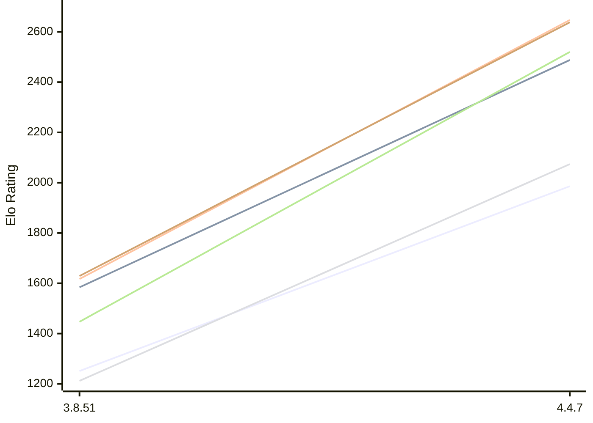
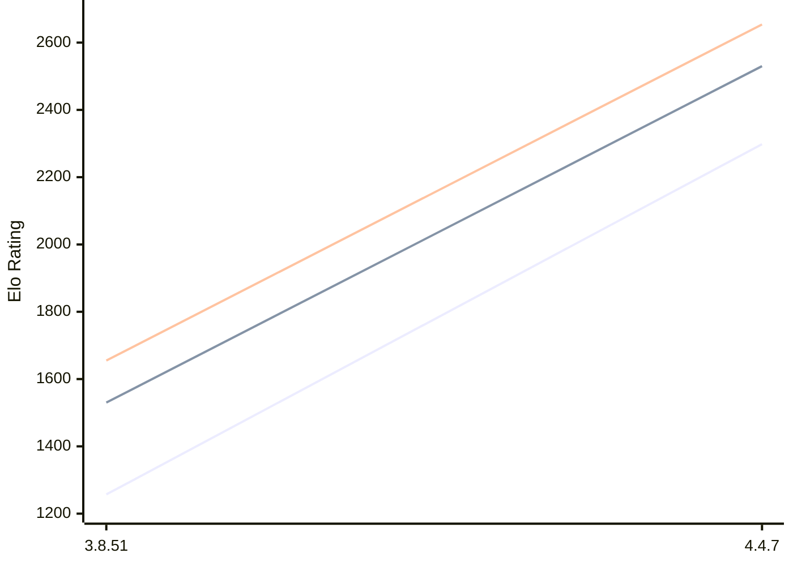

# Engine: Scoria

Author: Ian Nathan Kusmiantoro

Home: https://github.com/iannathan-k/scoria

## Elo Ratings E1 (Ultra 7 265T (1.50 GHz) - E-Core)

| Version | Published | STC 8.0+0.08s  | LTC 60.0+0.60s | VLTC 2m24s+1.12s | Comment |
| --- | --- | --- | --- | --- | --- |
| 4.4.7 | 2026-08-10 | 1986(+735) | 2488(+904) | 2647(+1030) |  |
| 3.8.51 | 2025-08-10 | 1251 | 1584 | 1617 |  |
 | | | cElo (∆ prev) | cElo (∆ prev) | cElo (∆ prev) | 

## Elo Ratings P1 (Ultra 7 265T (1.50 GHz) - P-Core)

| Version | Published | STC 8.0+0.08s  | LTC 60.0+0.60s | VLTC 2m24s+1.12s | Comment |
| --- | --- | --- | --- | --- | --- |
| 4.4.7 | 2026-08-10 | 2074(+862) | 2520(+1073) | 2638(+1009) |  |
| 3.8.51 | 2025-08-10 | 1212 | 1447 | 1629 |  |
 | | | cElo (∆ prev) | cElo (∆ prev) | cElo (∆ prev) | 

## Elo Ratings T1 (i5-7500T 2.70GHz)

| Version | Published | STC 8.0+0.08s  | LTC 60.0+0.60s | VLTC 2m24s+1.12s | Comment |
| --- | --- | --- | --- | --- | --- |
| 4.4.7 | 2026-08-10 | 2298(+1041) | 2530(+1000) | 2654(+999) |  |
| 3.8.51 | 2025-08-10 | 1257 | 1530 | 1655 |  |
 | | | cElo (∆ prev) | cElo (∆ prev) | cElo (∆ prev) | 

<a href="https://github.com/computer-chess-index/cci/issues/new?template=submit-version.yml&title=[VERSION]+Scoria+<version>&body=###%20Engine%20name%0AScoria%0A%0A###%20Version%0A4.4.7" target="_blank">Submit new version</a>

 Test Conditions:

GUI/CLI: <a href=https://github.com/cutechess/cutechess target="_blank">Cute-Chess</a> 
Elo Calculation: <a href=https://www.remi-coulom.fr/Bayesian-Elo/ target="_blank">Bayesian-Elo</a> 
CPU for P1: Intel(R) Core(TM) Ultra 7 265T (1.50 GHz) - P-Core 
CPU for E1: Intel(R) Core(TM) Ultra 7 265T (1.50 GHz) - E-Core 
CPU for T1: Intel(R) Core(TM) i5-7500T 2.70GHz 
Opening book: 8_moves_v3 
\* STC: 8.0+0.08s, LTC: 60.0+0.60s, VLTC: 2m24s+1.12s

 Lists:
Ratings: <a href=https://github.com/computer-chess-index/cci/blob/main/lists/CCIRatings.csv target="_blank">Complete list</a>

Generated: 2026-11-24 05:42:58

## Ratings Verlauf E1 / P1

```mermaid
%%{init: {"theme":"base","themeVariables":{"seriesColors:['#a3a3a3','#222221','#faa371']}}}%%
xychart-beta
  x-axis ["3.8.51", "4.4.7"]
  y-axis "Elo Rating" 1200 --> 2700
  line "E1: STC (8.0+0.08s)" [1251, 1986]
  line "E1: LTC (60.0+0.60s)" [1584, 2488]
  line "E1: VLTC (2m24s+1.12s)" [1617, 2647]
  line "P1: STC (8.0+0.08s)" [1212, 2074]
  line "P1: LTC (60.0+0.60s)" [1447, 2520]
  line "P1: VLTC (2m24s+1.12s)" [1629, 2638]
```

## Ratings Verlauf T1

```mermaid
%%{init: {"theme":"base","themeVariables":{"seriesColors:['#a3a3a3','#222221','#faa371']}}}%%
xychart-beta
  x-axis ["3.8.51", "4.4.7"]
  y-axis "Elo Rating" 1200 --> 2700
  line "T1: STC (8.0+0.08s)" [1257, 2298]
  line "T1: LTC (60.0+0.60s)" [1530, 2530]
  line "T1: VLTC (2m24s+1.12s)" [1655, 2654]
```

## Detailed Evaluation Results

| Version | Time Control | Variant | Elo  | Range +/- | Matches | Score | Average Opponent Elo | Draws |
| --- | --- |--- | --- | --- | --- | --- | --- | --- |
| 4.4.7 | VLTC (2m24s+1.12s) | T1 | 2654 | 30 | 372 | 49% | 2650 | 29% |
|  |  | P1 | 2638 | 37 | 246 | 52% | 2589 | 30% |
|  |  | E1 | 2647 | 33 | 312 | 48% | 2668 | 31% |
|  | LTC (60.0+0.60s) | P1 | 2520 | 35 | 288 | 50% | 2493 | 27% |
|  |  | E1 | 2488 | 34 | 282 | 52% | 2464 | 32% |
|  |  | T1 | 2530 | 32 | 328 | 54% | 2468 | 31% |
|  | STC (8.0+0.08s) | P1 | 2074 | 39 | 242 | 53% | 2043 | 26% |
|  |  | E1 | 1986 | 33 | 356 | 50% | 1994 | 20% |
|  |  | T1 | 2298 | 34 | 300 | 52% | 2259 | 31% |
| --- | --- |--- | --- | --- | --- | --- | --- | --- |
| 3.8.51 | VLTC (2m24s+1.12s) | T1 | 1655 | 24 | 554 | 45% | 1724 | 42% |
|  |  | P1 | 1629 | 66 | 82 | 37% | 1862 | 37% |
|  |  | E1 | 1617 | 51 | 128 | 41% | 1793 | 39% |
|  | LTC (60.0+0.60s) | T1 | 1530 | 26 | 498 | 49% | 1566 | 38% |
|  |  | P1 | 1447 | 56 | 112 | 41% | 1639 | 36% |
|  |  | E1 | 1584 | 50 | 136 | 46% | 1742 | 37% |
|  | STC (8.0+0.08s) | T1 | 1257 | 25 | 576 | 54% | 1196 | 34% |
|  |  | P1 | 1212 | 56 | 126 | 34% | 1461 | 27% |
|  |  | E1 | 1251 | 55 | 132 | 39% | 1494 | 26% |