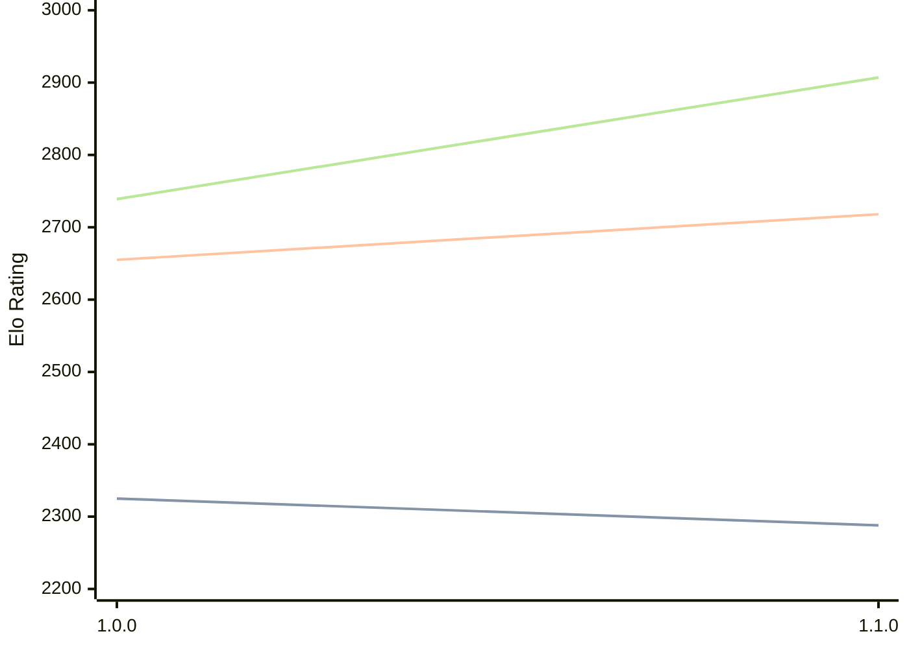

# Engine: ShallowGuess

Author: Zixiao Han

Home: https://github.com/buildingwheels/ShallowGuess

## Elo Ratings

| Version | Published | STC 8.0+0.08s  | LTC 60.0+0.60s | VLTC 2m24s+1.12s | Comment |
| --- | --- | --- | --- | --- | --- |
| 1.1.0 | 2026-03-25 | 2288(-37) | 2718(+63) | 2907(+168) |  |
| 1.0.0 | 2026-02-24 | 2325 | 2655 | 2739 |  |
 | | | cElo (∆ prev) | cElo (∆ prev) | cElo (∆ prev) | 

<a href="https://github.com/computer-chess-index/cci/issues/new?template=submit-version.yml&title=[VERSION]+ShallowGuess+<version>&body=###%20Engine%20name%0AShallowGuess%0A%0A###%20Version%0A1.1.0" target="_blank">Submit new version</a>

 Test Conditions:

GUI/CLI: <a href=https://github.com/cutechess/cutechess target="_blank">Cute-Chess</a> 
Elo Calculation: <a href=https://www.remi-coulom.fr/Bayesian-Elo/ target="_blank">Bayesian-Elo</a> 
CPU: Intel(R) Core(TM) i5-7500T 2.70GHz 
Opening book: 8_moves_v3 
\* STC: 8.0+0.08s, LTC: 60.0+0.60s, VLTC: 2m24s+1.12s

 Lists:
Ratings: <a href=https://github.com/computer-chess-index/cci/blob/main/lists/CCIRatings.csv target="_blank">Complete list</a>

Generated: 2026-08-25 06:29:59

## Ratings Verlauf

⬛ STC (8.0+0.08s) &nbsp;&nbsp; 🟧 LTC (60.0+0.60s) &nbsp;&nbsp; 🟩 VLTC (2m24s+1.12s)

dark mode: 🟩STC (8.0+0.08s) 🟧LTC (60.0+0.60s) ⬜VLTC (2m24s+1.12s)

## Detailed Evaluation Results

| Version | Time Control | Elo  | Range +/- | Matches | Score | Average Opponent Elo | Draws |
| --- | --- | --- | --- | --- | --- | --- | --- |
| 1.1.0 | VLTC (2m24s+1.12s) | 2907 | 55 | 98 | 54% | 2878 | 42% |
| 1.1.0 | LTC (60.0+0.60s) | 2718 | 56 | 92 | 51% | 2707 | 48% |
| 1.1.0 | STC (8.0+0.08s) | 2288 | 66 | 80 | 53% | 2261 | 21% |
| --- | --- | --- | --- | --- | --- | --- | --- |
| 1.0.0 | VLTC (2m24s+1.12s) | 2739 | 33 | 284 | 49% | 2754 | 40% |
| 1.0.0 | LTC (60.0+0.60s) | 2655 | 34 | 286 | 51% | 2655 | 35% |
| 1.0.0 | STC (8.0+0.08s) | 2325 | 35 | 290 | 48% | 2353 | 25% |
| --- | --- | --- | --- | --- | --- | --- | --- |