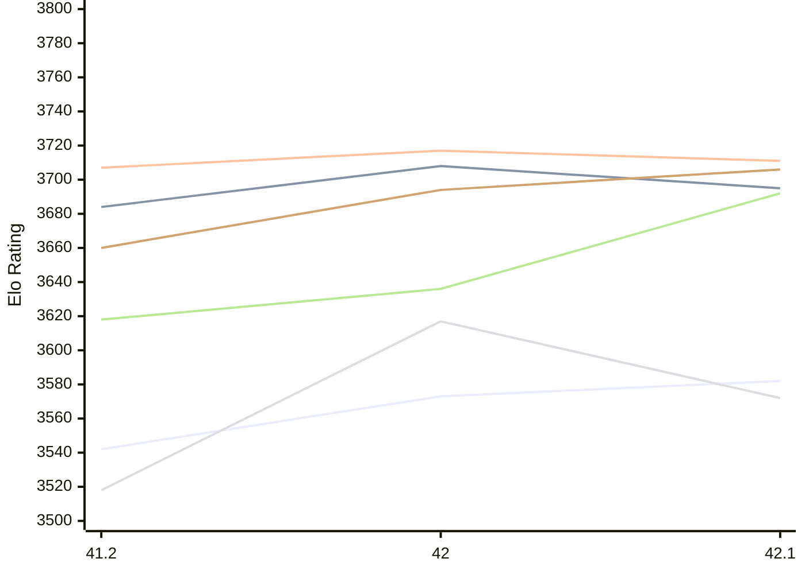
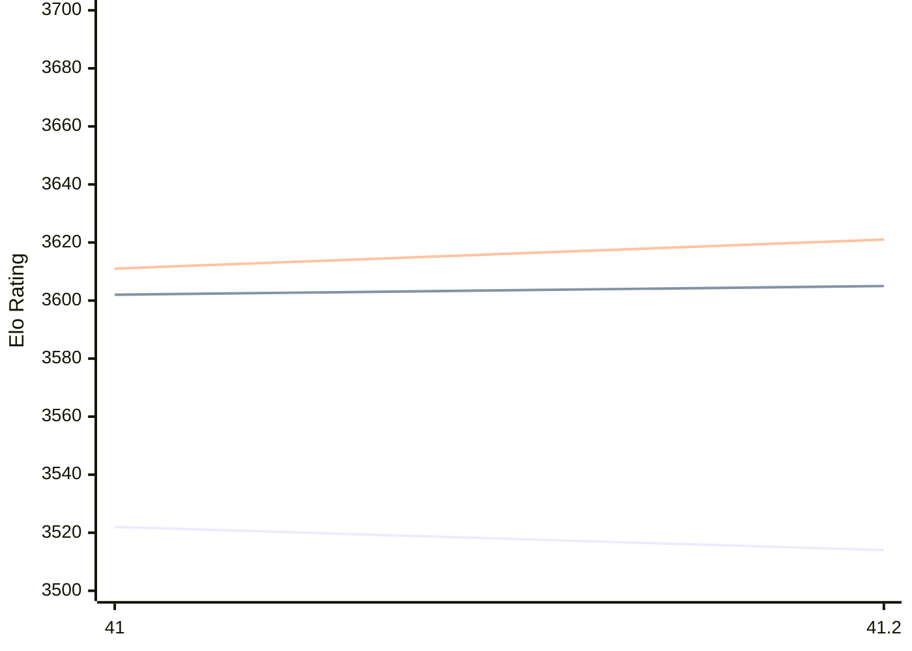

# Engine: Shashchess

Author: Andrea Manzo

Home: https://github.com/amchess/ShashChess

## Elo Ratings E1 (Ultra 7 265T (1.50 GHz) - E-Core)

| Version | Published | STC 8.0+0.08s  | LTC 60.0+0.60s | VLTC 2m24s+1.12s | Comment |
| --- | --- | --- | --- | --- | --- |
| 42.1 | 2026-11-08 | 3582(+9) | 3695(-13) | 3711(-6) |  |
| 42 | 2026-11-05 | 3573(+31) | 3708(+24) | 3717(+10) |  |
| 41.2 | 2026-03-31 | 3542 | 3684 | 3707 |  |
 | | | cElo (∆ prev) | cElo (∆ prev) | cElo (∆ prev) | 

## Elo Ratings P1 (Ultra 7 265T (1.50 GHz) - P-Core)

| Version | Published | STC 8.0+0.08s  | LTC 60.0+0.60s | VLTC 2m24s+1.12s | Comment |
| --- | --- | --- | --- | --- | --- |
| 42.1 | 2026-11-08 | 3572(-45) | 3692(+56) | 3706(+12) |  |
| 42 | 2026-11-05 | 3617(+99) | 3636(+18) | 3694(+34) |  |
| 41.2 | 2026-03-31 | 3518 | 3618 | 3660 |  |
 | | | cElo (∆ prev) | cElo (∆ prev) | cElo (∆ prev) | 

## Elo Ratings T1 (i5-7500T 2.70GHz)

| Version | Published | STC 8.0+0.08s  | LTC 60.0+0.60s | VLTC 2m24s+1.12s | Comment |
| --- | --- | --- | --- | --- | --- |
| 41.2 | 2026-03-31 | 3514(-8) | 3605(+3) | 3621(+10) |  |
| 41 | 2026-03-05 | 3522 | 3602 | 3611 |  |
 | | | cElo (∆ prev) | cElo (∆ prev) | cElo (∆ prev) | 

<a href="https://github.com/computer-chess-index/cci/issues/new?template=submit-version.yml&title=[VERSION]+Shashchess+<version>&body=###%20Engine%20name%0AShashchess%0A%0A###%20Version%0A41.2" target="_blank">Submit new version</a>

 Test Conditions:

GUI/CLI: <a href=https://github.com/cutechess/cutechess target="_blank">Cute-Chess</a> 
Elo Calculation: <a href=https://www.remi-coulom.fr/Bayesian-Elo/ target="_blank">Bayesian-Elo</a> 
CPU for P1: Intel(R) Core(TM) Ultra 7 265T (1.50 GHz) - P-Core 
CPU for E1: Intel(R) Core(TM) Ultra 7 265T (1.50 GHz) - E-Core 
CPU for T1: Intel(R) Core(TM) i5-7500T 2.70GHz 
Opening book: 8_moves_v3 
\* STC: 8.0+0.08s, LTC: 60.0+0.60s, VLTC: 2m24s+1.12s

 Lists:
Ratings: <a href=https://github.com/computer-chess-index/cci/blob/main/lists/CCIRatings.csv target="_blank">Complete list</a>

Generated: 2026-11-26 05:43:20

## Ratings Verlauf E1 / P1

```mermaid
%%{init: {"theme":"base","themeVariables":{"seriesColors:['#a3a3a3','#222221','#faa371']}}}%%
xychart-beta
  x-axis ["41.2", "42", "42.1"]
  y-axis "Elo Rating" 3500 --> 3800
  line "E1: STC (8.0+0.08s)" [3542, 3573, 3582]
  line "E1: LTC (60.0+0.60s)" [3684, 3708, 3695]
  line "E1: VLTC (2m24s+1.12s)" [3707, 3717, 3711]
  line "P1: STC (8.0+0.08s)" [3518, 3617, 3572]
  line "P1: LTC (60.0+0.60s)" [3618, 3636, 3692]
  line "P1: VLTC (2m24s+1.12s)" [3660, 3694, 3706]
```

## Ratings Verlauf T1

```mermaid
%%{init: {"theme":"base","themeVariables":{"seriesColors:['#a3a3a3','#222221','#faa371']}}}%%
xychart-beta
  x-axis ["41", "41.2"]
  y-axis "Elo Rating" 3500 --> 3700
  line "T1: STC (8.0+0.08s)" [3522, 3514]
  line "T1: LTC (60.0+0.60s)" [3602, 3605]
  line "T1: VLTC (2m24s+1.12s)" [3611, 3621]
```

## Detailed Evaluation Results

| Version | Time Control | Variant | Elo  | Range +/- | Matches | Score | Average Opponent Elo | Draws |
| --- | --- |--- | --- | --- | --- | --- | --- | --- |
| 42.1 | VLTC (2m24s+1.12s) | P1 | 3706 | 57 | 68 | 53% | 3687 | 91% |
|  |  | E1 | 3711 | 24 | 402 | 53% | 3690 | 89% |
|  | LTC (60.0+0.60s) | P1 | 3692 | 47 | 100 | 53% | 3673 | 89% |
|  |  | E1 | 3695 | 23 | 416 | 51% | 3691 | 94% |
|  | STC (8.0+0.08s) | P1 | 3572 | 43 | 124 | 49% | 3576 | 84% |
|  |  | E1 | 3582 | 28 | 296 | 52% | 3567 | 80% |
| --- | --- |--- | --- | --- | --- | --- | --- | --- |
| 42 | VLTC (2m24s+1.12s) | P1 | 3694 | 58 | 64 | 52% | 3679 | 95% |
|  |  | E1 | 3717 | 41 | 140 | 54% | 3691 | 85% |
|  | LTC (60.0+0.60s) | P1 | 3636 | 64 | 52 | 51% | 3630 | 98% |
|  |  | E1 | 3708 | 39 | 148 | 53% | 3688 | 91% |
|  | STC (8.0+0.08s) | P1 | 3617 | 44 | 116 | 47% | 3637 | 87% |
|  |  | E1 | 3573 | 35 | 196 | 50% | 3573 | 82% |
| --- | --- |--- | --- | --- | --- | --- | --- | --- |
| 41.2 | VLTC (2m24s+1.12s) | E1 | 3707 | 32 | 252 | 60% | 3573 | 79% |
|  |  | T1 | 3621 | 32 | 228 | 55% | 3586 | 86% |
|  |  | P1 | 3660 | 42 | 158 | 64% | 3424 | 70% |
|  | LTC (60.0+0.60s) | T1 | 3605 | 30 | 244 | 52% | 3587 | 90% |
|  |  | P1 | 3618 | 32 | 274 | 64% | 3310 | 71% |
|  |  | E1 | 3684 | 30 | 280 | 58% | 3522 | 79% |
|  | STC (8.0+0.08s) | T1 | 3514 | 19 | 626 | 51% | 3509 | 83% |
|  |  | P1 | 3518 | 33 | 212 | 48% | 3528 | 82% |
|  |  | E1 | 3542 | 28 | 316 | 47% | 3560 | 76% |
| --- | --- |--- | --- | --- | --- | --- | --- | --- |
| 41 | VLTC (2m24s+1.12s) | T1 | 3611 | 34 | 198 | 56% | 3565 | 84% |
|  | LTC (60.0+0.60s) | T1 | 3602 | 39 | 156 | 54% | 3567 | 87% |
|  | STC (8.0+0.08s) | T1 | 3522 | 26 | 358 | 51% | 3509 | 78% |