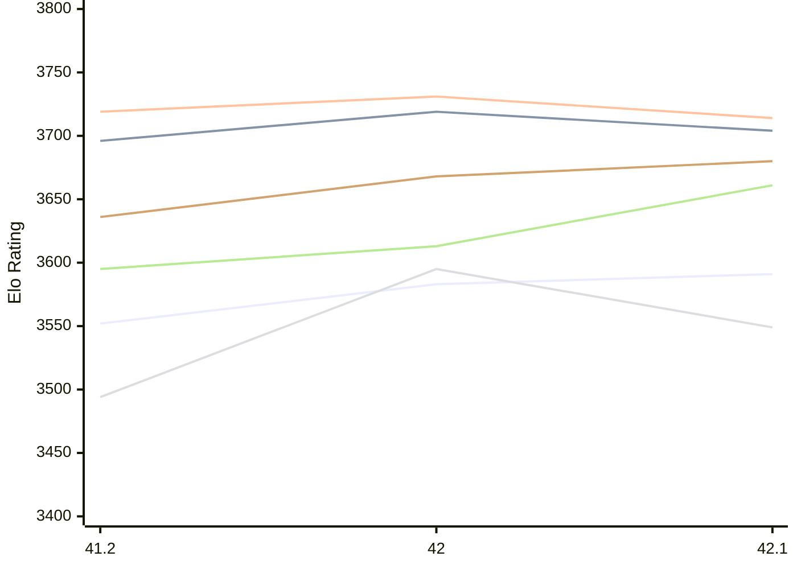
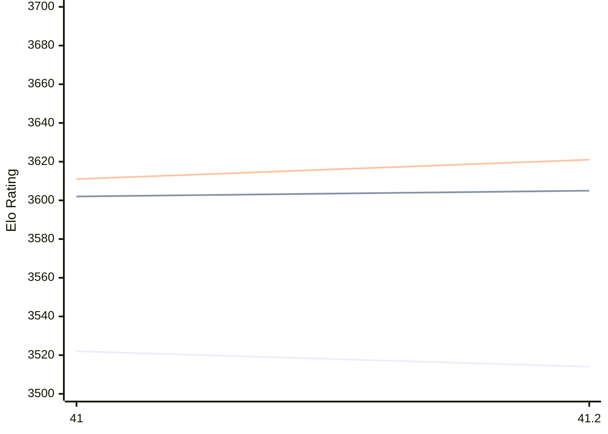

# Engine: Shashchess

Author: Andrea Manzo

Home: https://github.com/amchess/ShashChess

## Elo Ratings E1 (Ultra 7 265T (1.50 GHz) - E-Core)

| Version | Published | STC 8.0+0.08s  | LTC 60.0+0.60s | VLTC 2m24s+1.12s | Comment |
| --- | --- | --- | --- | --- | --- |
| 42.1 | 2026-11-08 | 3591(+8) | 3704(-15) | 3714(-17) |  |
| 42 | 2026-11-05 | 3583(+31) | 3719(+23) | 3731(+12) |  |
| 41.2 | 2026-03-31 | 3552 | 3696 | 3719 |  |
 | | | cElo (∆ prev) | cElo (∆ prev) | cElo (∆ prev) | 

## Elo Ratings P1 (Ultra 7 265T (1.50 GHz) - P-Core)

| Version | Published | STC 8.0+0.08s  | LTC 60.0+0.60s | VLTC 2m24s+1.12s | Comment |
| --- | --- | --- | --- | --- | --- |
| 42.1 | 2026-11-08 | 3549(-46) | 3661(+48) | 3680(+12) |  |
| 42 | 2026-11-05 | 3595(+101) | 3613(+18) | 3668(+32) |  |
| 41.2 | 2026-03-31 | 3494 | 3595 | 3636 |  |
 | | | cElo (∆ prev) | cElo (∆ prev) | cElo (∆ prev) | 

## Elo Ratings T1 (i5-7500T 2.70GHz)

| Version | Published | STC 8.0+0.08s  | LTC 60.0+0.60s | VLTC 2m24s+1.12s | Comment |
| --- | --- | --- | --- | --- | --- |
| 41.2 | 2026-03-31 | 3514(-8) | 3605(+3) | 3621(+10) |  |
| 41 | 2026-03-05 | 3522 | 3602 | 3611 |  |
 | | | cElo (∆ prev) | cElo (∆ prev) | cElo (∆ prev) | 

<a href="https://github.com/computer-chess-index/cci/issues/new?template=submit-version.yml&title=[VERSION]+Shashchess+<version>&body=###%20Engine%20name%0AShashchess%0A%0A###%20Version%0A41.2" target="_blank">Submit new version</a>

 Test Conditions:

GUI/CLI: <a href=https://github.com/cutechess/cutechess target="_blank">Cute-Chess</a> 
Elo Calculation: <a href=https://www.remi-coulom.fr/Bayesian-Elo/ target="_blank">Bayesian-Elo</a> 
CPU for P1: Intel(R) Core(TM) Ultra 7 265T (1.50 GHz) - P-Core 
CPU for E1: Intel(R) Core(TM) Ultra 7 265T (1.50 GHz) - E-Core 
CPU for T1: Intel(R) Core(TM) i5-7500T 2.70GHz 
Opening book: 8_moves_v3 
\* STC: 8.0+0.08s, LTC: 60.0+0.60s, VLTC: 2m24s+1.12s

 Lists:
Ratings: <a href=https://github.com/computer-chess-index/cci/blob/main/lists/CCIRatings.csv target="_blank">Complete list</a>

Generated: 2026-11-16 05:42:49

## Ratings Verlauf E1 / P1

```mermaid
%%{init: {"theme":"base","themeVariables":{"seriesColors:['#a3a3a3','#222221','#faa371']}}}%%
xychart-beta
  x-axis ["41.2", "42", "42.1"]
  y-axis "Elo Rating" 3400 --> 3800
  line "E1: STC (8.0+0.08s)" [3552, 3583, 3591]
  line "E1: LTC (60.0+0.60s)" [3696, 3719, 3704]
  line "E1: VLTC (2m24s+1.12s)" [3719, 3731, 3714]
  line "P1: STC (8.0+0.08s)" [3494, 3595, 3549]
  line "P1: LTC (60.0+0.60s)" [3595, 3613, 3661]
  line "P1: VLTC (2m24s+1.12s)" [3636, 3668, 3680]
```

## Ratings Verlauf T1

```mermaid
%%{init: {"theme":"base","themeVariables":{"seriesColors:['#a3a3a3','#222221','#faa371']}}}%%
xychart-beta
  x-axis ["41", "41.2"]
  y-axis "Elo Rating" 3500 --> 3700
  line "T1: STC (8.0+0.08s)" [3522, 3514]
  line "T1: LTC (60.0+0.60s)" [3602, 3605]
  line "T1: VLTC (2m24s+1.12s)" [3611, 3621]
```

## Detailed Evaluation Results

| Version | Time Control | Variant | Elo  | Range +/- | Matches | Score | Average Opponent Elo | Draws |
| --- | --- |--- | --- | --- | --- | --- | --- | --- |
| 42.1 | VLTC (2m24s+1.12s) | P1 | 3680 | 67 | 48 | 52% | 3667 | 92% |
|  |  | E1 | 3714 | 37 | 168 | 53% | 3695 | 87% |
|  | LTC (60.0+0.60s) | P1 | 3661 | 53 | 80 | 52% | 3648 | 89% |
|  |  | E1 | 3704 | 35 | 176 | 51% | 3698 | 94% |
|  | STC (8.0+0.08s) | P1 | 3549 | 44 | 120 | 49% | 3553 | 83% |
|  |  | E1 | 3591 | 30 | 272 | 52% | 3573 | 79% |
| --- | --- |--- | --- | --- | --- | --- | --- | --- |
| 42 | VLTC (2m24s+1.12s) | P1 | 3668 | 60 | 60 | 52% | 3657 | 97% |
|  |  | E1 | 3731 | 41 | 140 | 54% | 3706 | 85% |
|  | LTC (60.0+0.60s) | P1 | 3613 | 64 | 52 | 51% | 3607 | 98% |
|  |  | E1 | 3719 | 39 | 148 | 53% | 3700 | 91% |
|  | STC (8.0+0.08s) | P1 | 3595 | 45 | 112 | 47% | 3615 | 87% |
|  |  | E1 | 3583 | 36 | 178 | 50% | 3583 | 82% |
| --- | --- |--- | --- | --- | --- | --- | --- | --- |
| 41.2 | VLTC (2m24s+1.12s) | E1 | 3719 | 32 | 252 | 60% | 3584 | 79% |
|  |  | T1 | 3621 | 32 | 228 | 55% | 3586 | 86% |
|  |  | P1 | 3636 | 42 | 158 | 64% | 3397 | 70% |
|  | LTC (60.0+0.60s) | E1 | 3696 | 30 | 280 | 58% | 3533 | 79% |
|  |  | T1 | 3605 | 30 | 244 | 52% | 3587 | 90% |
|  |  | P1 | 3595 | 32 | 274 | 64% | 3287 | 71% |
|  | STC (8.0+0.08s) | E1 | 3552 | 28 | 316 | 47% | 3569 | 76% |
|  |  | T1 | 3514 | 19 | 626 | 51% | 3509 | 83% |
|  |  | P1 | 3494 | 33 | 212 | 48% | 3503 | 82% |
| --- | --- |--- | --- | --- | --- | --- | --- | --- |
| 41 | VLTC (2m24s+1.12s) | T1 | 3611 | 34 | 198 | 56% | 3565 | 84% |
|  | LTC (60.0+0.60s) | T1 | 3602 | 39 | 156 | 54% | 3567 | 87% |
|  | STC (8.0+0.08s) | T1 | 3522 | 26 | 358 | 51% | 3509 | 78% |